# 비즈니스 모델 설계 가이드

## 개요

기술만으로는 부족합니다. **진짜 문제를 해결하고, 가치를 창출하며, 지속가능한 비즈니스**를 만드는 것이 공모전의 핵심입니다.

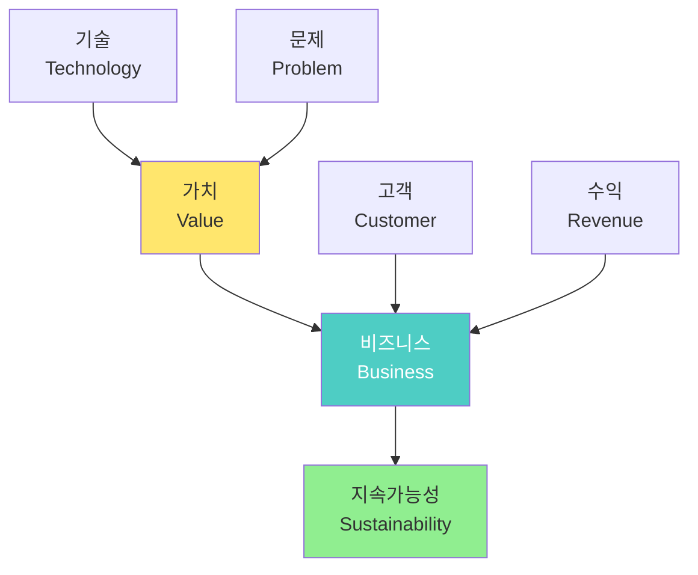

---

## 1. 비즈니스 모델 캔버스 (Business Model Canvas)

### 1.1 9가지 구성 요소

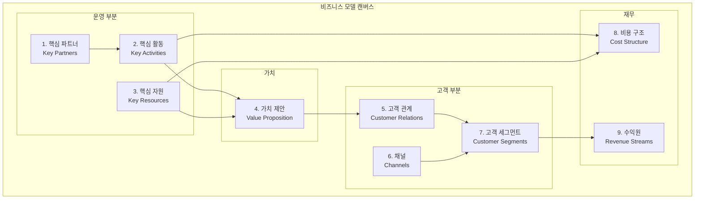

### 1.2 작성 순서

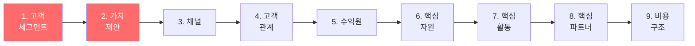

---

## 2. 고객 세그먼트 (Customer Segments)

### 2.1 누가 우리의 고객인가?

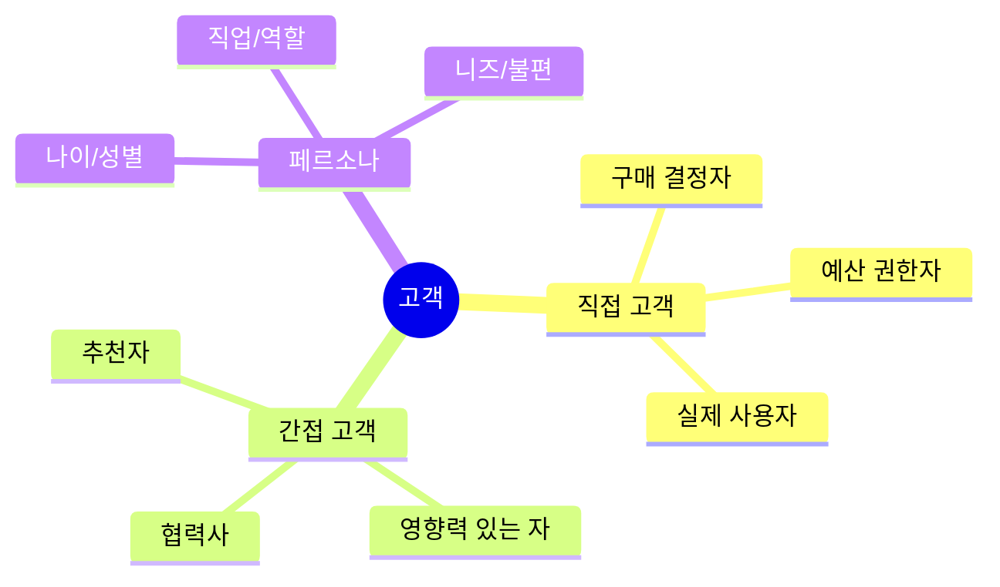

### 2.2 고객 분석 프레임워크

#### 페르소나 템플릿

```markdown
# 고객 페르소나 #1

## 기본 정보
- **이름**: 김현장 (가명)
- **나이/성별**: 45세 / 남성
- **직업**: 중소 제조업체 품질관리 팀장
- **경력**: 20년차

## 현재 상황
- 하루 8시간 육안 검사 관리
- 팀원 3명 관리
- 불량률 5% (목표 2%)
- 월 예산: 인건비 900만원

## 불편 사항 (Pain Points)
1. 작업자 피로로 인한 오후 불량률 증가
2. 검사 기준이 사람마다 다름
3. 불량 원인 데이터 분석 어려움
4. 인력 충원 예산 없음

## 원하는 것 (Gains)
1. 일관된 검사 품질
2. 불량률 감소 → 고객 만족 up
3. 데이터 기반 개선
4. 비용 절감

## 구매 동기
- 투자 회수 기간 1년 이내
- 설치 간편 (공장 라인 중단 최소)
- 사후 관리 지원

## 의사결정 과정
1. 무료 시범 운영 요청
2. 팀원들과 사용 테스트
3. 공장장에게 보고
4. ROI 계산서 작성
5. 구매 승인
```

### 2.3 고객 우선순위 매트릭스

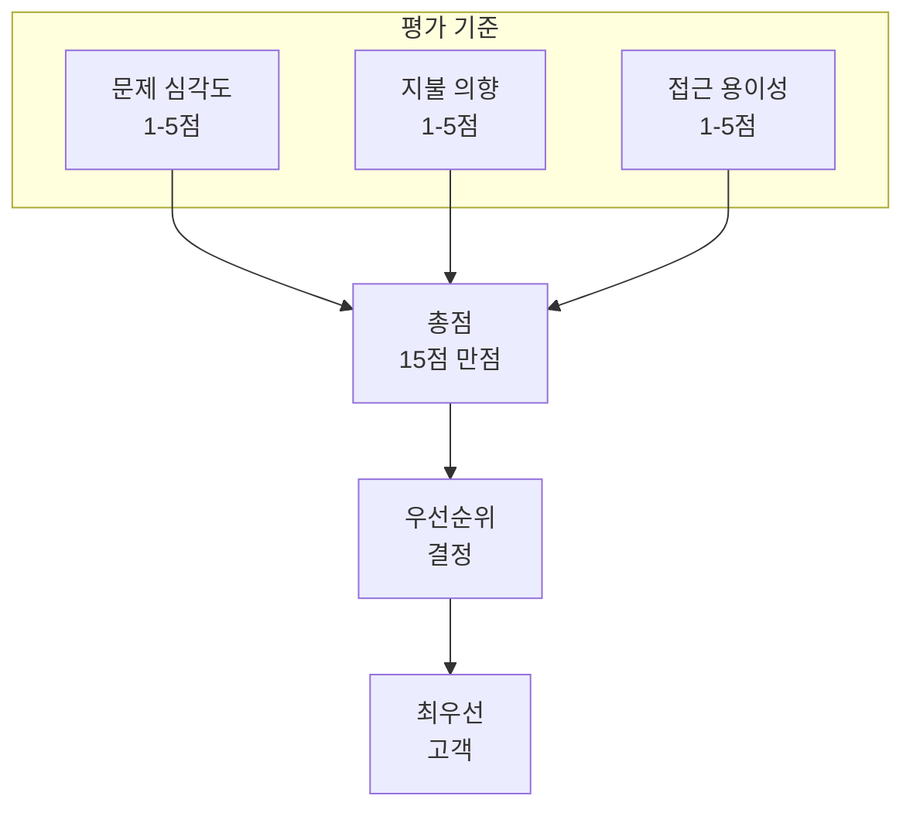

| 고객 유형 | 문제 심각도 | 지불 의향 | 접근 용이성 | 총점 | 우선순위 |
|----------|------------|----------|-----------|------|---------|
| 중소 제조업체 | 5 | 4 | 5 | 14 | 1 🥇 |
| 대기업 공장 | 3 | 5 | 2 | 10 | 3 |
| 교육 기관 | 2 | 2 | 5 | 9 | 4 |
| 스타트업 | 4 | 3 | 4 | 11 | 2 🥈 |

---

## 3. 가치 제안 (Value Proposition)

### 3.1 가치 제안 캔버스

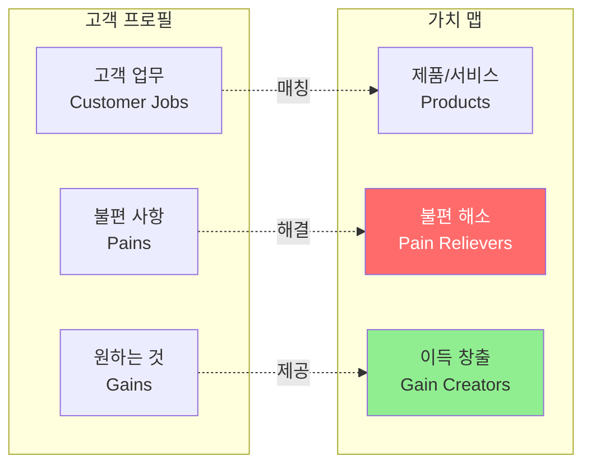

### 3.2 가치 제안 작성 예시

#### 나쁜 예 ❌
```
"최신 AI 기술을 활용한 스마트 로봇 팔 시스템"
```
→ 기술 나열일 뿐, 고객 가치 없음

#### 좋은 예 ✅
```
"불량률 5% → 1%로 줄여서 연 2,400만원 손실을 방지하고,
 검사 인력 50% 절감으로 월 450만원을 절약합니다.
 설치 비용 300만원, 7개월이면 투자 회수!"
```
→ 구체적 숫자, 명확한 이득, 빠른 회수

### 3.3 가치 제안 공식

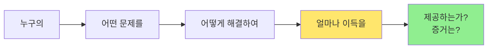

**예시:**
```
[중소 제조업체]의 [육안 검사 오류 문제]를
[AI 비전 + 로봇 팔 자동 분류]로 해결하여
[불량률 80% 감소, 인건비 50% 절감]을 제공합니다.
[시범 운영 3곳에서 평균 불량률 5% → 1% 달성]
```

---

## 4. 수익 모델 (Revenue Streams)

### 4.1 수익 모델 유형

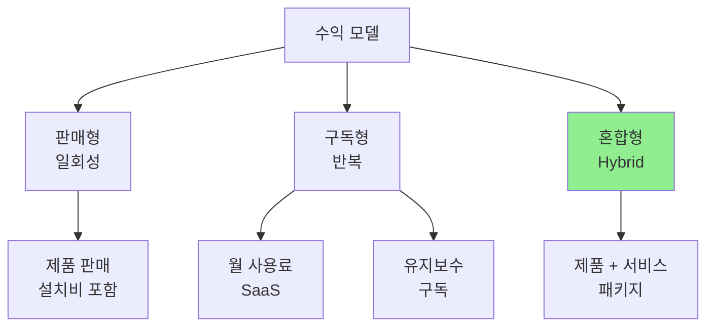

### 4.2 가격 책정 전략

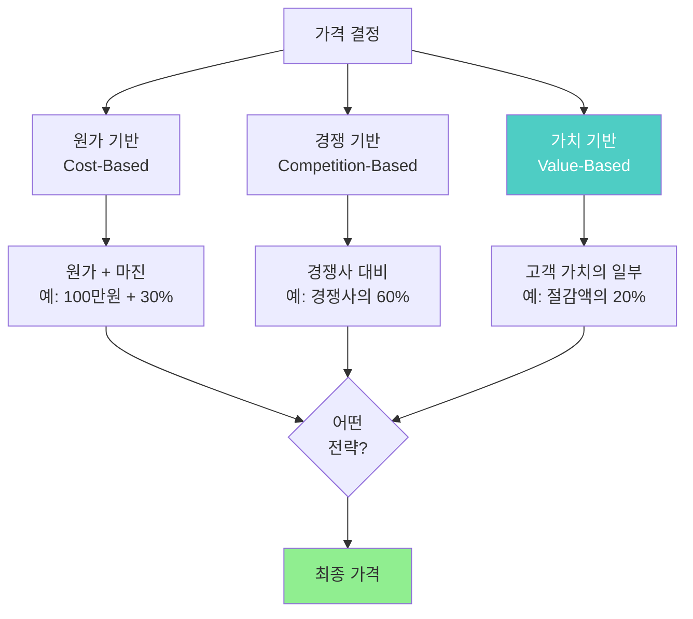

#### 가격 책정 예시

**원가 계산:**
```
재료비:        80만원
노동비:        30만원
간접비:        20만원
총 원가:      130만원

희망 마진:     30% (39만원)
판매가:       169만원 → 170만원
```

**가치 기반 계산:**
```
고객 절감액:   연 2,400만원
절감액 20%:    연 480만원
1회 판매가:    300만원 (7.5개월 회수)
```

**최종 가격:**
- 교육용: 30만원 (원가 + 최소 마진)
- 중소기업: 300만원 (가치 기반)
- 대기업: 500만원 (커스터마이징 포함)

### 4.3 수익 시뮬레이션

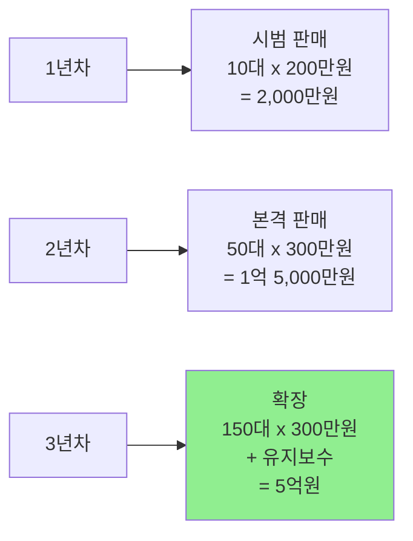

---

## 5. 비용 구조 (Cost Structure)

### 5.1 비용 분류

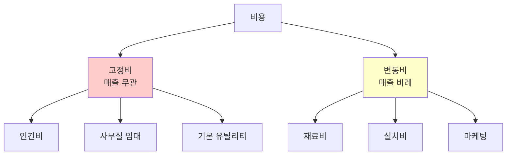

### 5.2 상세 비용 분석

| 비용 항목 | 금액 | 분류 | 비고 |
|----------|------|------|------|
| **개발비** |  |  |  |
| - R&D 인건비 | 500만원 | 초기 | 3개월 개발 |
| - 프로토타입 재료 | 100만원 | 초기 | 3회 제작 |
| **제조비 (대당)** |  |  |  |
| - 로봇 팔 | 12만원 | 변동 | 도매 구매 |
| - 아두이노/센서 | 3만원 | 변동 |  |
| - 스마트폰 거치대 | 2만원 | 변동 |  |
| - 포장/매뉴얼 | 1만원 | 변동 |  |
| **운영비 (월)** |  |  |  |
| - 사무실 | 50만원 | 고정 | 공유 오피스 |
| - 통신/유틸리티 | 10만원 | 고정 |  |
| - 마케팅 | 100만원 | 변동 | 판매 비례 |
| **기타** |  |  |  |
| - 법인 설립 | 50만원 | 초기 | 1회 |
| - 특허 출원 | 100만원 | 초기 | 선택 |

### 5.3 손익분기점 (BEP) 분석

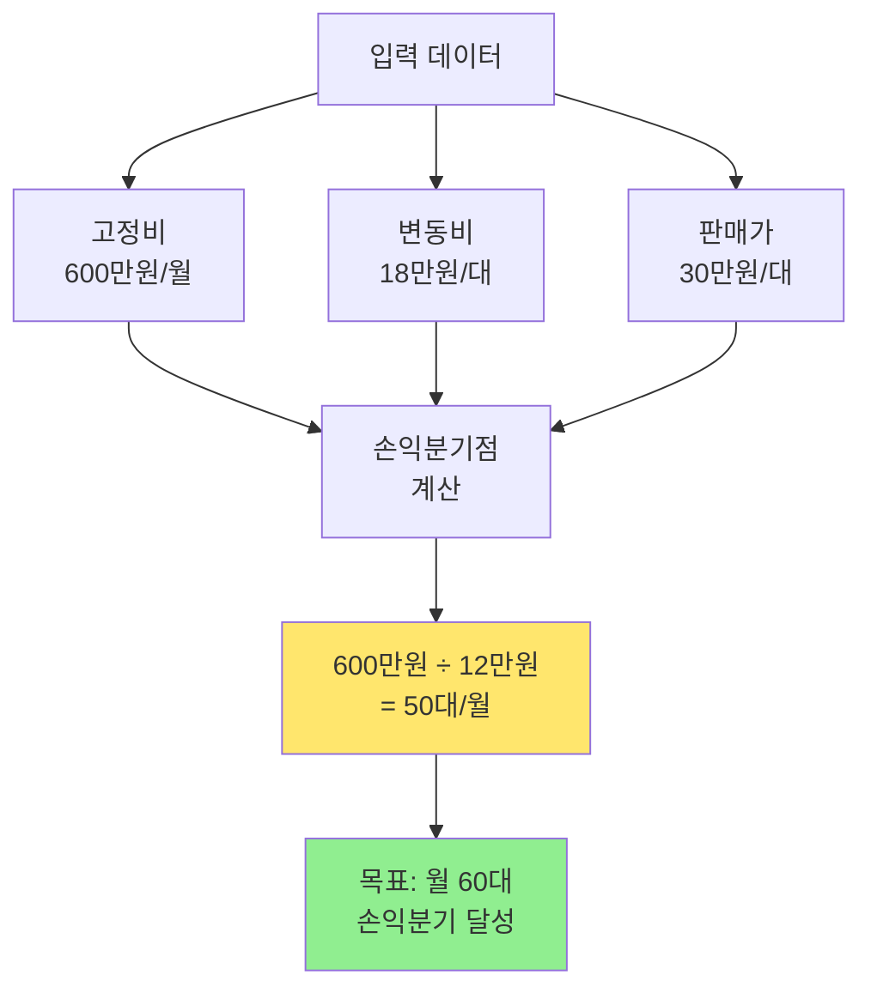

**손익분기점 계산:**
```
기여이익 = 판매가 - 변동비
        = 30만원 - 18만원
        = 12만원/대

손익분기점 = 고정비 ÷ 기여이익
          = 600만원 ÷ 12만원
          = 50대/월
```

---

## 6. 시장 조사 및 경쟁 분석

### 6.1 TAM-SAM-SOM 분석

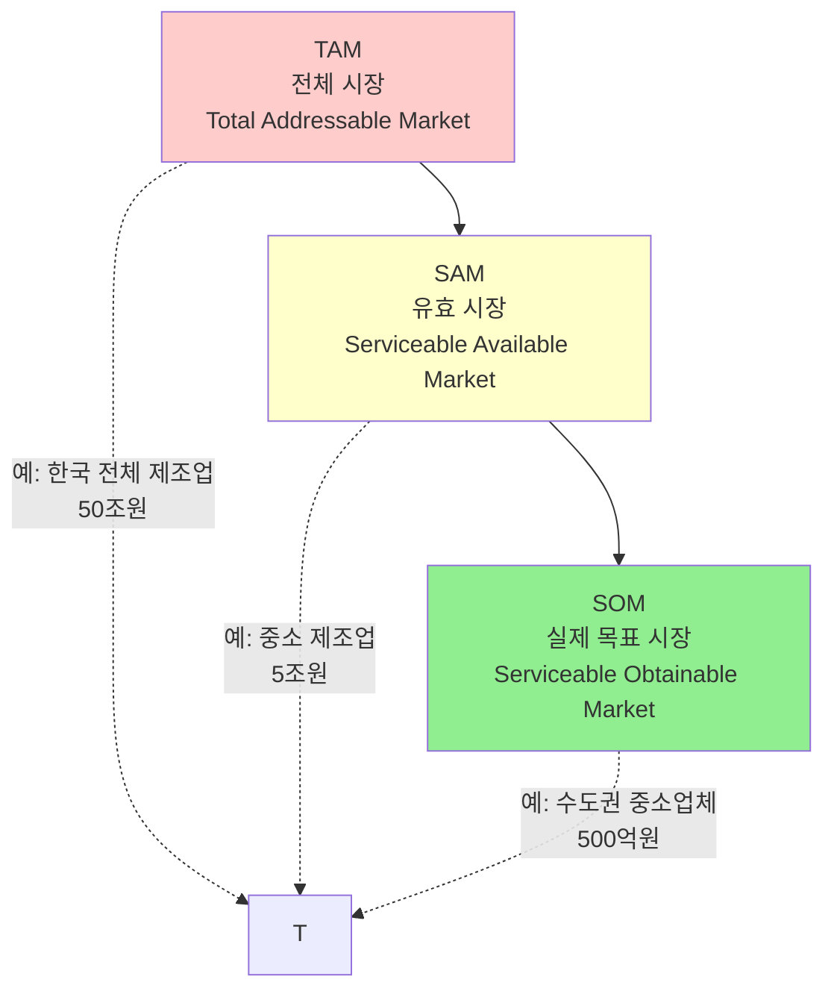

#### 시장 규모 추정 예시

```markdown
## 시장 규모 추정

### TAM (전체 잠재 시장)
- 한국 제조업체 수: 약 10만개
- 평균 품질 검사 비용: 연 3,000만원
- TAM = 10만 x 3,000만원 = 3조원

### SAM (실제 접근 가능 시장)
- 직원 10-100명 중소 제조업체: 약 3만개
- 우리 제품 적용 가능: 70% (2.1만개)
- SAM = 2.1만 x 3,000만원 x 10% (교체율) = 630억원

### SOM (3년 내 목표 시장)
- 1년차 목표: 수도권 50개 업체 = 1.5억원
- 2년차 목표: 전국 200개 업체 = 6억원
- 3년차 목표: 500개 업체 = 15억원
```

### 6.2 경쟁 분석

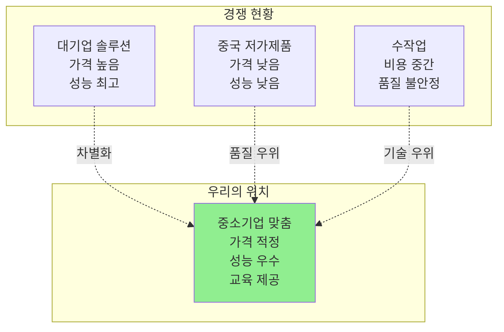

#### 경쟁 매트릭스

| 요소 | 대기업 (A사) | 중국 제품 (B사) | 수작업 | 우리 제품 |
|------|-------------|---------------|--------|----------|
| **가격** | 500만원 | 50만원 | 인건비 300만원/년 | 250만원 |
| **정확도** | 98% | 70% | 85% | 92% |
| **설치** | 전문가 필요 | 어려움 | - | 쉬움 (DIY) |
| **커스터마이징** | 제한적 | 불가능 | 유연 | 가능 |
| **사후지원** | 유료 | 없음 | - | 6개월 무료 |
| **교육** | 없음 | 없음 | - | 교육 프로그램 |

### 6.3 SWOT 분석

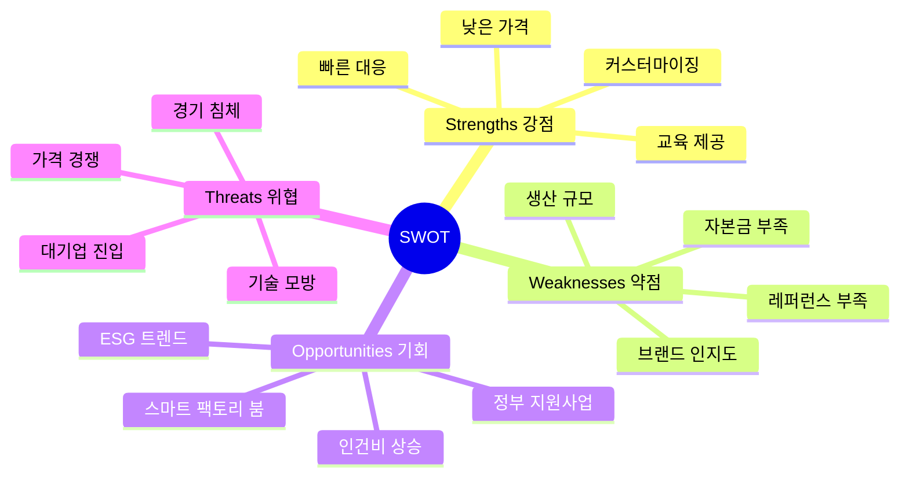

---

## 7. 고객 획득 전략 (Go-to-Market)

### 7.1 마케팅 퍼널

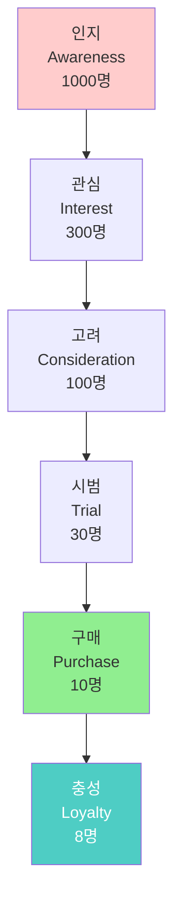

### 7.2 채널 전략

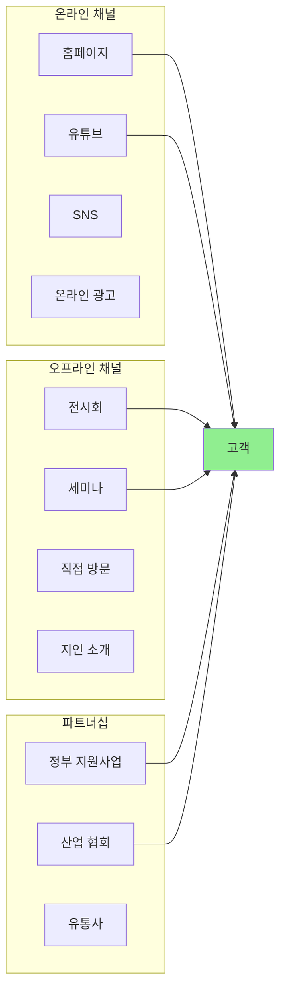

### 7.3 론칭 로드맵

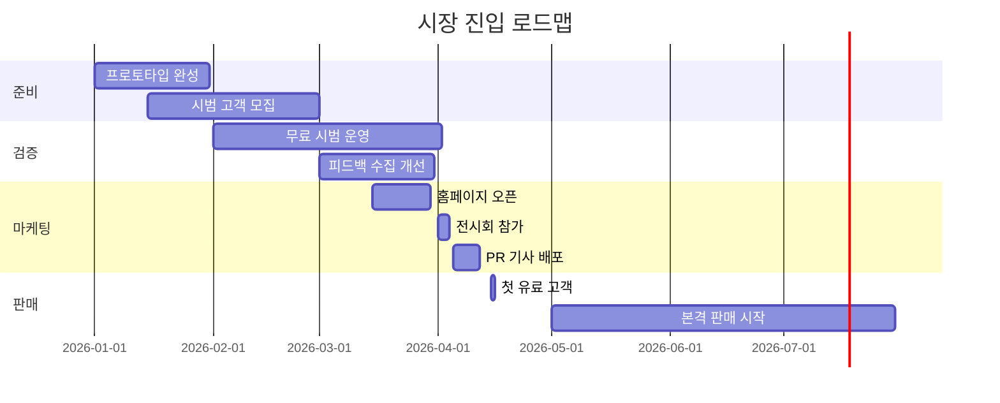

---

## 8. 피칭 (Pitching) 기술

### 8.1 피칭 구조

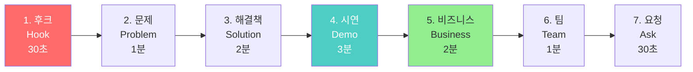

### 8.2 피칭 스크립트 템플릿

```markdown
# 10분 피칭 스크립트

## 1. 후크 (30초)
"여러분의 공장에서 매년 2,400만원이 사라지고 있다면 믿으시겠습니까?
바로 불량품을 걸러내지 못해 생기는 손실입니다."

## 2. 문제 (1분)
"중소 제조업체의 70%는 여전히 사람 눈으로 불량을 검사합니다.
하지만 사람은 피곤하고, 기준이 모호하며, 실수를 합니다.
결과적으로 불량률 5%, 연간 손실 2,400만원.
검사 인력 3명에 월 900만원을 쓰고 있습니다."

## 3. 해결책 (2분)
"저희는 스마트폰 AI와 로봇 팔로 이 문제를 해결합니다.
스마트폰 카메라가 불량을 99% 정확도로 찾아내고,
로봇 팔이 자동으로 분류합니다.

특별한 점은,
- 설치가 쉽습니다. 공장 라인 중단 없이 2시간.
- 학습이 쉽습니다. 불량 사진 100장이면 충분.
- 가격이 저렴합니다. 대기업 제품의 절반."

## 4. 시연 (3분)
[실제 시연]
"지금 보시는 것처럼, 불량품이 지나가면...
1초 만에 인식, 2초 만에 분류합니다."

## 5. 비즈니스 (2분)
"시장 규모는 630억원.
우리의 3년 목표는 500개 업체, 매출 15억원입니다.

가격은 250만원, 원가는 100만원.
고객은 7개월이면 투자를 회수합니다.

이미 3곳에서 시범 운영 중이며,
모두 불량률이 80% 감소했습니다."

## 6. 팀 (1분)
"저희 팀은 4명입니다.
- 김팀장: 10년차 제조업 경험
- 이개발: AI 석사, 3년 경력
- 박기계: 로봇 공학 전공
- 최사업: 스타트업 3회 경험

## 7. 요청 (30초)
"저희는 시드 투자 5,000만원을 찾고 있습니다.
생산 설비 구축과 마케팅에 사용하여,
1년 내 100개 업체 공급을 목표로 합니다.
함께하시겠습니까?"
```

### 8.3 피칭 시 주의사항

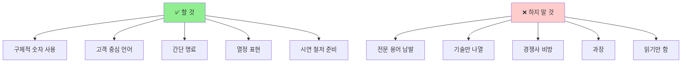

---

## 9. 지속가능성 평가

### 9.1 ESG 관점

```mermaid
mindmap
  root((ESG))
    Environmental 환경
      에너지 효율
      재료 선택
      수명 주기
      재활용
    Social 사회
      노동자 안전
      일자리 영향
      교육 제공
      지역 기여
    Governance 지배구조
      투명 경영
      윤리 경영
      데이터 보호
      법규 준수
```

### 9.2 지속가능성 체크리스트

#### 환경적 지속가능성

- [ ] **에너지 효율**: 평균 소비 전력 < 50W
- [ ] **재료 선택**: 재활용 가능 플라스틱 80%
- [ ] **수명**: 최소 5년 이상 사용 가능
- [ ] **폐기**: 분리수거 가능한 구조
- [ ] **탄소 발자국**: 제조-운영-폐기 전 과정 측정

#### 사회적 지속가능성

- [ ] **안전성**: 작업자 안전 인증 (CE, KC)
- [ ] **일자리**: 단순 대체가 아닌 고부가가치 일자리 창출
- [ ] **교육**: 무료 교육 프로그램 제공
- [ ] **접근성**: 중소기업도 구매 가능한 가격
- [ ] **지역 기여**: 지역 부품 50% 이상 사용

#### 경제적 지속가능성

- [ ] **수익성**: 2년 내 흑자 달성
- [ ] **확장성**: 다른 산업 적용 가능
- [ ] **경쟁력**: 5년 후에도 경쟁 우위 유지 전략
- [ ] **위기 대응**: 경기 침체 시 생존 전략
- [ ] **혁신**: 지속적 R&D 투자 (매출의 10%)

---

## 10. 공모전 제출 자료

### 10.1 사업계획서 구조

```markdown
# 사업계획서 목차

## 1. 요약 (Executive Summary)
- 한 페이지에 전체 내용 요약
- 투자자가 1분 안에 이해 가능

## 2. 문제 정의
- 시장 조사 데이터
- 고객 인터뷰 결과
- 문제의 심각성 증빙

## 3. 해결책
- 기술 개요 (비전문가도 이해 가능)
- 차별점
- 시연 영상 링크

## 4. 시장 분석
- TAM-SAM-SOM
- 경쟁 분석
- SWOT

## 5. 비즈니스 모델
- 비즈니스 모델 캔버스
- 수익 모델
- 가격 전략

## 6. 마케팅 전략
- 고객 획득 계획
- 채널 전략
- 마일스톤

## 7. 재무 계획
- 3년 손익 예측
- 현금 흐름
- 필요 자금 및 사용 계획

## 8. 팀 소개
- 핵심 멤버
- 역할 분담
- 경험 및 역량

## 9. 로드맵
- 개발 일정
- 시장 진입 계획
- 주요 마일스톤

## 10. 부록
- 특허/인증
- 파트너십 MOU
- 시범 운영 결과
```

### 10.2 제출 체크리스트

```mermaid
graph TD
    CHECK1[✅ 문서 완성도] --> C1[맞춤법/오타 검토]
    CHECK1 --> C2[일관된 서식]
    CHECK1 --> C3[페이지 번호]
    
    CHECK2[✅ 내용 완성도] --> C4[숫자 검증]
    CHECK2 --> C5[출처 명시]
    CHECK2 --> C6[논리적 흐름]
    
    CHECK3[✅ 시각 자료] --> C7[고화질 이미지]
    CHECK3 --> C8[명확한 그래프]
    CHECK3 --> C9[시연 영상]
    
    CHECK4[✅ 제출 요건] --> C10[파일 형식]
    CHECK4 --> C11[용량 제한]
    CHECK4 --> C12[마감 시간]
```

---

## 11. 실전 예시: 불량품 검사 시스템

### 11.1 완성된 비즈니스 모델 캔버스

```markdown
## 비즈니스 모델 캔버스: SmartQC (가상 회사명)

### 1. 핵심 파트너
- 로봇 팔 제조사 (OEM 공급)
- 제조업 협회 (홍보 협력)
- 정부 (스마트 팩토리 지원사업)
- 교육 기관 (연구 협력)

### 2. 핵심 활동
- AI 모델 커스터마이징 (고객 맞춤 학습)
- 시스템 설치 및 교육
- 사후 관리 및 업데이트
- 신규 시장 개척

### 3. 핵심 자원
- AI 기술 및 노하우
- 고객 데이터베이스
- 설치 기술자 팀
- 브랜드 (레퍼런스)

### 4. 가치 제안
**중소 제조업체의 불량률을 80% 줄이고,
검사 인력을 50% 절감하여,
7개월 만에 투자를 회수하게 합니다.**

특징:
- 쉬운 설치 (2시간)
- 저렴한 가격 (250만원)
- 무료 교육 제공
- 6개월 무상 AS

### 5. 고객 관계
- 무료 시범 운영 (1개월)
- 전담 CS 매니저 배정
- 분기별 방문 점검
- 온라인 커뮤니티 운영

### 6. 채널
- 직접 영업 (B2B)
- 제조업 전시회
- 정부 지원사업 연계
- 고객 추천 (레퍼럴 보상)

### 7. 고객 세그먼트
**주 고객**: 직원 10-100명 중소 제조업체
- 식품, 전자, 기계 부품
- 불량률 3% 이상
- 수도권 위주

### 8. 비용 구조
고정비 (월): 600만원
- 인건비 400만원 (4명)
- 사무실 100만원
- 기타 100만원

변동비 (대당): 100만원
- 재료비 80만원
- 설치비 20만원

### 9. 수익원
- 시스템 판매: 250만원/대
- 유지보수 (선택): 10만원/월
- 교육 프로그램: 50만원/회
- 데이터 분석 서비스: 20만원/월

**매출 목표 (3년)**:
- 1년차: 50대 = 1.25억원
- 2년차: 200대 = 5억원
- 3년차: 500대 = 12.5억원
```

---

## 12. 마무리: 비즈니스 마인드셋

```mermaid
mindmap
  root((비즈니스<br/>사고))
    고객 중심
      항상 고객 관점
      문제 해결이 우선
      가치 창출
    숫자로 말하기
      추측 금지
      데이터 기반
      측정 가능
    실행과 검증
      빠른 시도
      빠른 실패
      빠른 학습
    지속가능성
      환경 고려
      사회 기여
      윤리 경영
```

### 핵심 원칙 3가지

1. **기술은 수단, 가치가 목적**
   - "AI를 만들었다" ❌
   - "불량률을 80% 줄였다" ✅

2. **추측이 아닌 검증**
   - "아마 팔릴 것이다" ❌
   - "3곳에서 시범 운영 성공" ✅

3. **완벽보다 실행**
   - "완벽해지면 출시" ❌
   - "출시하고 개선" ✅

---

## 다음 단계

- **06_공모전_전략.md**: 공모전 준비 및 발표 전략
- **07_평가_루브릭.md**: 비즈니스 모델 평가 기준
- **README.md**: 프로젝트 전체 가이드
