# 프로젝트 아이디어 모음 (Teachable Machine 활용)

## 개요

이 문서는 **Teachable Machine**을 활용하여 쉽게 구현할 수 있는 다양한 스마트 팩토리 & 로봇 팔 프로젝트 아이디어를 제공합니다.

### Teachable Machine의 장점

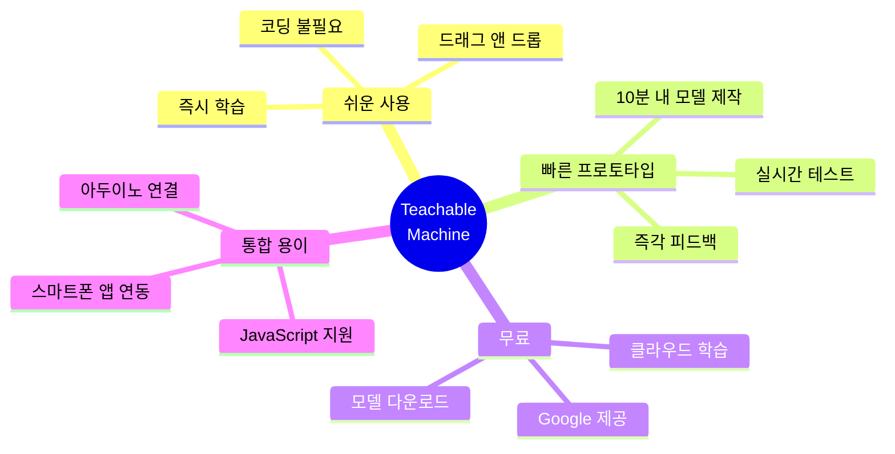

---

## 난이도별 프로젝트 분류

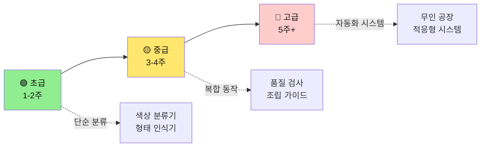

---

## 🟢 초급 프로젝트 (1-2주)

### 프로젝트 1: 색상 블록 분류기

#### 문제 정의
```
공장에서 다양한 색상의 부품을 수작업으로 분류하는데 
시간이 오래 걸리고 실수가 발생합니다.
```

#### 시스템 구성

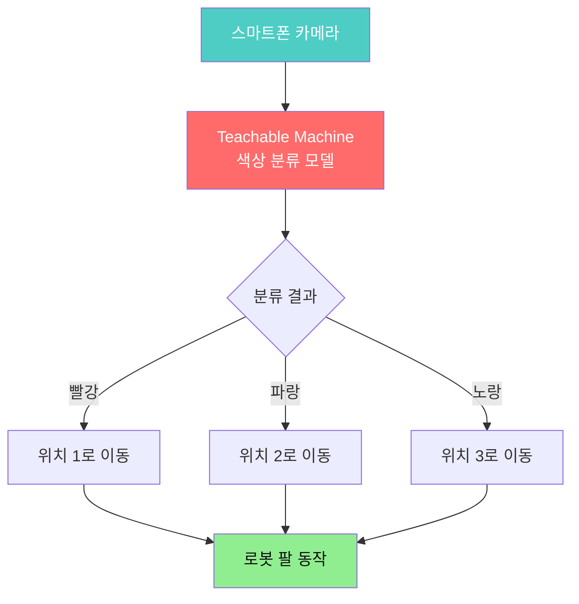

#### 구현 단계

| 단계 | 활동 | 소요 시간 | 결과물 |
|------|------|----------|--------|
| 1 | **데이터 수집** | 30분 | - 빨강 블록 50장<br/>- 파랑 블록 50장<br/>- 노랑 블록 50장 |
| 2 | **모델 학습** | 10분 | Teachable Machine 모델<br/>(정확도 > 95%) |
| 3 | **모델 내보내기** | 5분 | - TensorFlow Lite<br/>- 또는 클라우드 링크 |
| 4 | **앱 연동** | 2시간 | 스마트폰 앱에서 실시간 인식 |
| 5 | **로봇 팔 제어** | 3시간 | Bluetooth로 위치 명령 전송 |
| 6 | **통합 테스트** | 1시간 | 완성된 분류 시스템 |

#### Teachable Machine 학습 가이드

```markdown
## Teachable Machine 사용법

### 1. 웹사이트 접속
- https://teachablemachine.withgoogle.com/
- "Get Started" 클릭
- "Image Project" 선택

### 2. 클래스 생성
- Class 1: "Red Block"
- Class 2: "Blue Block"  
- Class 3: "Yellow Block"

### 3. 이미지 수집
- 각 클래스당 웹캠으로 50-100장 촬영
- 다양한 각도, 조명에서 촬영
- 배경 변화도 포함

### 4. 학습
- "Train Model" 버튼 클릭
- 2-3분 대기
- 정확도 확인

### 5. 테스트
- 웹캠으로 실시간 테스트
- 오인식 시 더 많은 이미지 추가

### 6. 내보내기
- "Export Model" 클릭
- "TensorFlow Lite" 선택 (스마트폰용)
- 또는 "Upload" (클라우드 링크)
```

#### 코드 예시 (JavaScript - 스마트폰 앱)

```javascript
// Teachable Machine 모델 로드
const URL = "https://teachablemachine.withgoogle.com/models/YOUR_MODEL_ID/";
let model, webcam, maxPredictions;

async function init() {
    const modelURL = URL + "model.json";
    const metadataURL = URL + "metadata.json";
    
    // 모델 로드
    model = await tmImage.load(modelURL, metadataURL);
    maxPredictions = model.getTotalClasses();
    
    // 웹캠 설정
    webcam = new tmImage.Webcam(200, 200, true);
    await webcam.setup();
    await webcam.play();
    
    window.requestAnimationFrame(loop);
}

async function loop() {
    webcam.update();
    await predict();
    window.requestAnimationFrame(loop);
}

async function predict() {
    const prediction = await model.predict(webcam.canvas);
    
    // 가장 높은 확률의 클래스 찾기
    let maxProb = 0;
    let resultClass = "";
    
    for (let i = 0; i < maxPredictions; i++) {
        if (prediction[i].probability > maxProb) {
            maxProb = prediction[i].probability;
            resultClass = prediction[i].className;
        }
    }
    
    // 신뢰도가 80% 이상일 때만 동작
    if (maxProb > 0.8) {
        sendToArduino(resultClass);
    }
}

function sendToArduino(color) {
    // Bluetooth로 로봇 팔에 명령 전송
    let position = 0;
    
    if (color === "Red Block") position = 1;
    else if (color === "Blue Block") position = 2;
    else if (color === "Yellow Block") position = 3;
    
    // Bluetooth 전송
    bluetooth.send(`MOVE:${position}\n`);
}
```

#### 확장 아이디어

- ✅ 더 많은 색상 추가 (5-10가지)
- ✅ 크기별 분류 추가
- ✅ 카운팅 기능 (각 색상별 개수 표시)
- ✅ 데이터베이스 저장 (일일 통계)

---

### 프로젝트 2: 제품 형태 분류기

#### 문제 정의
```
동일한 색상이지만 형태가 다른 부품(원형, 사각형, 삼각형)을
빠르게 분류해야 합니다.
```

#### 데이터 수집 전략

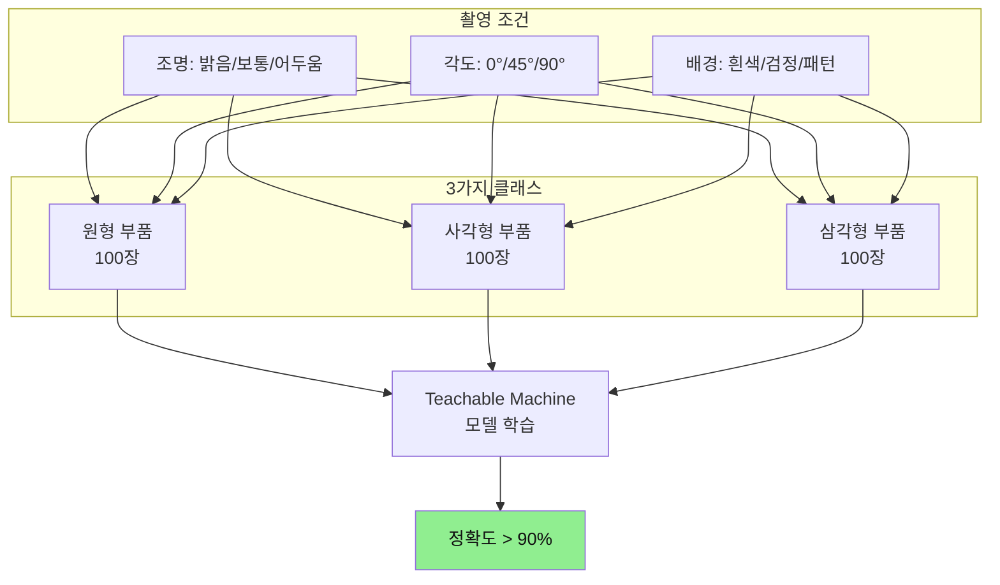

#### 비즈니스 가치

| 지표 | 수작업 | AI 자동화 | 개선율 |
|------|--------|----------|--------|
| 분류 속도 | 10개/분 | 30개/분 | **200% ↑** |
| 정확도 | 85% | 95% | **10%p ↑** |
| 인건비 | 월 200만원 | 초기 30만원 | **연 2,400만원 절감** |
| 피로도 | 높음 | 없음 | **작업 만족도 ↑** |

---

### 프로젝트 3: 조립 완성도 검사

#### 문제 정의
```
제품 조립 후 육안으로 완성도를 체크하는데,
빠뜨린 부품이나 잘못 조립된 경우를 놓칩니다.
```

#### 시스템 흐름

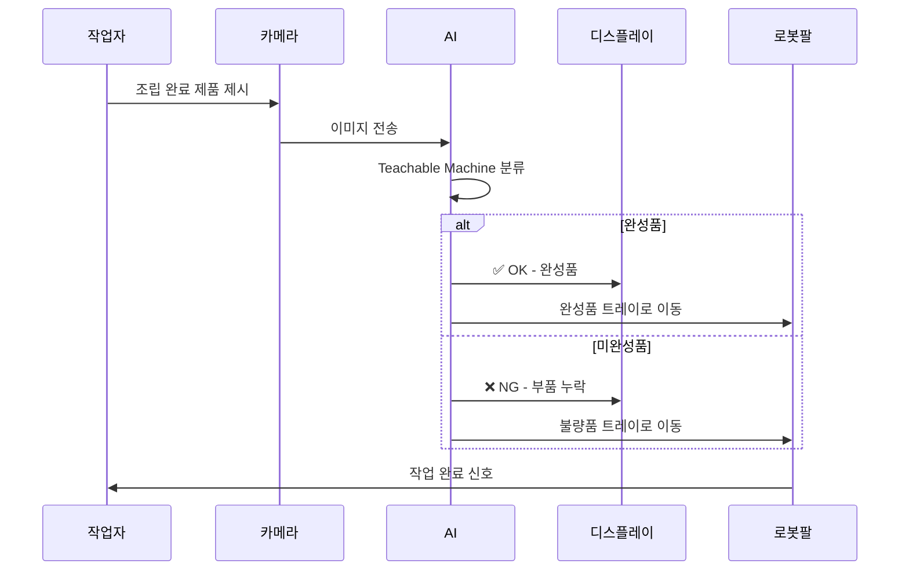

#### 학습 클래스 구성

| 클래스 | 설명 | 이미지 수 | 특징 |
|--------|------|----------|------|
| **완성품** | 모든 부품 조립 완료 | 150장 | 정상 상태 |
| **부품 누락** | 1개 이상 부품 없음 | 100장 | 명확한 차이 |
| **잘못된 조립** | 부품이 잘못된 위치 | 100장 | 비정상 형태 |
| **뒤집힌 상태** | 제품이 거꾸로 | 50장 | 회전 오류 |

---

## 🟡 중급 프로젝트 (3-4주)

### 프로젝트 4: 불량품 검사 시스템

#### 문제 정의
```
제품 표면의 긁힘, 오염, 변색을 육안으로 검사하기 어렵고
검사 기준이 사람마다 다릅니다.
```

#### 고급 데이터 수집 전략

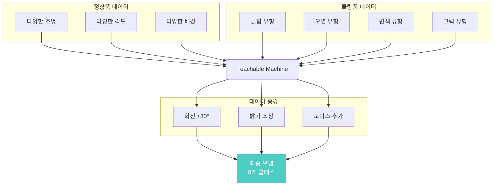

#### 성능 개선 팁

```markdown
## 불량 검사 정확도 높이는 방법

### 1. 데이터 품질 개선
- ❌ 나쁜 예: 흐릿한 사진, 멀리서 촬영
- ✅ 좋은 예: 선명한 사진, 불량 부위 클로즈업

### 2. 조명 표준화
- 일정한 조명 환경 구축
- LED 링 라이트 사용
- 역광 제거

### 3. 배경 단순화
- 단색 배경 사용 (흰색 또는 검정)
- 반사 제거
- 그림자 최소화

### 4. 클래스 세분화
- ❌ "불량품" 하나의 클래스
- ✅ "긁힘", "오염", "변색" 개별 클래스

### 5. 더 많은 데이터
- 클래스당 최소 200장
- 실제 불량 샘플 직접 촬영
- 다양한 불량 정도 포함
```

#### 통합 시스템 구성

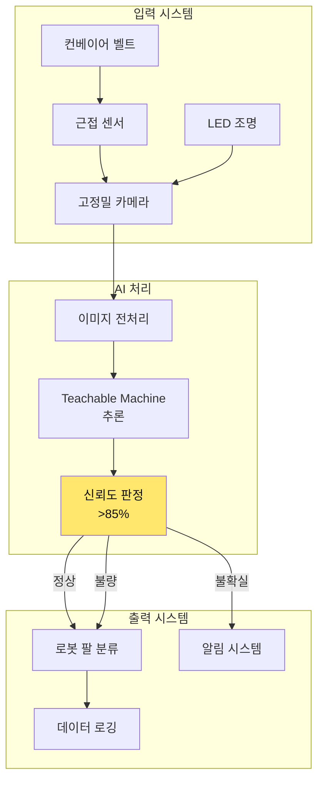

---

### 프로젝트 5: 다단계 조립 가이드 시스템

#### 문제 정의
```
복잡한 조립 순서를 처음 배우는 작업자가
순서를 헷갈려 하고 실수가 잦습니다.
```

#### 시스템 개념

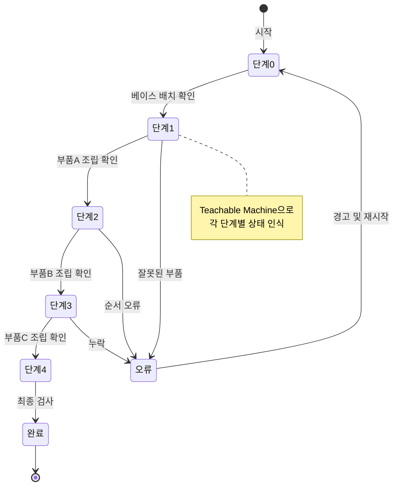

#### 클래스 구조

| 단계 | 클래스 이름 | 학습 이미지 | 설명 |
|------|------------|-----------|------|
| 0 | `empty_base` | 100장 | 빈 베이스만 있는 상태 |
| 1 | `step1_complete` | 100장 | 부품A 조립 완료 |
| 1-오류 | `step1_error` | 50장 | 잘못된 부품 또는 위치 |
| 2 | `step2_complete` | 100장 | 부품A+B 조립 완료 |
| 2-오류 | `step2_error` | 50장 | 부품B 누락 또는 오류 |
| 3 | `step3_complete` | 100장 | 부품A+B+C 조립 완료 |
| 3-오류 | `step3_error` | 50장 | 부품C 오류 |
| 완료 | `final_product` | 150장 | 완성된 제품 |

#### 인터페이스 설계

```markdown
## 작업자 화면 UI

┌─────────────────────────────────────┐
│  조립 가이드 시스템            [3/5] │
├─────────────────────────────────────┤
│                                     │
│    [카메라 미리보기 화면]            │
│                                     │
│         현재 상태 인식 중...         │
│                                     │
├─────────────────────────────────────┤
│  ✅ 단계 1: 베이스 배치 - 완료      │
│  ✅ 단계 2: 부품 A 조립 - 완료      │
│  ⏳ 단계 3: 부품 B 조립 - 진행 중   │
│  ⬜ 단계 4: 부품 C 조립             │
│  ⬜ 단계 5: 최종 검사               │
├─────────────────────────────────────┤
│  💡 안내: 부품 B를 왼쪽 슬롯에      │
│           끼워 주세요               │
│                                     │
│  ⚠️ 주의: 방향을 확인하세요!        │
└─────────────────────────────────────┘
```

---

### 프로젝트 6: 재고 관리 시스템

#### 문제 정의
```
창고에 쌓인 박스를 일일이 확인하여
재고를 파악하는데 시간이 오래 걸립니다.
```

#### 시스템 흐름

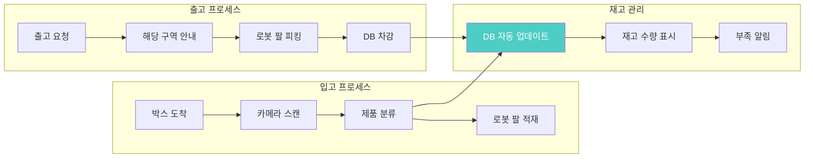

#### Teachable Machine 활용

**인식 클래스 예시:**
- `product_A_box` - 제품 A 박스
- `product_B_box` - 제품 B 박스
- `product_C_box` - 제품 C 박스
- `empty_space` - 빈 공간
- `damaged_box` - 손상된 박스

#### 데이터베이스 연동 코드

```javascript
// Firebase Realtime Database 예시
const database = firebase.database();

async function updateInventory(productClass, action) {
    const ref = database.ref('inventory/' + productClass);
    
    // 현재 재고 수량 가져오기
    const snapshot = await ref.once('value');
    let currentStock = snapshot.val() || 0;
    
    // 입고/출고에 따라 증감
    if (action === 'in') {
        currentStock += 1;
    } else if (action === 'out' && currentStock > 0) {
        currentStock -= 1;
    }
    
    // 업데이트
    await ref.set(currentStock);
    
    // 재고 부족 알림 (5개 미만)
    if (currentStock < 5) {
        sendAlert(`${productClass} 재고 부족: ${currentStock}개 남음`);
    }
    
    // 로그 기록
    database.ref('logs').push({
        product: productClass,
        action: action,
        quantity: currentStock,
        timestamp: Date.now()
    });
}
```

---

## 🔴 고급 프로젝트 (5주+)

### 프로젝트 7: 적응형 품질 관리 시스템

#### 문제 정의
```
제품 종류가 자주 바뀌는 공장에서
매번 새로운 검사 기준을 만들어야 합니다.
```

#### 고급 기능

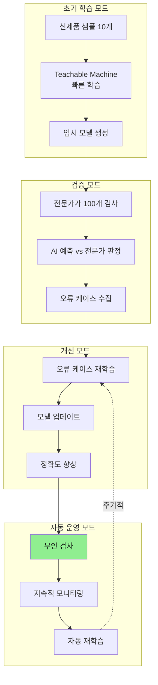

#### 구현 핵심 기술

1. **Few-shot Learning** (적은 데이터로 학습)
2. **Active Learning** (불확실한 케이스 우선 학습)
3. **Model Versioning** (모델 버전 관리)
4. **A/B Testing** (새 모델 vs 기존 모델)

---

### 프로젝트 8: 멀티모달 검사 시스템

#### 문제 정의
```
시각적으로만 판단하기 어려운 불량
(소리, 무게, 온도 등 복합 판정 필요)
```

#### 시스템 구성

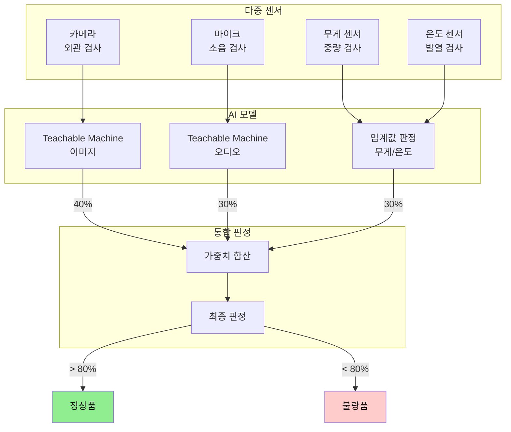

#### Teachable Machine 오디오 모델 활용

```markdown
## 소음 기반 불량 검사

### 1. Teachable Machine Audio Project
- "Audio Project" 선택
- 마이크로 소리 녹음

### 2. 클래스 구성
- `normal_sound`: 정상 작동음 (100개 샘플)
- `abnormal_vibration`: 비정상 진동음 (50개)
- `clicking_sound`: 부품 헐거움 (50개)
- `no_sound`: 무음 (오동작) (30개)

### 3. 녹음 팁
- 1초 클립으로 녹음
- 배경 소음 최소화
- 마이크를 제품에 가까이
- 다양한 작동 상태에서 녹음

### 4. 통합
- JavaScript로 실시간 소리 분석
- 카메라 + 오디오 동시 판정
- 신뢰도 가중 평균
```

---

### 프로젝트 9: 협업 로봇 안전 시스템

#### 문제 정의
```
작업자와 로봇이 같은 공간에서 일할 때
충돌 위험이 있습니다.
```

#### 안전 시스템 구조

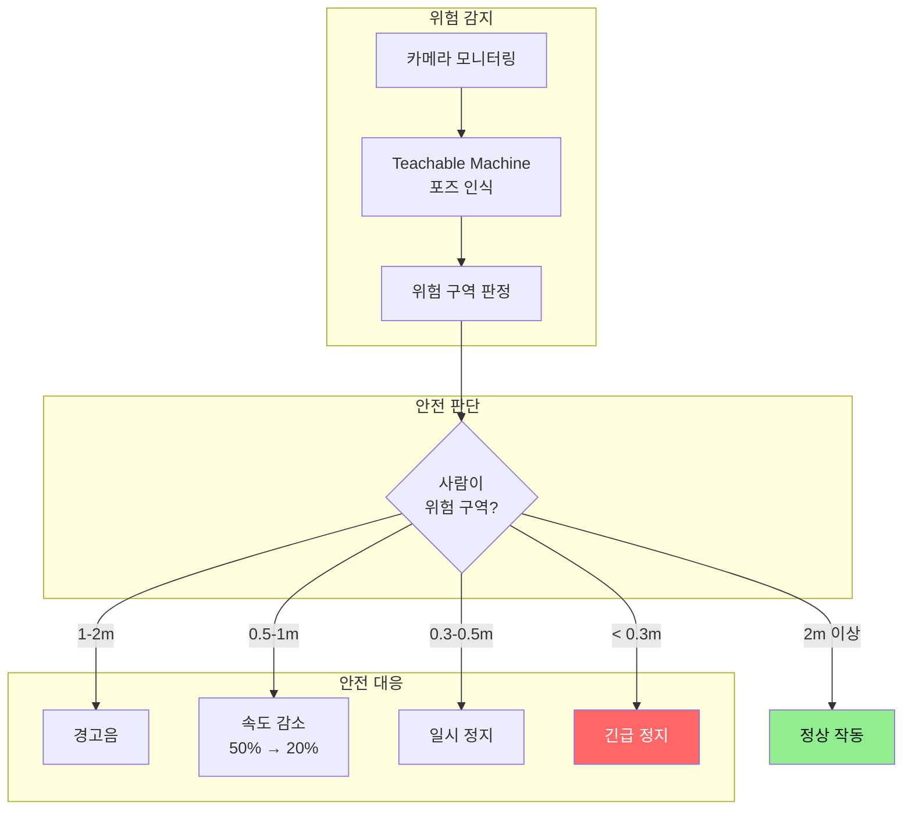

#### Teachable Machine Pose Project 활용

**인식 클래스:**
- `person_safe_zone` - 안전 거리 유지
- `person_warning_zone` - 경고 구역 진입
- `person_danger_zone` - 위험 구역 진입
- `hand_near_robot` - 손이 로봇 가까이
- `no_person` - 사람 없음

---

## 💡 프로젝트 선택 가이드

### 난이도 vs 임팩트 매트릭스

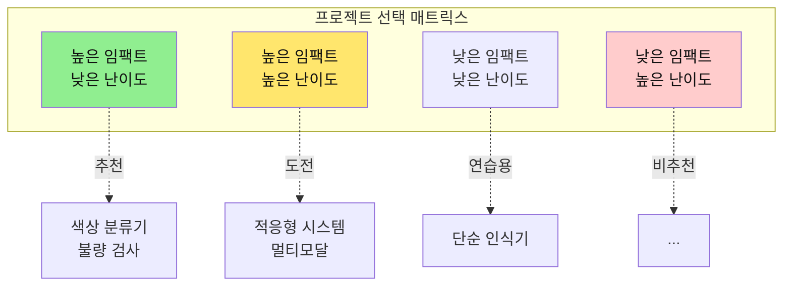

### 팀 역량별 추천

| 팀 구성 | 추천 프로젝트 | 이유 |
|---------|-------------|------|
| **초보자 중심** | 색상 블록 분류기 | 빠른 성공 경험, 자신감 up |
| **프로그래밍 가능** | 불량품 검사 시스템 | 데이터 처리, 통합 경험 |
| **기계 제작 가능** | 조립 가이드 시스템 | 하드웨어 + AI 통합 |
| **비즈니스 관심** | 재고 관리 시스템 | 명확한 ROI, 사업화 가능 |
| **고급 팀** | 적응형/멀티모달 | 차별화된 기술, 공모전 우위 |

---

## 🛠️ 공통 구현 가이드

### 1. Teachable Machine → 스마트폰 연동

```markdown
## Android 앱 연동 (Kotlin)

### build.gradle 설정
```gradle
dependencies {
    // TensorFlow Lite
    implementation 'org.tensorflow:tensorflow-lite:2.13.0'
    implementation 'org.tensorflow:tensorflow-lite-support:0.4.4'
    
    // CameraX
    implementation "androidx.camera:camera-camera2:1.3.0"
    implementation "androidx.camera:camera-lifecycle:1.3.0"
    implementation "androidx.camera:camera-view:1.3.0"
}
```

### 기본 코드 구조
```kotlin
class ImageClassifier(private val context: Context) {
    private var interpreter: Interpreter? = null
    
    init {
        // TFLite 모델 로드
        val model = loadModelFile("model.tflite")
        interpreter = Interpreter(model)
    }
    
    fun classify(bitmap: Bitmap): String {
        // 이미지 전처리 (224x224)
        val inputBuffer = preprocessImage(bitmap)
        
        // 추론
        val output = Array(1) { FloatArray(3) } // 3개 클래스
        interpreter?.run(inputBuffer, output)
        
        // 결과 해석
        val probabilities = output[0]
        val maxIndex = probabilities.indices.maxByOrNull { probabilities[it] } ?: 0
        
        return classNames[maxIndex]
    }
}
```
```

### 2. 스마트폰 → 아두이노 통신

```markdown
## Bluetooth 통신 프로토콜

### 명령 형식
```
[STX][CMD][DATA][ETX]
```

### 예시 명령어
- `<MOVE:1>` - 위치 1로 이동
- `<GRIP:1>` - 그리퍼 닫기
- `<GRIP:0>` - 그리퍼 열기
- `<HOME>` - 홈 포지션 복귀
- `<STOP>` - 긴급 정지

### Arduino 수신 코드
```cpp
String command = "";

void loop() {
    if (Serial.available() > 0) {
        char c = Serial.read();
        
        if (c == '<') {
            command = "";
        } else if (c == '>') {
            processCommand(command);
            command = "";
        } else {
            command += c;
        }
    }
}

void processCommand(String cmd) {
    if (cmd.startsWith("MOVE:")) {
        int position = cmd.substring(5).toInt();
        moveToPosition(position);
    }
    else if (cmd == "HOME") {
        moveHome();
    }
    // ... 기타 명령 처리
}
```
```

### 3. 성능 최적화 팁

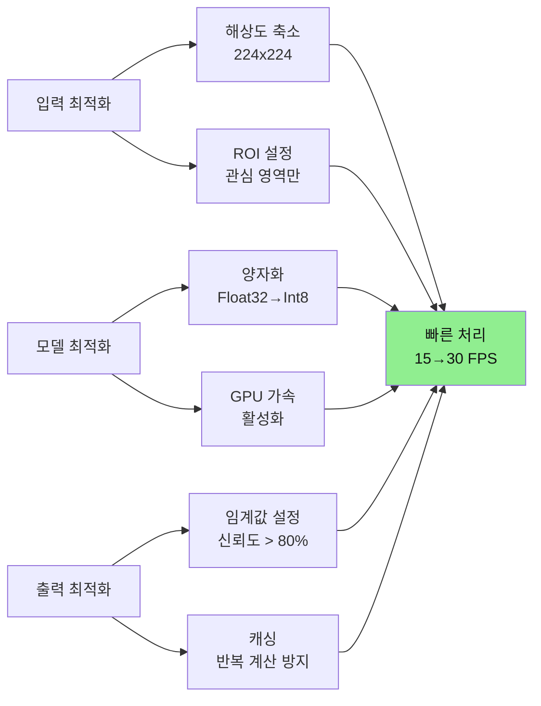

---

## 📊 프로젝트 평가 기준

### 공모전 평가 항목

| 항목 | 비중 | 평가 내용 | 우수 사례 |
|------|------|----------|----------|
| **문제 정의** | 25% | 진짜 문제인가?<br/>측정 가능한가? | 현장 인터뷰, 데이터 기반 |
| **기술 구현** | 25% | 작동하는가?<br/>안정적인가? | 90% 이상 정확도, 실시간 |
| **창의성** | 20% | 차별화되었는가?<br/>독창적인가? | 새로운 접근법, 확장성 |
| **비즈니스** | 20% | 시장성 있는가?<br/>수익 가능한가? | ROI 계산, 시범 운영 |
| **발표** | 10% | 명확한가?<br/>설득력 있는가? | 시연, 숫자 기반 설명 |

### 프로젝트 체크리스트

#### 기술 완성도
- [ ] Teachable Machine 모델 정확도 > 90%
- [ ] 실시간 처리 가능 (< 100ms)
- [ ] 로봇 팔 동작 정상
- [ ] 안정적 통신 (Bluetooth/Wi-Fi)
- [ ] 오류 처리 구현

#### 문서화
- [ ] 문제 정의서 작성
- [ ] 시스템 구조도 완성
- [ ] 사용자 매뉴얼 제공
- [ ] 시연 영상 제작
- [ ] 소스 코드 주석

#### 비즈니스
- [ ] 시장 조사 완료
- [ ] 비용 계산 (BEP)
- [ ] 경쟁 분석
- [ ] 피칭 자료 준비

---

## 🚀 다음 단계

### 프로젝트 시작 순서

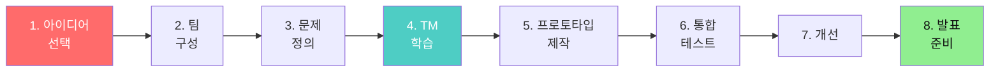

### 추천 학습 자료

1. **Teachable Machine 공식 사이트**
   - https://teachablemachine.withgoogle.com/
   - 튜토리얼 및 예제

2. **TensorFlow Lite 문서**
   - https://www.tensorflow.org/lite
   - 모바일 배포 가이드

3. **Arduino 블루투스 통신**
   - HC-05/06 모듈 사용법
   - 시리얼 통신 프로토콜

4. **Firebase 연동**
   - 실시간 데이터베이스
   - 클라우드 저장소

---

## 💬 FAQ

**Q: Teachable Machine 무료인가요?**
A: 네, 완전 무료입니다. Google이 교육 목적으로 제공합니다.

**Q: 코딩 없이 가능한가요?**
A: Teachable Machine 학습은 코딩 불필요. 하지만 로봇 팔 연동은 기본 코딩 필요.

**Q: 정확도가 낮으면 어떻게 하나요?**
A: 1) 더 많은 이미지 수집, 2) 조명 개선, 3) 클래스 재정의

**Q: 모델을 업데이트할 수 있나요?**
A: 네, 언제든지 재학습하여 새 모델로 교체 가능합니다.

**Q: 인터넷 연결이 필요한가요?**
A: 학습은 클라우드(인터넷 필요). 추론은 TFLite 다운로드 후 오프라인 가능.

---

## 📚 관련 문서

- [00_프로젝트_개요.md](./00_프로젝트_개요.md) - 전체 프로젝트 소개
- [03_바이브_코딩_가이드.md](./03_바이브_코딩_가이드.md) - 개발 방법론
- [04_피지컬AI_학습방법.md](./04_피지컬AI_학습방법.md) - AI 기술 심화
- [05_비즈니스_모델_설계.md](./05_비즈니스_모델_설계.md) - 사업화 전략

---

**행운을 빕니다! 여러분의 창의적인 프로젝트를 기대합니다! 🎉**
