# 앱인벤터 + Teachable Machine 연동 가이드
> **교육용 AI 이미지 분류 앱 제작 완벽 가이드**

## 📌 개요

이 가이드는 **Teachable Machine에서 학습한 이미지 분류 모델**을 **MIT 앱인벤터**에서 사용하는 방법을 단계별로 설명합니다.

### 왜 이 조합인가?

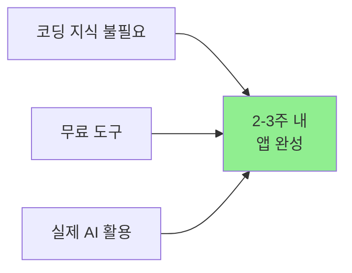

| 장점 | 설명 |
|------|------|
| **접근성** | 비전공자도 블록 코딩으로 AI 앱 제작 가능 |
| **무료** | 모든 도구가 무료 (Google 계정만 필요) |
| **실용성** | 실제 작동하는 AI 앱을 스마트폰에 설치 |
| **확장성** | 아두이노, 블루투스 등과 연동 가능 |

---

## 🌐 참고 자료

### 공식 웹사이트

| 자료 | 링크 | 설명 |
|------|------|------|
| **TMIC 공식 사이트** | [computacaonaescola.ufsc.br/en/tmic](https://computacaonaescola.ufsc.br/en/tmic/) | TMIC Extension 다운로드, 예제 프로젝트 (.aia, .apk) 제공 |
| **TMIC 논문** | [arxiv.org/abs/2208.12637](https://arxiv.org/abs/2208.12637) | TMIC의 기술적 배경 및 구조 설명 |
| **MIT App Inventor 공식** | [appinventor.mit.edu](https://appinventor.mit.edu/explore/resources/ai/image-classification-look-extension) | 공식 이미지 분류 튜토리얼 |
| **Technovation 교육자료** | [technovationchallenge.org](https://technovationchallenge.org/courses/ai-in-action-curriculum/lessons/ai-software-options/) | 단계별 교육 커리큘럼 |
| **TMIC Community** | [community.appinventor.mit.edu](https://community.appinventor.mit.edu/t/tmic-app-inventor-extension-for-the-deployment-of-image-classification-models-exported-from-teachable-machine/64411) | 질문/답변, 문제 해결 |

### 유튜브 튜토리얼

| 영상 제목 | 채널/출처 | 내용 |
|----------|---------|------|
| **Teachable Machine 1: Image Classification** | The Coding Train | TM 기본 사용법 |
| **ML model with TM → App Inventor** | Technovation | TM 모델을 앱인벤터에 통합하는 전체 과정 |
| **Personal Image Classifier Tutorial** | MIT App Inventor | 앱인벤터 PIC Extension 사용법 |
| **Rock, Paper, Scissors 앱 만들기** | Technovation | 실전 프로젝트 예시 |

> **검색 키워드**: "App Inventor Teachable Machine tutorial", "TMIC extension tutorial", "앱인벤터 AI 이미지 분류"

---

## 📦 준비물

### 필수 항목

- [ ] **컴퓨터** (Windows, Mac, Chrome OS 모두 가능)
  - 웹브라우저 (Chrome 권장)
  - 인터넷 연결

- [ ] **Google 계정**
  - Teachable Machine 사용
  - 앱인벤터 사용
  - Google Drive 또는 Firebase (모델 호스팅)

- [ ] **안드로이드 스마트폰**
  - Android 8.0 이상 권장
  - 카메라 기능
  - MIT AI2 Companion 앱 설치

- [ ] **학습용 이미지**
  - 클래스당 50-100장
  - 다양한 조명, 각도, 배경

### 다운로드 파일

- [ ] **TMIC Extension** (.aix 파일)
  - 다운로드: [TMIC 공식 사이트](https://computacaonaescola.ufsc.br/en/tmic/)
  
- [ ] **예제 프로젝트** (선택사항)
  - .aia 파일: 앱인벤터에서 바로 열기
  - .apk 파일: 스마트폰에 직접 설치

---

## 🎯 전체 프로세스 개요

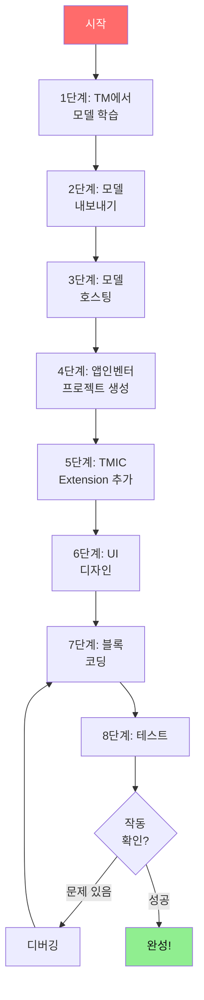

**예상 소요 시간:**
- 1-3단계 (TM 모델 학습): 2-3시간
- 4-7단계 (앱 제작): 2-3시간
- 8단계 (테스트 및 디버깅): 1-2시간
- **총 5-8시간** (초보자 기준)

---

## 1️⃣ 단계 1: Teachable Machine에서 모델 학습

### 1.1 Teachable Machine 접속

1. 웹브라우저에서 [teachablemachine.withgoogle.com](https://teachablemachine.withgoogle.com) 접속
2. **"Get Started"** 클릭
3. **"Image Project"** 선택
4. **"Standard image model"** 선택

### 1.2 클래스 생성 및 이미지 수집

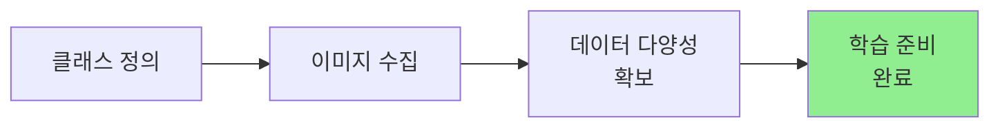

#### 클래스 이름 규칙 (중요!)

✅ **좋은 예시:**
- `class_A`, `class_B`, `class_C`
- `normal`, `defect`
- `red`, `blue`, `yellow`

❌ **피해야 할 예시:**
- `클래스A` (한글)
- `Class A` (공백 포함)
- `Café` (특수문자)

> **주의**: 영문, 숫자, 언더스코어(_)만 사용하세요!

#### 이미지 수집 체크리스트

- [ ] **각 클래스당 최소 50장** (100장 권장)
- [ ] **다양한 조명**: 밝은 곳, 어두운 곳, 그림자
- [ ] **다양한 각도**: 정면, 측면, 45도
- [ ] **다양한 거리**: 가까이, 멀리, 중간
- [ ] **다양한 배경**: 단순 배경, 복잡한 배경
- [ ] **현실적인 조건**: 실제 사용 환경과 유사하게

#### 이미지 수집 방법

**방법 1: 웹캠으로 직접 촬영**
```
1. "Webcam" 버튼 클릭
2. "Hold to Record" 버튼을 누른 채로 물체를 여러 각도로 회전
3. 50-100장 자동 촬영
```

**방법 2: 파일 업로드**
```
1. "Upload" 버튼 클릭
2. 준비한 이미지 파일들 선택
3. 여러 파일 동시 선택 가능
```

### 1.3 모델 학습

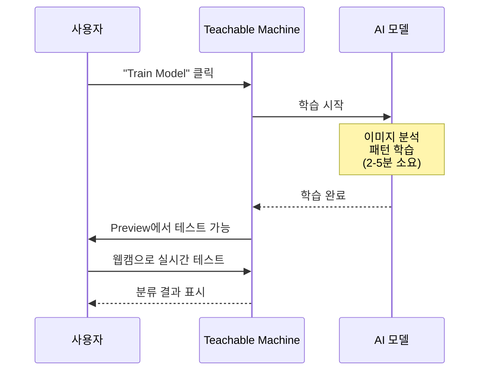

1. **"Train Model"** 버튼 클릭
2. 학습 진행 (2-5분 소요)
3. 학습 완료 후 **Preview** 탭에서 테스트
4. 웹캠으로 실시간 테스트
5. 정확도 확인 (80% 이상 목표)

#### 정확도가 낮을 때 해결 방법

| 문제 | 원인 | 해결 방법 |
|------|------|----------|
| 특정 클래스 인식 안됨 | 데이터 부족 | 해당 클래스 이미지 추가 (100장 이상) |
| 배경에 민감함 | 배경 다양성 부족 | 다양한 배경에서 촬영 |
| 조명에 민감함 | 조명 다양성 부족 | 밝기 다르게 촬영 |
| 전체적으로 낮음 | 클래스 간 차이 불명확 | 더 명확한 클래스 정의 |

---

## 2️⃣ 단계 2: 모델 내보내기 (Export)

### 2.1 TensorFlow.js 형식으로 내보내기

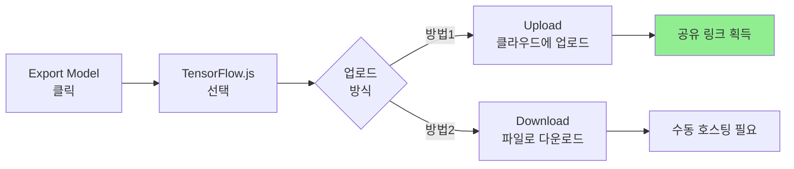

#### 방법 1: 클라우드 업로드 (권장)

1. **"Export Model"** 클릭
2. **"TensorFlow.js"** 탭 선택
3. **"Upload my model"** 클릭
4. 업로드 완료 후 **URL 복사** (나중에 사용!)

**장점:**
- ✅ 가장 간단함
- ✅ 별도 호스팅 불필요
- ✅ 바로 사용 가능

**URL 예시:**
```
https://teachablemachine.withgoogle.com/models/[모델ID]/
```

#### 방법 2: 파일 다운로드

1. **"Export Model"** 클릭
2. **"TensorFlow.js"** 탭 선택
3. **"Download my model"** 클릭
4. 다운로드된 파일:
   - `model.json` (모델 구조)
   - `weights.bin` (학습된 가중치)
   - `metadata.json` (클래스 정보)

> **주의**: 이 방법은 다음 단계에서 직접 호스팅해야 합니다.

---

## 3️⃣ 단계 3: 모델 호스팅

> **방법 1 (클라우드 업로드)을 선택했다면 이 단계는 건너뛰세요!**

### 3.1 Google Drive 호스팅 (가장 쉬움)

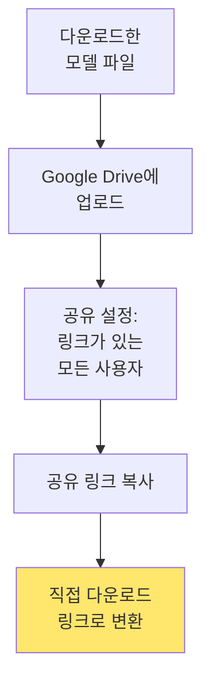

**단계:**

1. Google Drive 접속
2. 새 폴더 생성 (예: `teachable_machine_model`)
3. 모델 파일 3개 모두 업로드
4. 폴더 우클릭 → **"공유"**
5. **"링크가 있는 모든 사용자"**로 변경
6. 각 파일의 공유 링크 획득

**공유 링크 변환:**

원본 링크:
```
https://drive.google.com/file/d/1ABC...XYZ/view?usp=sharing
```

변환 링크:
```
https://drive.google.com/uc?export=download&id=1ABC...XYZ
```

### 3.2 Firebase Hosting (추천)

**장점:**
- ✅ 빠른 로딩 속도
- ✅ 안정적인 서비스
- ✅ 무료 (일일 10GB 전송)

**설정 방법:**

```bash
# 1. Firebase CLI 설치
npm install -g firebase-tools

# 2. 로그인
firebase login

# 3. 프로젝트 초기화
firebase init hosting

# 4. 모델 파일을 public 폴더에 복사
cp model.json weights.bin metadata.json public/

# 5. 배포
firebase deploy
```

**결과 URL:**
```
https://your-project.web.app/model.json
```

### 3.3 GitHub Pages (개발자용)

```bash
# 1. GitHub 저장소 생성
# 2. 모델 파일 업로드
# 3. Settings → Pages 활성화
```

**결과 URL:**
```
https://username.github.io/repo-name/model.json
```

---

## 4️⃣ 단계 4: 앱인벤터 프로젝트 생성

### 4.1 앱인벤터 접속 및 프로젝트 생성

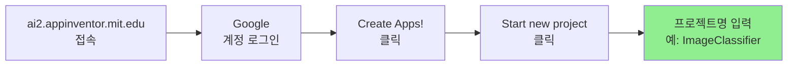

1. [ai2.appinventor.mit.edu](http://ai2.appinventor.mit.edu) 접속
2. Google 계정으로 로그인
3. **"Create Apps!"** 클릭
4. **"Start new project"** 클릭
5. 프로젝트 이름 입력 (예: `ImageClassifier`)
   - 공백 없이 입력 (예: `Image_Classifier` 또는 `ImageClassifier`)

### 4.2 앱인벤터 화면 구성 이해

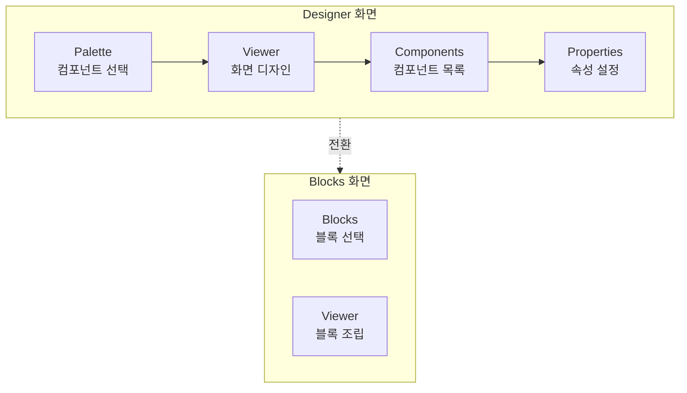

---

## 5️⃣ 단계 5: TMIC Extension 추가

### 5.1 Extension 다운로드

1. [TMIC 공식 사이트](https://computacaonaescola.ufsc.br/en/tmic/) 접속
2. **"Download Extension"** 클릭
3. `TMIC.aix` 파일 저장

### 5.2 앱인벤터에 Extension 추가

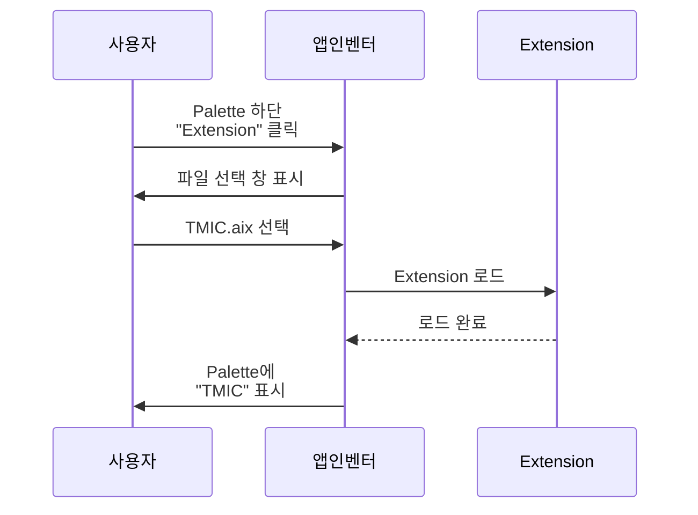

**단계:**

1. **Designer** 화면에서
2. **Palette** 하단의 **"Extension"** 클릭
3. **"Import extension"** 클릭
4. 다운로드한 `TMIC.aix` 파일 선택
5. 업로드 완료 대기 (10-30초)
6. Palette에 **"TMIC"** 항목 나타남

> **문제 해결**: Extension이 보이지 않으면 페이지 새로고침(F5)

---

## 6️⃣ 단계 6: UI 디자인

### 6.1 필요한 컴포넌트

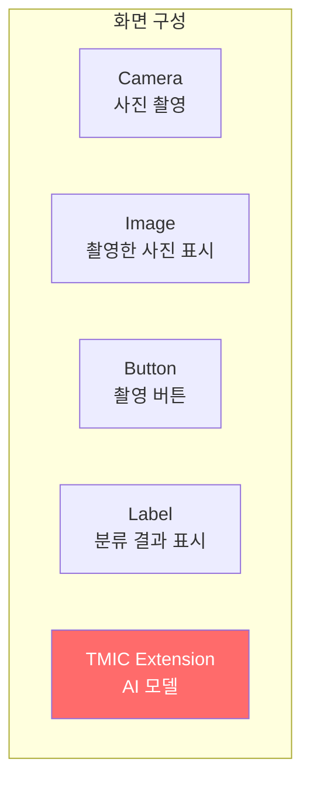

### 6.2 컴포넌트 추가하기

#### 1) Camera 추가

```
Palette → Media → Camera
```

- Viewer에 **드래그 앤 드롭**
- **Non-visible component** (화면에 안 보임)

**Properties 설정:**
- `UseFront`: **체크 해제** (후면 카메라 사용)

#### 2) Button 추가 (촬영 버튼)

```
Palette → User Interface → Button
```

**Properties 설정:**
- `Text`: `"사진 촬영"`
- `Width`: `Fill parent`
- `Height`: `60 pixels`
- `FontSize`: `18`
- `BackgroundColor`: `Blue`
- `TextColor`: `White`

#### 3) Image 추가 (촬영한 사진 표시)

```
Palette → User Interface → Image
```

**Properties 설정:**
- `Width`: `Fill parent`
- `Height`: `300 pixels`
- `ScalePictureToFit`: **체크**

#### 4) Label 추가 (결과 표시)

```
Palette → User Interface → Label
```

**Properties 설정:**
- `Text`: `"결과가 여기에 표시됩니다"`
- `Width`: `Fill parent`
- `Height`: `Automatic`
- `FontSize`: `20`
- `FontBold`: **체크**
- `TextAlignment`: `center`

#### 5) TMIC Extension 추가

```
Palette → Extension → TMIC
```

- Viewer에 **드래그 앤 드롭**
- **Non-visible component**

**Properties 설정:**
- `ModelURL`: **(나중에 Blocks에서 설정)**

### 6.3 레이아웃 정리

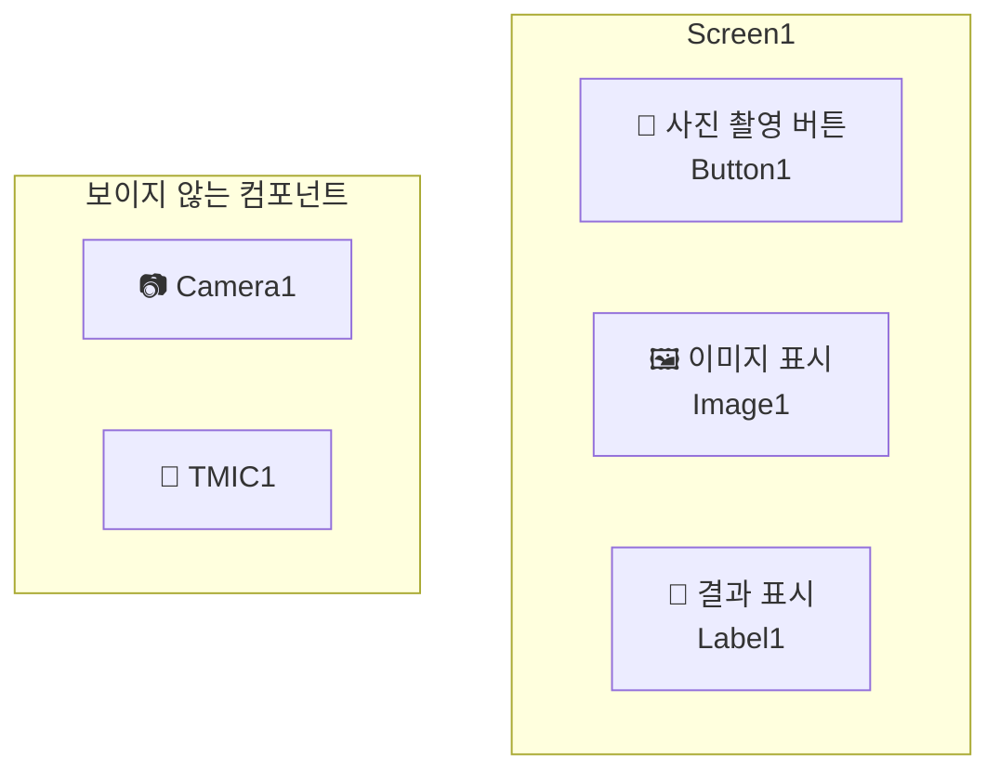

**최종 구성:**

```
┌─────────────────────────────────┐
│  Screen1                         │
├─────────────────────────────────┤
│  [  사진 촬영  ]  Button1        │
│                                  │
│  ┌────────────────────────────┐ │
│  │                            │ │
│  │     Image1 (300px)         │ │
│  │                            │ │
│  └────────────────────────────┘ │
│                                  │
│  결과: class_A (95%)  Label1     │
│                                  │
└─────────────────────────────────┘

Non-visible:
- Camera1
- TMIC1
```

---

## 7️⃣ 단계 7: 블록 코딩

### 7.1 초기 설정 블록

```
when Screen1.Initialize
  do
    set TMIC1.ModelURL to "https://teachablemachine.withgoogle.com/models/YOUR_MODEL_ID/"
    set Label1.Text to "촬영 버튼을 눌러주세요"
```

**블록 만들기:**

1. **Blocks** 화면으로 전환
2. **Screen1** 클릭
3. `when Screen1.Initialize` 블록 드래그
4. **TMIC1** 클릭
5. `set TMIC1.ModelURL to` 블록 드래그
6. **Text** (Built-in) 클릭
7. `" "` (빈 텍스트) 블록 드래그
8. **모델 URL 입력** (2단계에서 복사한 URL)

### 7.2 사진 촬영 블록

```
when Button1.Click
  do
    call Camera1.TakePicture
```

**블록 만들기:**

1. **Button1** 클릭
2. `when Button1.Click` 블록 드래그
3. **Camera1** 클릭
4. `call Camera1.TakePicture` 블록 드래그하여 연결

### 7.3 사진 촬영 후 처리 블록

```
when Camera1.AfterPicture
  do
    set Image1.Picture to image
    set Label1.Text to "분석 중..."
    call TMIC1.ClassifyImage
      image: image
```

**블록 만들기:**

1. **Camera1** 클릭
2. `when Camera1.AfterPicture` 블록 드래그
3. **Image1** 클릭
4. `set Image1.Picture to` 블록 드래그하여 연결
5. `Camera1.AfterPicture`의 `image` 매개변수를 연결
6. **Label1** 클릭
7. `set Label1.Text to` 블록 추가
8. **TMIC1** 클릭
9. `call TMIC1.ClassifyImage` 블록 추가
10. `image` 소켓에 `Camera1.AfterPicture`의 `image` 연결

### 7.4 분류 결과 표시 블록

```
when TMIC1.GotClassification
  do
    set Label1.Text to join
                         "결과: "
                         get label
                         " ("
                         round (get confidence * 100)
                         "%)"
```

**블록 만들기:**

1. **TMIC1** 클릭
2. `when TMIC1.GotClassification` 블록 드래그
3. **Label1** 클릭
4. `set Label1.Text to` 블록 추가
5. **Text** (Built-in) 클릭
6. `join` 블록 드래그 (여러 텍스트 결합)
7. 다음 요소들을 순서대로 연결:
   - `"결과: "` (텍스트)
   - `get label` (TMIC1.GotClassification의 매개변수)
   - `" ("` (텍스트)
   - `round` (Math) 블록 → `get confidence * 100`
   - `"%)"`(텍스트)

### 7.5 오류 처리 블록

```
when TMIC1.Error
  do
    set Label1.Text to join
                         "오류 발생: "
                         get errorMessage
```

**블록 만들기:**

1. **TMIC1** 클릭
2. `when TMIC1.Error` 블록 드래그
3. **Label1** 클릭
4. `set Label1.Text to` 블록 추가
5. **Text** 클릭
6. `join` 블록으로 `"오류 발생: "`과 `get errorMessage` 연결

### 7.6 전체 블록 구조

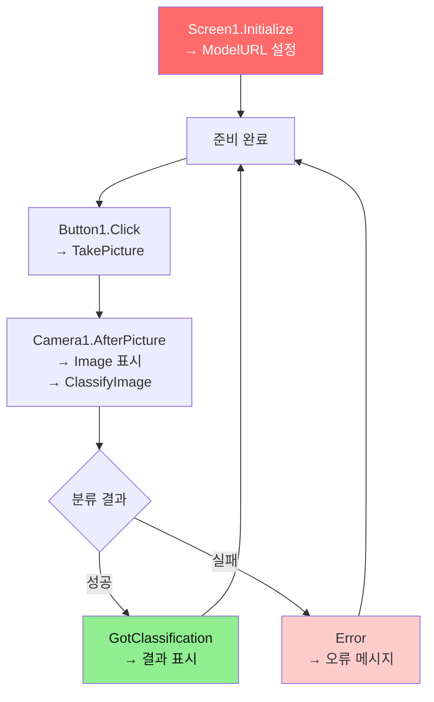

---

## 8️⃣ 단계 8: 테스트 및 디버깅

### 8.1 테스트 준비

```mermaid
graph LR
    A[스마트폰에<br/>MIT AI2 Companion<br/>설치] --> B[앱인벤터에서<br/>Connect → AI Companion]
    B --> C[QR 코드 스캔<br/>또는 코드 입력]
    C --> D[앱 로딩<br/>(30초-1분)]
    D --> E[테스트 시작]
    
    style E fill:#90EE90
```

#### MIT AI2 Companion 설치

1. Google Play Store에서 검색: **"MIT AI2 Companion"**
2. 설치
3. 앱 실행

#### 앱인벤터 연결

1. 앱인벤터 상단 메뉴에서 **Connect → AI Companion**
2. QR 코드 또는 6자리 코드 표시
3. MIT AI2 Companion 앱에서:
   - **"scan QR code"** 또는
   - **"connect with code"** 입력
4. 연결 대기 (30초-1분)
5. 스마트폰에 앱 화면 표시

### 8.2 기본 기능 테스트

#### 테스트 체크리스트

- [ ] **앱 로딩 확인**
  - 초기 메시지: "촬영 버튼을 눌러주세요"
  - 버튼 정상 표시
  - 오류 메시지 없음

- [ ] **카메라 권한 확인**
  - "사진 촬영" 버튼 클릭
  - 카메라 권한 요청 메시지 → **허용**
  - 카메라 화면 정상 표시

- [ ] **사진 촬영 기능**
  - 셔터 버튼 클릭
  - 촬영된 사진이 Image1에 표시
  - "분석 중..." 메시지 표시

- [ ] **AI 분류 기능**
  - 2-5초 후 결과 표시
  - 형식: `결과: class_A (95%)`
  - Confidence가 표시됨

### 8.3 다양한 조건에서 테스트

#### 테스트 시나리오

| 테스트 항목 | 방법 | 기대 결과 | 실제 결과 |
|-----------|------|----------|----------|
| **밝은 조명** | 햇빛 아래에서 촬영 | 정확한 분류 | ☐ |
| **어두운 조명** | 실내 조명만으로 촬영 | 정확한 분류 | ☐ |
| **다양한 각도** | 45도, 측면에서 촬영 | 정확한 분류 | ☐ |
| **다양한 거리** | 가까이/멀리서 촬영 | 정확한 분류 | ☐ |
| **복잡한 배경** | 배경이 복잡한 곳에서 촬영 | 정확한 분류 | ☐ |
| **잘못된 객체** | 학습하지 않은 객체 촬영 | 낮은 confidence | ☐ |

### 8.4 문제 해결 (Troubleshooting)

#### 문제 1: 앱이 로딩되지 않음

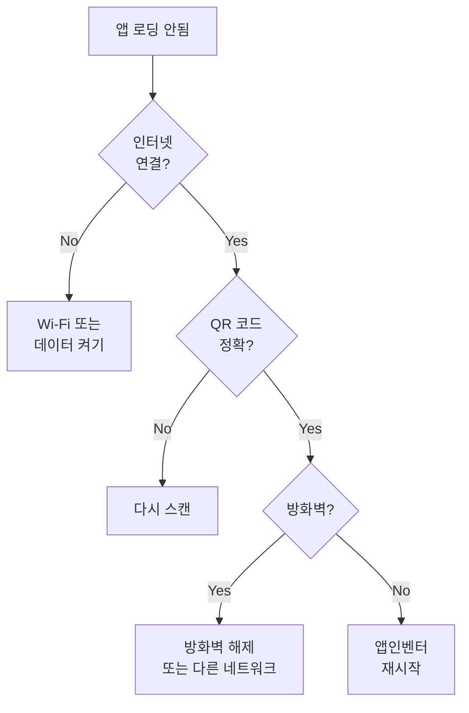

**해결 방법:**
- 스마트폰과 컴퓨터가 **같은 Wi-Fi** 연결 확인
- 방화벽 또는 보안 프로그램 일시 해제
- 앱인벤터와 MIT AI2 Companion 재시작

#### 문제 2: 카메라 권한 오류

**증상:**
```
오류 발생: Camera permission denied
```

**해결 방법:**
1. 스마트폰 설정 → 앱 → MIT AI2 Companion
2. 권한 → **카메라 권한 허용**
3. 앱 재시작

#### 문제 3: 모델 로딩 실패

**증상:**
```
오류 발생: Failed to load model
```

**원인 및 해결:**

| 원인 | 해결 방법 |
|------|----------|
| **잘못된 URL** | ModelURL 다시 확인 및 수정 |
| **인터넷 연결 문제** | Wi-Fi 또는 데이터 연결 확인 |
| **CORS 오류** | Google Drive 공유 설정 확인 |
| **모델 파일 손상** | Teachable Machine에서 다시 내보내기 |

#### 문제 4: 분류 결과가 부정확함

**원인 분석:**

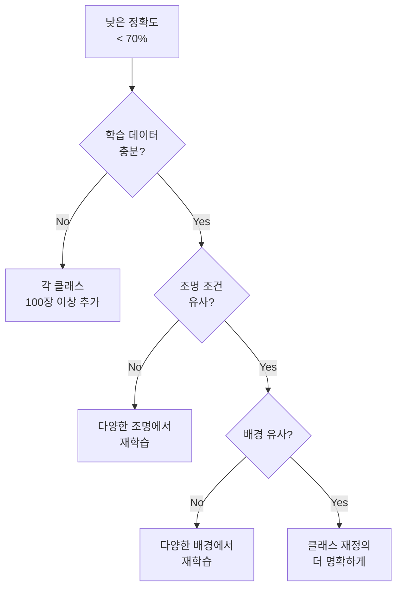

**개선 방법:**

1. **데이터 추가**
   - 각 클래스당 100장 이상
   - 실제 사용 환경과 유사한 조건에서 촬영

2. **데이터 다양성 확보**
   - 밝은 곳, 어두운 곳, 중간 조명
   - 다양한 각도 (정면, 측면, 45도)
   - 다양한 배경 (단순, 복잡)

3. **재학습**
   - Teachable Machine에서 데이터 추가 후
   - **"Train Model"** 다시 클릭
   - 새 모델로 **Export** 및 **호스팅**

4. **앱인벤터에서 ModelURL 업데이트**
   - 새 모델 URL로 변경
   - 앱 재테스트

#### 문제 5: 분류 속도가 느림

**증상:**
- 분류 결과까지 10초 이상 소요

**원인 및 해결:**

| 원인 | 해결 방법 |
|------|----------|
| **느린 인터넷** | 더 빠른 Wi-Fi 사용 |
| **큰 이미지 파일** | 이미지 해상도 낮추기 (Camera 속성) |
| **서버 응답 지연** | Firebase Hosting 사용 (Google Drive 대신) |
| **모델 크기** | Teachable Machine에서 더 작은 모델 선택 |

### 8.5 성능 측정

#### 정확도 측정 방법

```
정확도 = (정확히 분류된 횟수 / 전체 테스트 횟수) × 100%
```

**테스트 시트 예시:**

| 테스트 번호 | 실제 클래스 | 예측 클래스 | Confidence | 정확? |
|-----------|-----------|-----------|-----------|-------|
| 1 | class_A | class_A | 95% | ✅ |
| 2 | class_A | class_A | 88% | ✅ |
| 3 | class_B | class_B | 92% | ✅ |
| 4 | class_B | class_A | 65% | ❌ |
| 5 | class_C | class_C | 97% | ✅ |
| ... | ... | ... | ... | ... |

**목표 정확도:**
- 교육용 프로젝트: **80% 이상**
- 실용 프로젝트: **90% 이상**
- 산업용 시스템: **95% 이상**

---

## 9️⃣ 고급 기능 추가

### 9.1 신뢰도 기준 설정

**문제점:**
- 낮은 confidence (예: 60%)에서도 결과 표시
- 부정확한 분류 가능성

**해결책: Confidence 임계값 설정**

```
when TMIC1.GotClassification
  do
    if (get confidence > 0.8)  // 80% 이상만 표시
    then
      set Label1.Text to join
                           "결과: "
                           get label
                           " ("
                           round (get confidence * 100)
                           "%)"
      set Label1.BackgroundColor to Green
    else
      set Label1.Text to "정확도가 낮습니다. 다시 촬영해주세요."
      set Label1.BackgroundColor to Orange
```

### 9.2 여러 장 연속 촬영

**기능:**
- 한 번에 여러 장 촬영하여 평균 결과 표시
- 더 높은 정확도

**구현:**

1. **변수 추가:**
   - `results` (리스트)
   - `count` (숫자)

2. **블록 로직:**

```
when Button1.Click
  do
    set global count to 0
    set global results to create empty list
    call Timer1.Enabled to true  // 0.5초마다 촬영

when Timer1.Timer
  do
    if (global count < 5)  // 5장 촬영
    then
      call Camera1.TakePicture
      set global count to (global count + 1)
    else
      call Timer1.Enabled to false
      // 가장 많이 나온 결과 표시

when TMIC1.GotClassification
  do
    add items to list (global results)
      item: get label
```

### 9.3 결과 기록 저장

**기능:**
- 분류 결과를 파일로 저장
- 나중에 분석 가능

**필요 컴포넌트:**
- `File1` (Storage)
- `Clock1` (날짜/시간)

**블록:**

```
when TMIC1.GotClassification
  do
    set global result_text to join
                                get Clock1.FormatDateTime
                                ","
                                get label
                                ","
                                get confidence
                                "\n"
    call File1.AppendToFile
      fileName: "classification_log.csv"
      text: global result_text
```

### 9.4 블루투스로 아두이노 제어

> 이 프로젝트의 핵심 기능!

**목표:**
- 이미지 분류 결과에 따라 로봇 팔 제어

**추가 컴포넌트:**
- `BluetoothClient1`

**블록:**

```
// 앱 시작 시 블루투스 연결
when Screen1.Initialize
  do
    call BluetoothClient1.Connect
      address: "00:11:22:33:44:55"  // HC-05 주소

// 분류 결과에 따라 명령 전송
when TMIC1.GotClassification
  do
    if (get label = "class_A")
    then
      call BluetoothClient1.SendText
        text: "1"  // 위치 A로 이동
    else if (get label = "class_B")
    then
      call BluetoothClient1.SendText
        text: "2"  // 위치 B로 이동
    else if (get label = "class_C")
    then
      call BluetoothClient1.SendText
        text: "3"  // 위치 C로 이동
```

**아두이노 코드:**

```cpp
void loop() {
  if (Serial.available() > 0) {
    char cmd = Serial.read();
    
    switch(cmd) {
      case '1':
        moveToPositionA();
        break;
      case '2':
        moveToPositionB();
        break;
      case '3':
        moveToPositionC();
        break;
    }
  }
}
```

---

## 🔟 APK 빌드 및 배포

### 10.1 APK 빌드하기

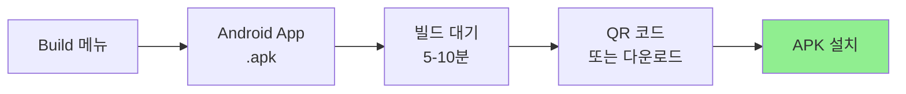

**단계:**

1. 앱인벤터 상단 메뉴: **Build → Android App (.apk)**
2. 빌드 시작 (5-10분 소요)
3. 완료 후 선택:
   - **QR 코드로 다운로드** (추천)
   - **직접 다운로드**

### 10.2 APK 설치하기

**방법 1: QR 코드**
1. 스마트폰에서 QR 코드 스캔
2. 다운로드 링크 클릭
3. APK 파일 다운로드
4. **설치** 클릭

**방법 2: 직접 전송**
1. 컴퓨터에서 APK 다운로드
2. 스마트폰에 파일 전송 (USB, 이메일, 클라우드)
3. 파일 매니저에서 APK 열기
4. **설치** 클릭

**보안 설정:**
- "출처를 알 수 없는 앱" 설치 허용 필요
- Android 설정 → 보안 → **알 수 없는 출처 허용**

### 10.3 앱 업데이트

**앱 수정 후:**
1. 앱인벤터에서 수정 완료
2. **Build → Android App (.apk)** 다시 실행
3. 새 APK 다운로드
4. 기존 앱 위에 설치 (데이터 유지)

---

## ⚙️ 제약사항 및 한계

### 지원 기능

| 기능 | 지원 여부 | 비고 |
|------|----------|------|
| **이미지 분류** | ✅ 지원 | TMIC의 주요 기능 |
| **객체 검출** | ❌ 미지원 | 바운딩 박스 불가 |
| **포즈 인식** | ❌ 미지원 | 스켈레톤 추적 불가 |
| **오디오 분류** | ❌ 미지원 | 소리 인식 불가 |
| **오프라인 사용** | ⚠️ 제한적 | 모델 로딩 시 인터넷 필요 |
| **전면 카메라** | ⚠️ 제한적 | 일부 버전에서만 지원 |
| **갤러리 이미지** | ⚠️ 제한적 | 카메라 촬영만 권장 |

### 성능 제약

| 항목 | 제약 | 권장 사항 |
|------|------|----------|
| **분류 속도** | 2-5초 | 실시간 처리 어려움 |
| **이미지 크기** | 최대 2MB | 고해상도 이미지 피하기 |
| **모델 크기** | 최대 10MB | 경량 모델 사용 |
| **네트워크** | 인터넷 필수 | Wi-Fi 환경 권장 |
| **Android 버전** | 8.0+ | 최신 OS 권장 |

### 환경 제약

**Reality Gap 문제:**
- 학습 환경과 사용 환경이 다르면 정확도 하락
- 다양한 조건에서 학습 데이터 수집 필수

**조명 민감도:**
- 조명 변화에 민감
- 학습 시 다양한 조명 조건 포함

**배경 민감도:**
- 복잡한 배경에서 정확도 하락
- 단순한 배경 또는 배경 다양성 확보

---

## 📚 참고 자료 및 추가 학습

### 공식 문서

| 자료 | 링크 | 설명 |
|------|------|------|
| **Teachable Machine 가이드** | [teachablemachine.withgoogle.com/train](https://teachablemachine.withgoogle.com/train) | 공식 튜토리얼 |
| **MIT App Inventor 문서** | [appinventor.mit.edu/explore](http://appinventor.mit.edu/explore) | 컴포넌트 레퍼런스 |
| **TMIC 논문** | [arxiv.org/abs/2208.12637](https://arxiv.org/abs/2208.12637) | 기술 세부사항 |
| **TMIC GitHub** | [github.com/mit-cml](https://github.com/mit-cml) | 소스 코드 |

### 커뮤니티

| 커뮤니티 | 링크 | 용도 |
|---------|------|------|
| **MIT AI2 Community** | [community.appinventor.mit.edu](http://community.appinventor.mit.edu) | 질문/답변 |
| **TMIC 포럼** | [TMIC 게시글](https://community.appinventor.mit.edu/t/tmic-app-inventor-extension-for-the-deployment-of-image-classification-models-exported-from-teachable-machine/64411) | TMIC 전용 |
| **Reddit r/appinventor** | [reddit.com/r/appinventor](https://reddit.com/r/appinventor) | 영문 커뮤니티 |

### 유튜브 채널

| 채널 | 추천 영상 | 난이도 |
|------|----------|--------|
| **The Coding Train** | Teachable Machine 시리즈 | 초급 |
| **Technovation** | TM + App Inventor 통합 | 초급-중급 |
| **MIT App Inventor** | 공식 튜토리얼 | 초급 |

### 예제 프로젝트

| 프로젝트 | 난이도 | 다운로드 |
|---------|--------|----------|
| **Rock-Paper-Scissors** | 🟢 초급 | [TMIC 사이트](https://computacaonaescola.ufsc.br/en/tmic/) |
| **Healthy vs Diseased Fruit** | 🟡 중급 | Technovation 커리큘럼 |
| **QC Inspector (불량품 검사)** | 🔴 고급 | 본 프로젝트 |

---

## 📝 프로젝트 아이디어

### 초급 프로젝트

1. **색상 분류기**
   - 클래스: 빨강, 파랑, 노랑
   - 난이도: ⭐
   - 소요 시간: 2-3시간

2. **동물 인식 앱**
   - 클래스: 고양이, 강아지, 새
   - 난이도: ⭐
   - 소요 시간: 3-4시간

3. **과일 분류기**
   - 클래스: 사과, 바나나, 오렌지
   - 난이도: ⭐
   - 소요 시간: 2-3시간

### 중급 프로젝트

4. **제스처 인식 앱**
   - 클래스: OK, 엄지척, 손흔들기
   - 난이도: ⭐⭐
   - 소요 시간: 5-6시간

5. **재활용 분류기**
   - 클래스: 플라스틱, 유리, 종이, 캔
   - 난이도: ⭐⭐
   - 소요 시간: 6-8시간

6. **마스크 착용 검사**
   - 클래스: 착용, 미착용, 잘못 착용
   - 난이도: ⭐⭐
   - 소요 시간: 5-7시간

### 고급 프로젝트

7. **불량품 자동 검사** (본 프로젝트)
   - 클래스: 정상, 긁힘, 변색, 크기 오차
   - 난이도: ⭐⭐⭐
   - 소요 시간: 10-15시간
   - 로봇 팔 연동

8. **식물 병해충 진단**
   - 클래스: 건강, 병충해 A, 병충해 B
   - 난이도: ⭐⭐⭐
   - 소요 시간: 12-16시간

9. **얼굴 표정 인식**
   - 클래스: 행복, 슬픔, 화남, 놀람
   - 난이도: ⭐⭐⭐
   - 소요 시간: 10-14시간

---

## 🎓 교육 과정 제안

### 1주차: 기초 다지기

| 차시 | 주제 | 활동 | 결과물 |
|------|------|------|--------|
| 1 | AI와 머신러닝 개념 | - AI 사례 영상 시청<br/>- Teachable Machine 소개 | 개념 이해 |
| 2 | 첫 AI 모델 만들기 | - TM에서 3개 클래스 학습<br/>- 웹에서 테스트 | 학습된 모델 |
| 3 | 앱인벤터 기초 | - 계정 생성<br/>- 간단한 앱 제작 | Hello World 앱 |
| 4 | UI 디자인 | - 버튼, 레이블 배치<br/>- 속성 설정 | 디자인된 화면 |

### 2주차: 통합하기

| 차시 | 주제 | 활동 | 결과물 |
|------|------|------|--------|
| 5 | TMIC Extension 추가 | - Extension 설치<br/>- 모델 연결 | 확장 추가 |
| 6 | 카메라 연동 | - Camera 컴포넌트<br/>- 촬영 기능 구현 | 사진 촬영 앱 |
| 7 | AI 분류 구현 | - 블록 코딩<br/>- 결과 표시 | 이미지 분류 앱 |
| 8 | 테스트 및 개선 | - 실기기 테스트<br/>- 문제 해결 | 작동하는 앱 |

### 3주차: 확장하기

| 차시 | 주제 | 활동 | 결과물 |
|------|------|------|--------|
| 9 | 정확도 개선 | - 데이터 추가 수집<br/>- 재학습 | 개선된 모델 |
| 10 | 고급 기능 추가 | - Confidence 임계값<br/>- 결과 기록 | 고급 기능 |
| 11 | 블루투스 연동 | - 아두이노 연결<br/>- 로봇 제어 | 통합 시스템 |
| 12 | 발표 및 성찰 | - 프로젝트 발표<br/>- 피드백 | 최종 결과물 |

---

## 🏆 평가 기준

### 기능 평가 (60점)

| 항목 | 배점 | 기준 |
|------|------|------|
| **모델 학습** | 15점 | - 3개 이상 클래스<br/>- 각 100장 이상<br/>- 다양성 확보 |
| **앱 기본 기능** | 15점 | - 촬영 기능<br/>- 이미지 표시<br/>- 결과 표시 |
| **AI 분류 정확도** | 20점 | - 80% 이상: 20점<br/>- 70-79%: 15점<br/>- 60-69%: 10점 |
| **오류 처리** | 10점 | - 오류 메시지 표시<br/>- 재시도 기능 |

### 설계 평가 (20점)

| 항목 | 배점 | 기준 |
|------|------|------|
| **UI 디자인** | 10점 | - 직관적인 레이아웃<br/>- 명확한 레이블 |
| **사용성** | 10점 | - 사용 편의성<br/>- 피드백 명확성 |

### 문서화 (20점)

| 항목 | 배점 | 기준 |
|------|------|------|
| **프로젝트 설명** | 10점 | - 목적 명확<br/>- 과정 상세 |
| **테스트 결과** | 10점 | - 정량적 데이터<br/>- 문제점 및 개선 |

---

## 🚀 다음 단계

이 가이드를 완료했다면:

1. **프로젝트 고도화**
   - 더 많은 클래스 추가
   - 복잡한 분류 작업
   - 실제 문제 해결

2. **아두이노 연동**
   - [02_블루투스_프로토콜.md](./02_블루투스_프로토콜.md) 참고
   - 로봇 팔 제어
   - 센서 데이터 통합

3. **심화 학습**
   - TensorFlow Lite 직접 사용
   - 커스텀 모델 학습
   - 엣지 AI 구현

4. **공모전 참가**
   - [05_비즈니스_모델_설계.md](./05_비즈니스_모델_설계.md) 참고
   - 실제 산업 문제 해결
   - 창업 아이템화

---

## 📞 도움이 필요하신가요?

### 질문하기 전에

1. ✅ 이 가이드의 **문제 해결** 섹션 확인
2. ✅ **오류 메시지** 정확히 기록
3. ✅ **재현 단계** 정리
4. ✅ **블록 코드** 스크린샷 준비

### 질문하기 좋은 곳

- **MIT App Inventor Community**: 영문 질문
- **TMIC 포럼**: TMIC 관련 질문
- **프로젝트 Issues**: 이 프로젝트 관련

### 질문 템플릿

```markdown
## 문제 설명
[무엇이 안 되는지 명확히 설명]

## 재현 단계
1. [단계 1]
2. [단계 2]
3. [오류 발생]

## 오류 메시지
[오류 메시지 전체 복사]

## 시도한 해결 방법
- [시도1]
- [시도2]

## 환경
- Android 버전:
- MIT AI2 Companion 버전:
- 모델 URL: [일부만 공개]
```

---

## ✅ 체크리스트

프로젝트 완료 전 최종 확인:

### 기능

- [ ] Teachable Machine 모델 학습 완료
- [ ] 모델이 온라인에서 접근 가능
- [ ] 앱인벤터 프로젝트 생성
- [ ] TMIC Extension 설치
- [ ] UI 디자인 완료
- [ ] 블록 코딩 완료
- [ ] 초기 설정 블록 작동
- [ ] 카메라 촬영 기능 작동
- [ ] AI 분류 기능 작동
- [ ] 결과 표시 기능 작동
- [ ] 오류 처리 구현

### 테스트

- [ ] 밝은 조명에서 테스트
- [ ] 어두운 조명에서 테스트
- [ ] 다양한 각도 테스트
- [ ] 다양한 거리 테스트
- [ ] 잘못된 객체 테스트
- [ ] 정확도 80% 이상 달성

### 문서화

- [ ] 프로젝트 설명 작성
- [ ] 테스트 결과 기록
- [ ] 스크린샷 확보
- [ ] 문제점 및 해결 방법 정리

### 배포

- [ ] APK 빌드 성공
- [ ] 스마트폰에 설치 성공
- [ ] 독립 실행 확인

---

**축하합니다! 🎉**

이제 여러분은 **AI 기반 이미지 분류 앱**을 만들 수 있습니다!

다음 프로젝트로 이 기술을 **로봇 제어**, **자동화 시스템**, **스마트 팩토리**에 적용해보세요.

**Happy Coding! 🚀**
