# 스마트 팩토리 산업 분석 및 미래 전망

> **"제조업의 4차 산업혁명 - 자동화에서 지능화로"**  
> 현대, 테슬라, 샤오미 사례 분석 + 핵심 기술 + 미래 전망 + 커리어 로드맵

---

## 📊 목차

1. [스마트 팩토리 기본 개념](#1-스마트-팩토리-기본-개념)
2. [전문 용어 사전](#2-전문-용어-사전-용어집)
3. [스마트 공장 전체 동작 순서도](#3-스마트-공장-전체-동작-순서도)
4. [생산성 향상 기술 매트릭스](#4-생산성-향상-기술-매트릭스)
5. [글로벌 사례 분석](#5-글로벌-사례-분석)
6. [핵심 기술 체계](#6-핵심-기술-체계)
7. [단계별 발전 과정](#7-단계별-발전-과정)
8. [미래 기술 전망](#8-미래-기술-전망-2026-2035)
9. [기술 용어 정리](#9-핵심-기술-용어-정리)
10. [커리어 로드맵](#10-커리어-로드맵-취업창업)

---

## 1. 스마트 팩토리 기본 개념

### 1.1 정의 및 특징

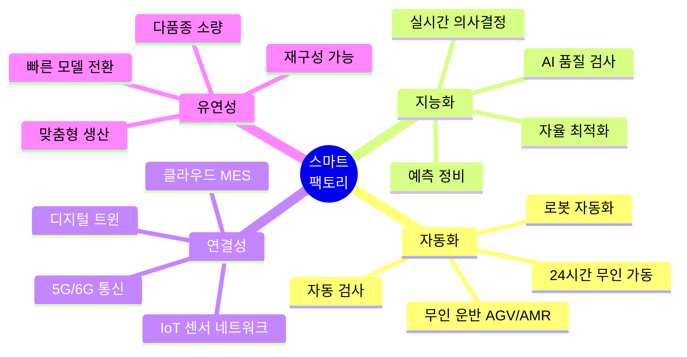
```mermaid
mindmap
  root((스마트<br/>팩토리))
    자동화
      로봇 자동화
      무인 운반 AGV/AMR
      자동 검사
      24시간 무인 가동
    지능화
      AI 품질 검사
      예측 정비
      자율 최적화
      실시간 의사결정
    연결성
      IoT 센서 네트워크
      5G/6G 통신
      클라우드 MES
      디지털 트윈
    유연성
      맞춤형 생산
      빠른 모델 전환
      다품종 소량
      재구성 가능
```

### 1.2 스마트 팩토리 vs 전통 공장

| 구분 | 전통 공장 | 스마트 팩토리 |
|------|----------|--------------|
| **생산 방식** | 대량 생산 | 맞춤형 생산 |
| **제어** | 수동/반자동 | 완전 자동/AI 제어 |
| **품질 관리** | 사후 검사 | 실시간 모니터링 |
| **유지보수** | 고장 후 수리 | 예측 정비 |
| **데이터** | 부분적 수집 | 전체 수집 + 분석 |
| **의사결정** | 관리자 | AI + 관리자 |
| **근로자 역할** | 단순 작업 | 고급 기술 + 관리 |
| **생산성** | 기준 100% | 150-300% |
| **불량률** | 3-5% | 0.5-1% |

### 1.3 스마트 팩토리 핵심 요소

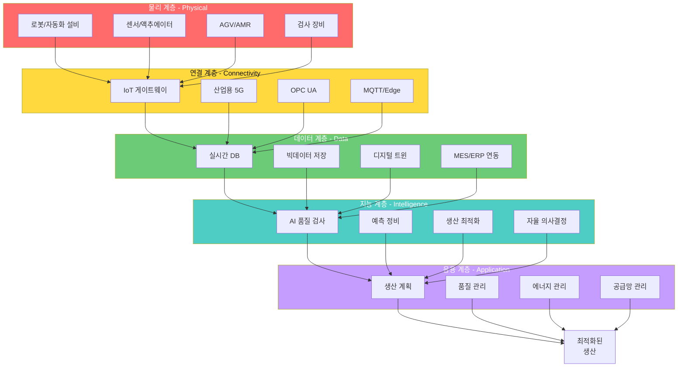
```mermaid
graph TB
    subgraph 물리_계층[물리 계층 - Physical]
        P1[로봇/자동화 설비]
        P2[센서/액추에이터]
        P3[AGV/AMR]
        P4[검사 장비]
    end
    
    subgraph 연결_계층[연결 계층 - Connectivity]
        C1[IoT 게이트웨이]
        C2[산업용 5G]
        C3[OPC UA]
        C4[MQTT/Edge]
    end
    
    subgraph 데이터_계층[데이터 계층 - Data]
        D1[실시간 DB]
        D2[빅데이터 저장]
        D3[디지털 트윈]
        D4[MES/ERP 연동]
    end
    
    subgraph 지능_계층[지능 계층 - Intelligence]
        I1[AI 품질 검사]
        I2[예측 정비]
        I3[생산 최적화]
        I4[자율 의사결정]
    end
    
    subgraph 응용_계층[응용 계층 - Application]
        A1[생산 계획]
        A2[품질 관리]
        A3[에너지 관리]
        A4[공급망 관리]
    end
    
    P1 & P2 & P3 & P4 --> C1
    C1 & C2 & C3 & C4 --> D1
    D1 & D2 & D3 & D4 --> I1
    I1 & I2 & I3 & I4 --> A1
    A1 & A2 & A3 & A4 --> OUTPUT[최적화된<br/>생산]
    
    style 물리_계층 fill:#FF6B6B,color:#fff
    style 연결_계층 fill:#FFD93D,color:#111
    style 데이터_계층 fill:#6BCB77,color:#fff
    style 지능_계층 fill:#4ECDC4,color:#fff
    style 응용_계층 fill:#C59DFF,color:#fff
```

---

## 2. 전문 용어 사전 (용어집)

### 2.1 제조 시스템 용어

| 용어 | 영문 | 정의 | 적용 사례 |
|------|------|------|----------|
| **MES** | Manufacturing Execution System | 제조 실행 시스템: 생산 현장의 작업 지시, 실시간 모니터링, 품질 관리를 담당하는 시스템 | 테슬라 공장 전체 라인 제어 |
| **ERP** | Enterprise Resource Planning | 전사적 자원 관리: 구매, 재고, 회계, 인사 등 기업 전체 자원을 통합 관리 | SAP, Oracle 시스템 |
| **PLM** | Product Lifecycle Management | 제품 수명 주기 관리: 설계부터 폐기까지 제품의 전 생애 관리 | 현대차 신차 개발 프로세스 |
| **SCADA** | Supervisory Control And Data Acquisition | 감시 제어 데이터 수집: 설비의 실시간 상태 감시 및 제어 | 발전소, 정유 공장 |
| **PLC** | Programmable Logic Controller | 프로그래머블 로직 컨트롤러: 산업 자동화를 위한 디지털 컴퓨터 | 컨베이어 벨트 제어 |
| **HMI** | Human-Machine Interface | 사람-기계 인터페이스: 작업자가 설비를 제어하는 화면 | 터치스크린 제어 패널 |
| **OEE** | Overall Equipment Effectiveness | 종합 설비 효율: 가동률 × 성능률 × 양품률 | 테슬라 95% OEE 목표 |
| **JIT** | Just-In-Time | 적시 생산: 필요한 것을 필요한 때에 필요한 만큼 생산 | 도요타 생산 방식 |
| **Lean** | Lean Manufacturing | 린 생산: 낭비 제거를 통한 효율 극대화 | 도요타, 현대차 |
| **TPM** | Total Productive Maintenance | 전사적 생산 보전: 모든 부서가 참여하는 설비 관리 | 일본 제조업 |
| **Kaizen** | 改善 (개선) | 지속적 개선: 작은 개선을 지속적으로 실행 | 도요타 문화 |
| **Kanban** | 看板 (간판) | 간판 방식: 시각적 신호로 생산량 조절 | JIT의 핵심 도구 |
| **SMED** | Single-Minute Exchange of Die | 1분 이내 금형 교체: 생산 전환 시간 단축 | 다품종 소량 생산 |
| **Poka-Yoke** | ポカヨケ (포카요케) | 실수 방지: 오류를 사전에 방지하는 장치 | 조립 라인 오삽입 방지 |

### 2.2 로봇 및 자동화 용어

| 용어 | 영문 | 정의 | 사양 예시 |
|------|------|------|----------|
| **DOF** | Degrees of Freedom | 자유도: 로봇이 움직일 수 있는 독립적인 축의 수 | 6축 산업용 로봇 (6 DOF) |
| **Payload** | Payload | 가반 하중: 로봇이 들 수 있는 최대 무게 | UR5: 5kg, UR10: 10kg |
| **Reach** | Reach | 작업 반경: 로봇이 도달할 수 있는 최대 거리 | ABB IRB 6700: 3.2m |
| **Repeatability** | Repeatability | 반복 정밀도: 같은 위치로 반복 시 오차 | ±0.03mm (산업용 로봇) |
| **Cycle Time** | Cycle Time | 사이클 타임: 한 작업을 완료하는 시간 | 픽앤플레이스 2초 |
| **Takt Time** | Takt Time | 타크트 타임: 고객 수요에 맞춰 생산해야 하는 시간 간격 | 60초/대 (시간당 60대 생산) |
| **End Effector** | End Effector | 엔드 이펙터: 로봇 팔 끝에 장착되는 도구 | 그리퍼, 용접 토치, 드릴 |
| **Gripper** | Gripper | 그리퍼: 물체를 잡는 로봇 손 | 전기식, 공압식, 진공식 |
| **Cobot** | Collaborative Robot | 협동 로봇: 사람과 함께 일할 수 있는 안전한 로봇 | UR, Doosan, ABB YuMi |
| **AGV** | Automated Guided Vehicle | 무인 운반차: 정해진 경로를 따라 이동하는 차량 | 자기 테이프, QR 코드 유도 |
| **AMR** | Autonomous Mobile Robot | 자율 이동 로봇: 스스로 경로를 찾아 이동하는 로봇 | SLAM, LiDAR 기반 |
| **Teach Pendant** | Teach Pendant | 티칭 펜던트: 로봇을 수동으로 프로그래밍하는 휴대형 장치 | 산업용 로봇 조작기 |
| **IK** | Inverse Kinematics | 역기구학: 목표 위치에서 관절 각도를 계산 | 로봇 경로 계획 핵심 |
| **FK** | Forward Kinematics | 정기구학: 관절 각도에서 엔드 이펙터 위치 계산 | 현재 위치 확인 |
| **SLAM** | Simultaneous Localization And Mapping | 동시 위치 추정 및 지도 작성: 로봇이 스스로 환경 지도를 만들며 위치 파악 | AMR 자율 주행 핵심 |

### 2.3 IoT 및 통신 용어

| 용어 | 영문 | 정의 | 프로토콜 예시 |
|------|------|------|--------------|
| **IoT** | Internet of Things | 사물 인터넷: 센서와 기기를 인터넷으로 연결 | 온도, 진동, 압력 센서 네트워크 |
| **IIoT** | Industrial Internet of Things | 산업 사물 인터넷: 제조업에 특화된 IoT | 공장 설비 모니터링 |
| **Edge Computing** | Edge Computing | 엣지 컴퓨팅: 데이터 수집 지점 근처에서 처리 | 실시간 AI 품질 검사 |
| **Fog Computing** | Fog Computing | 포그 컴퓨팅: 엣지와 클라우드 사이의 중간 계층 | 지역 공장 데이터 집계 |
| **MQTT** | Message Queuing Telemetry Transport | 경량 메시지 프로토콜: IoT 기기 간 통신 | 센서 데이터 전송 |
| **OPC UA** | Open Platform Communications Unified Architecture | 산업 표준 통신 프로토콜: 다른 제조사 설비 간 통신 | Siemens ↔ Rockwell 연동 |
| **Modbus** | Modbus | 산업용 시리얼 통신 프로토콜 (1979년 개발) | PLC ↔ 센서 통신 |
| **CAN Bus** | Controller Area Network | 차량 및 산업용 네트워크 (노이즈 강함) | 자동차 ECU 통신 |
| **EtherCAT** | Ethernet for Control Automation Technology | 고속 실시간 이더넷: 1ms 이하 동기화 | 다축 로봇 제어 |
| **TSN** | Time-Sensitive Networking | 시간 민감 네트워킹: 이더넷에 실시간성 부여 | 5G 산업용 네트워크 |
| **5G URLLC** | Ultra-Reliable Low-Latency Communication | 초고신뢰 저지연 통신: 지연 1ms, 신뢰성 99.999% | 원격 로봇 제어 |
| **DDS** | Data Distribution Service | 실시간 데이터 배포 서비스 | ROS 2 통신 |

### 2.4 AI 및 데이터 용어

| 용어 | 영문 | 정의 | 적용 예시 |
|------|------|------|----------|
| **ML** | Machine Learning | 머신러닝: 데이터로부터 패턴을 학습 | 불량 예측 모델 |
| **DL** | Deep Learning | 딥러닝: 다층 신경망을 이용한 학습 | 이미지 품질 검사 |
| **CNN** | Convolutional Neural Network | 합성곱 신경망: 이미지 인식에 특화 | 용접 비드 검사 |
| **RNN** | Recurrent Neural Network | 순환 신경망: 시계열 데이터 처리 | 센서 데이터 예측 |
| **LSTM** | Long Short-Term Memory | 장단기 메모리: 장기 의존성 학습 | 설비 고장 예측 (3주 전) |
| **GAN** | Generative Adversarial Network | 생성적 적대 신경망: 가짜 데이터 생성 | 불량 데이터 증강 |
| **RL** | Reinforcement Learning | 강화학습: 보상을 통해 최적 행동 학습 | 생산 스케줄 최적화 |
| **CV** | Computer Vision | 컴퓨터 비전: 이미지/영상 분석 | AI 품질 검사, OCR |
| **OCR** | Optical Character Recognition | 광학 문자 인식: 이미지에서 텍자 추출 | 부품 시리얼 번호 읽기 |
| **YOLO** | You Only Look Once | 실시간 객체 탐지 알고리즘 (빠름!) | 컨베이어 물체 검출 (30fps) |
| **R-CNN** | Region-based CNN | 영역 기반 객체 탐지 (정확함) | 정밀 불량 검사 |
| **Transfer Learning** | Transfer Learning | 전이 학습: 기존 모델을 새 작업에 재사용 | ImageNet → 산업 데이터 |
| **Few-shot Learning** | Few-shot Learning | 적은 데이터로 학습: 10개 이하 샘플로 학습 | 희귀 불량 검출 |
| **MLOps** | Machine Learning Operations | ML 운영: AI 모델의 배포, 모니터링, 재학습 자동화 | 모델 성능 지속 관리 |
| **Digital Twin** | Digital Twin | 디지털 트윈: 현실 시스템의 가상 복제본 | 시뮬레이션으로 최적화 |
| **Predictive Maintenance** | Predictive Maintenance | 예측 정비: 고장 전 미리 수리 | 베어링 교체 (2주 전 예측) |
| **Anomaly Detection** | Anomaly Detection | 이상 탐지: 정상에서 벗어난 패턴 찾기 | 설비 이상 신호 감지 |

### 2.5 생산 방식 용어

| 용어 | 영문 | 정의 | 특징 |
|------|------|------|------|
| **Push System** | Push System | 푸시 시스템: 예측에 따라 미리 생산 | 재고 발생 가능, 대량 생산 |
| **Pull System** | Pull System | 풀 시스템: 주문이 들어오면 생산 (JIT) | 재고 최소화, 유연 생산 |
| **MTO** | Make-to-Order | 주문 생산: 주문 후 생산 시작 | 맞춤형 제품 (자동차) |
| **MTS** | Make-to-Stock | 재고 생산: 미리 만들어서 재고로 보관 | 표준 제품 (스마트폰) |
| **ATO** | Assemble-to-Order | 주문 조립: 부품 재고 + 주문 시 조립 | PC, 가구 (Dell 방식) |
| **CTO** | Configure-to-Order | 주문 구성: 고객이 옵션 선택 | 자동차 옵션 선택 |
| **Mass Production** | Mass Production | 대량 생산: 단일 제품 대량 생산 | 컨베이어 벨트 (포드) |
| **Mass Customization** | Mass Customization | 대량 맞춤: 대량 생산 + 맞춤형 | 나이키 신발 커스터마이징 |
| **Batch Production** | Batch Production | 배치 생산: 같은 제품을 묶음으로 생산 | 화학, 식품 산업 |
| **Flow Production** | Flow Production | 흐름 생산: 연속적으로 생산 | 자동차 조립 라인 |
| **Cell Production** | Cell Production | 셀 생산: 소규모 팀이 완제품 조립 | 현대차 HMGICS |
| **Modular Production** | Modular Production | 모듈형 생산: 모듈을 조합하여 제품 완성 | 레고 블록 방식 |

### 2.6 품질 관리 용어

| 용어 | 영문 | 정의 | 목표 |
|------|------|------|------|
| **TQM** | Total Quality Management | 전사적 품질 관리: 모든 부서가 품질 책임 | 불량률 제로 |
| **SPC** | Statistical Process Control | 통계적 공정 관리: 통계로 품질 관리 | 관리도 (Control Chart) |
| **SQC** | Statistical Quality Control | 통계적 품질 관리: 샘플링으로 품질 검사 | 샘플 100개 중 1개 불량 |
| **Six Sigma** | Six Sigma | 식스 시그마: 불량률 3.4 ppm 목표 | 99.99966% 합격률 |
| **ppm** | Parts Per Million | 백만 개당 불량 개수 | 3.4 ppm = 100만 개 중 3.4개 |
| **Cpk** | Process Capability Index | 공정 능력 지수: 공정이 규격 내에서 생산하는 능력 | Cpk ≥ 1.33 (양호) |
| **FMEA** | Failure Mode and Effects Analysis | 고장 모드 영향 분석: 잠재적 고장 사전 분석 | 리스크 평가 |
| **RPN** | Risk Priority Number | 위험 우선순위 수: 발생도 × 심각도 × 검출도 | RPN > 100 시 조치 |
| **FTQ** | First Time Quality | 초회 품질: 첫 번째 생산에서 합격률 | FTQ 99% 목표 |
| **RTY** | Rolled Throughput Yield | 누적 합격률: 전체 공정 합격률 | 95% × 98% × 99% = 92.2% |
| **DPMO** | Defects Per Million Opportunities | 백만 기회당 불량 수 | Six Sigma: 3.4 DPMO |
| **AQL** | Acceptable Quality Level | 합격 품질 수준: 허용 가능한 불량률 | AQL 1.0 (1% 불량 허용) |

### 2.7 생산성 지표 용어

| 용어 | 영문 | 정의 | 계산식 |
|------|------|------|--------|
| **OEE** | Overall Equipment Effectiveness | 종합 설비 효율 | 가동률 × 성능률 × 양품률 |
| **Availability** | Availability | 가동률: 설비가 가동된 시간 비율 | (운전 시간 / 계획 시간) × 100% |
| **Performance** | Performance | 성능률: 실제 생산량 / 이론 생산량 | (실제 생산 / 이상 생산) × 100% |
| **Quality** | Quality | 양품률: 합격품 비율 | (합격품 / 전체 생산) × 100% |
| **MTBF** | Mean Time Between Failures | 평균 고장 간격: 고장 사이의 평균 시간 | 1000시간 (41일) |
| **MTTR** | Mean Time To Repair | 평균 수리 시간: 고장 수리에 걸리는 평균 시간 | 2시간 |
| **Uptime** | Uptime | 가동 시간: 설비가 정상 작동한 시간 | 98% (365일 중 358일) |
| **Downtime** | Downtime | 정지 시간: 설비가 멈춘 시간 | 고장, 교체, 청소, 대기 |
| **Throughput** | Throughput | 처리량: 단위 시간당 생산량 | 100대/시간 |
| **Cycle Time** | Cycle Time | 사이클 시간: 1개 생산에 걸리는 시간 | 36초/대 (테슬라) |
| **Lead Time** | Lead Time | 리드 타임: 주문부터 납품까지 시간 | 3일 (아마존 당일 배송) |
| **WIP** | Work In Progress | 재공품: 생산 중인 반제품 | 최소화 목표 (JIT) |
| **Inventory Turnover** | Inventory Turnover | 재고 회전율: 연간 재고 회전 횟수 | 12회/년 (월 1회) |

---

## 3. 스마트 공장 전체 동작 순서도

### 3.1 전체 프로세스 개요

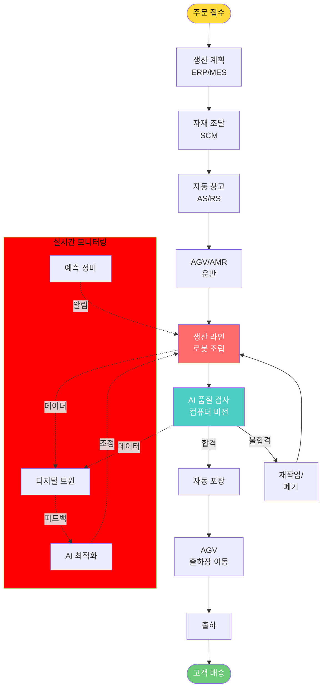
```mermaid
graph TB
    START([주문 접수]) --> PLAN[생산 계획<br/>ERP/MES]
    
    PLAN --> MATERIAL[자재 조달<br/>SCM]
    MATERIAL --> WAREHOUSE[자동 창고<br/>AS/RS]
    
    WAREHOUSE --> TRANS1[AGV/AMR<br/>운반]
    TRANS1 --> LINE[생산 라인<br/>로봇 조립]
    
    LINE --> QC[AI 품질 검사<br/>컴퓨터 비전]
    
    QC -->|합격| PACK[자동 포장]
    QC -->|불합격| REWORK[재작업/<br/>폐기]
    REWORK --> LINE
    
    PACK --> TRANS2[AGV<br/>출하장 이동]
    TRANS2 --> SHIP[출하]
    
    SHIP --> END([고객 배송])
    
    subgraph 실시간_모니터링[실시간 모니터링]
        MONITOR[디지털 트윈]
        AI_OPT[AI 최적화]
        PREDICT[예측 정비]
    end
    
    LINE -.데이터.-> MONITOR
    QC -.데이터.-> MONITOR
    MONITOR -.피드백.-> AI_OPT
    AI_OPT -.조정.-> LINE
    PREDICT -.알림.-> LINE
    
    style START fill:#FFD93D,color:#111
    style END fill:#6BCB77,color:#fff
    style LINE fill:#FF6B6B,color:#fff
    style QC fill:#4ECDC4,color:#fff
    style 실시간_모니터링 fill:#F00,color:#111
```

### 3.2 생산 라인 상세 동작 순서

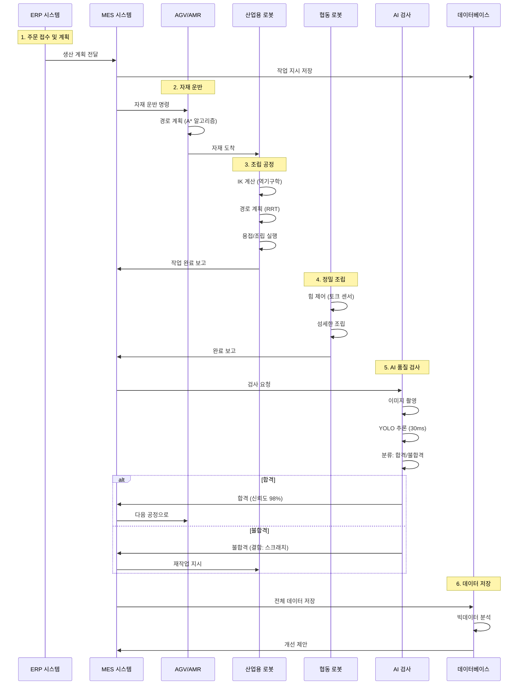
```mermaid
sequenceDiagram
    participant ERP as ERP 시스템
    participant MES as MES 시스템
    participant AGV as AGV/AMR
    participant ROBOT as 산업용 로봇
    participant COBOT as 협동 로봇
    participant AI as AI 검사
    participant DB as 데이터베이스
    
    Note over ERP: 1. 주문 접수 및 계획
    ERP->>MES: 생산 계획 전달
    MES->>DB: 작업 지시 저장
    
    Note over AGV: 2. 자재 운반
    MES->>AGV: 자재 운반 명령
    AGV->>AGV: 경로 계획 (A* 알고리즘)
    AGV->>ROBOT: 자재 도착
    
    Note over ROBOT: 3. 조립 공정
    ROBOT->>ROBOT: IK 계산 (역기구학)
    ROBOT->>ROBOT: 경로 계획 (RRT)
    ROBOT->>ROBOT: 용접/조립 실행
    ROBOT->>MES: 작업 완료 보고
    
    Note over COBOT: 4. 정밀 조립
    COBOT->>COBOT: 힘 제어 (토크 센서)
    COBOT->>COBOT: 섬세한 조립
    COBOT->>MES: 완료 보고
    
    Note over AI: 5. AI 품질 검사
    MES->>AI: 검사 요청
    AI->>AI: 이미지 촬영
    AI->>AI: YOLO 추론 (30ms)
    AI->>AI: 분류: 합격/불합격
    
    alt 합격
        AI->>MES: 합격 (신뢰도 98%)
        MES->>AGV: 다음 공정으로
    else 불합격
        AI->>MES: 불합격 (결함: 스크래치)
        MES->>ROBOT: 재작업 지시
    end
    
    Note over DB: 6. 데이터 저장
    MES->>DB: 전체 데이터 저장
    DB->>DB: 빅데이터 분석
    DB->>MES: 개선 제안
```

### 3.3 실시간 최적화 루프

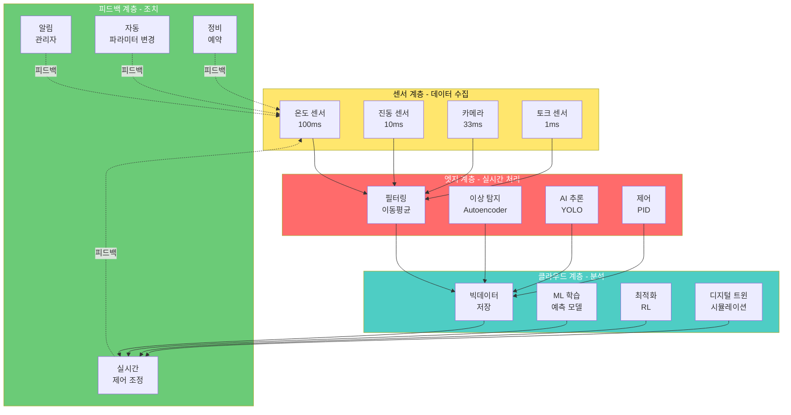
```mermaid
flowchart TB
    subgraph 센서_계층[센서 계층 - 데이터 수집]
        S1[온도 센서<br/>100ms]
        S2[진동 센서<br/>10ms]
        S3[카메라<br/>33ms]
        S4[토크 센서<br/>1ms]
    end
    
    subgraph 엣지_계층[엣지 계층 - 실시간 처리]
        E1[필터링<br/>이동평균]
        E2[이상 탐지<br/>Autoencoder]
        E3[AI 추론<br/>YOLO]
        E4[제어<br/>PID]
    end
    
    subgraph 클라우드_계층[클라우드 계층 - 분석]
        C1[빅데이터<br/>저장]
        C2[ML 학습<br/>예측 모델]
        C3[최적화<br/>RL]
        C4[디지털 트윈<br/>시뮬레이션]
    end
    
    subgraph 피드백_계층[피드백 계층 - 조치]
        F1[실시간<br/>제어 조정]
        F2[알림<br/>관리자]
        F3[자동<br/>파라미터 변경]
        F4[정비<br/>예약]
    end
    
    S1 & S2 & S3 & S4 --> E1
    E1 & E2 & E3 & E4 --> C1
    C1 & C2 & C3 & C4 --> F1
    F1 & F2 & F3 & F4 -.피드백.-> S1
    
    style 센서_계층 fill:#FFE66D,color:#111
    style 엣지_계층 fill:#FF6B6B,color:#fff
    style 클라우드_계층 fill:#4ECDC4,color:#fff
    style 피드백_계층 fill:#6BCB77,color:#fff
```

### 3.4 디지털 트윈 동작 플로우

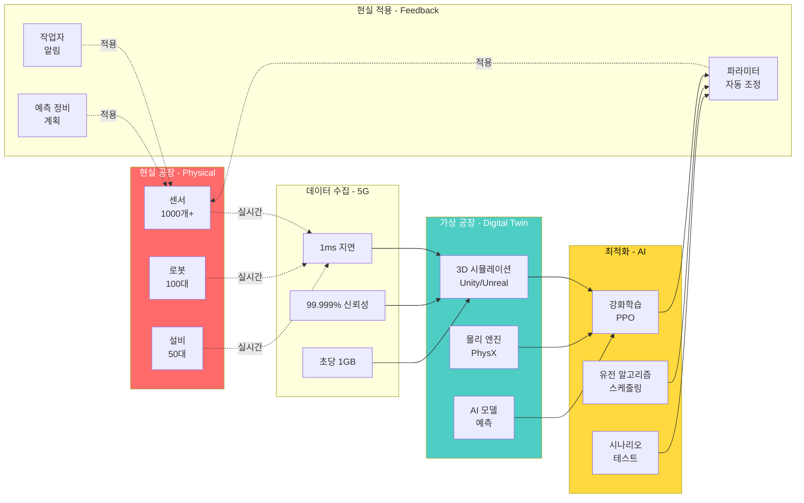
```mermaid
graph LR
    subgraph 현실_공장[현실 공장 - Physical]
        P1[센서<br/>1000개+]
        P2[로봇<br/>100대]
        P3[설비<br/>50대]
    end
    
    subgraph 데이터_수집[데이터 수집 - 5G]
        D1[1ms 지연]
        D2[99.999% 신뢰성]
        D3[초당 1GB]
    end
    
    subgraph 가상_공장[가상 공장 - Digital Twin]
        V1[3D 시뮬레이션<br/>Unity/Unreal]
        V2[물리 엔진<br/>PhysX]
        V3[AI 모델<br/>예측]
    end
    
    subgraph 최적화[최적화 - AI]
        O1[강화학습<br/>PPO]
        O2[유전 알고리즘<br/>스케줄링]
        O3[시나리오<br/>테스트]
    end
    
    subgraph 적용[현실 적용 - Feedback]
        A1[파라미터<br/>자동 조정]
        A2[작업자<br/>알림]
        A3[예측 정비<br/>계획]
    end
    
    P1 & P2 & P3 -.실시간.-> D1
    D1 & D2 & D3 --> V1
    V1 & V2 & V3 --> O1
    O1 & O2 & O3 --> A1
    A1 & A2 & A3 -.적용.-> P1
    
    style 현실_공장 fill:#FF6B6B,color:#fff
    style 가상_공장 fill:#4ECDC4,color:#fff
    style 최적화 fill:#FFD93D,color:#111
```

---

## 4. 생산성 향상 기술 매트릭스

### 4.1 생산성 향상 영역별 기술 매핑

| 생산성 지표 | 개선 목표 | 핵심 기술 | 알고리즘 | 로봇/설비 | 투자 대비 효과 |
|------------|---------|----------|---------|-----------|--------------|
| **생산 속도** | 2배 향상 | 로봇 자동화, 병렬 처리 | 동기화 제어, 최적 경로 | 6축 로봇, Delta 로봇 | ⭐⭐⭐⭐⭐ |
| **불량률** | 5% → 0.5% | AI 품질 검사, 예측 정비 | YOLO, CNN, LSTM | 비전 시스템, 센서 | ⭐⭐⭐⭐⭐ |
| **가동률** | 80% → 95% | 예측 정비, 자동 복구 | Anomaly Detection, RL | IoT 센서, SCADA | ⭐⭐⭐⭐ |
| **인건비** | 50% 절감 | 로봇 대체, 무인 운영 | 상태 머신, 자율 제어 | Cobot, AGV/AMR | ⭐⭐⭐⭐⭐ |
| **재고** | 70% 감소 | JIT, 실시간 SCM | 수요 예측, 최적화 | 자동 창고 (AS/RS) | ⭐⭐⭐ |
| **에너지** | 30% 절감 | 스마트 센서, AI 최적화 | 강화학습, PID 제어 | 스마트 미터, IoT | ⭐⭐⭐ |
| **리드 타임** | 5일 → 1일 | 자동화, 유연 생산 | 동적 스케줄링, GA | 셀 생산, 모듈형 라인 | ⭐⭐⭐⭐ |
| **유연성** | 모델 전환 2주 → 1일 | 재구성 가능 라인 | Modular 제어 | Cobot, 교체형 지그 | ⭐⭐⭐⭐ |
| **품질 일관성** | Cpk 1.0 → 1.67 | 통계적 공정 관리 | SPC, Real-time 모니터링 | 정밀 센서, AI | ⭐⭐⭐⭐ |
| **작업자 안전** | 재해 제로 | Cobot, 안전 센서 | 충돌 회피, Safety Zone | 라이트 커튼, 협동 로봇 | ⭐⭐⭐⭐⭐ |

### 4.2 생산 속도 향상 기술 상세

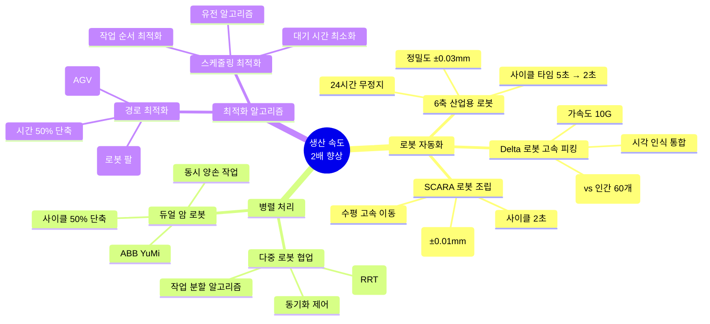
```mermaid
mindmap
  root((생산 속도<br/>2배 향상))
    로봇 자동화
      6축 산업용 로봇
        사이클 타임 5초 → 2초
        24시간 무정지
        정밀도 ±0.03mm
      Delta 로봇 고속 피킹
        분당 300개 (vs 인간 60개)
        가속도 10G
        시각 인식 통합
      SCARA 로봇 조립
        수평 고속 이동
        정밀 조립 (±0.01mm)
        사이클 2초
    병렬 처리
      다중 로봇 협업
        작업 분할 알고리즘
        충돌 회피 (RRT)
        동기화 제어
      듀얼 암 로봇
        동시 양손 작업
        ABB YuMi
        사이클 50% 단축
    최적화 알고리즘
      경로 최적화
        A* 알고리즘 (AGV)
        RRT* (로봇 팔)
        시간 50% 단축
      스케줄링 최적화
        유전 알고리즘
        작업 순서 최적화
        대기 시간 최소화
```

#### 생산 속도 향상 로드맵

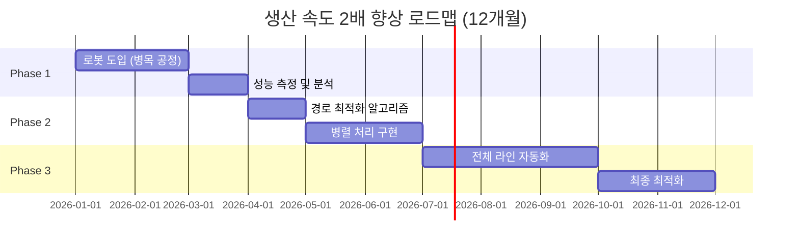
```mermaid
gantt
    title 생산 속도 2배 향상 로드맵 (12개월)
    dateFormat  YYYY-MM
    section Phase 1
    로봇 도입 (병목 공정)         :2026-01, 2026-03
    성능 측정 및 분석             :2026-03, 2026-04
    section Phase 2
    경로 최적화 알고리즘          :2026-04, 2026-05
    병렬 처리 구현                :2026-05, 2026-07
    section Phase 3
    전체 라인 자동화              :2026-07, 2026-10
    최종 최적화                   :2026-10, 2026-12
```

**예상 효과**:
- **Phase 1 (3개월)**: 생산 속도 +30% (수동 → 로봇)
- **Phase 2 (6개월)**: 생산 속도 +60% (최적화)
- **Phase 3 (12개월)**: 생산 속도 +100% (전체 자동화)

### 4.3 품질 향상 기술 상세

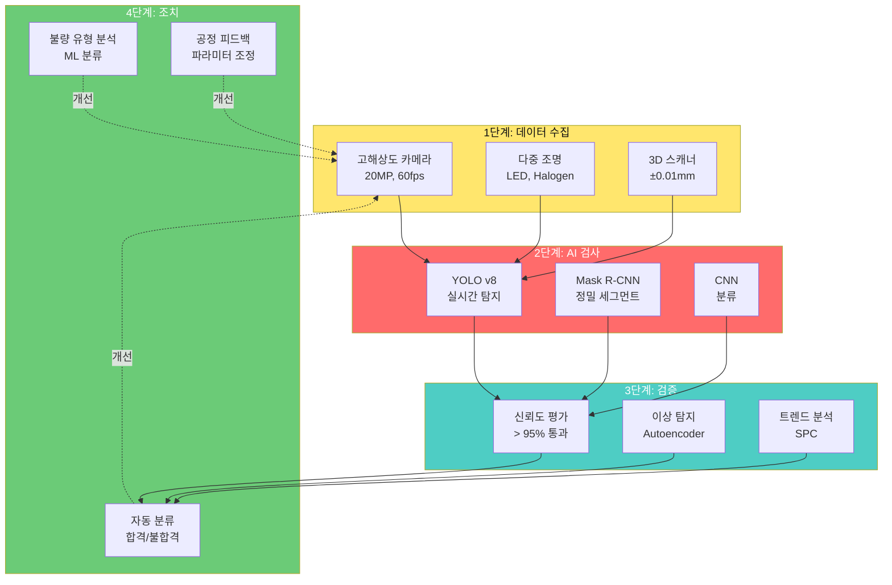
```mermaid
graph TB
    subgraph 데이터_수집[1단계: 데이터 수집]
        D1[고해상도 카메라<br/>20MP, 60fps]
        D2[다중 조명<br/>LED, Halogen]
        D3[3D 스캐너<br/>±0.01mm]
    end
    
    subgraph AI_검사[2단계: AI 검사]
        A1[YOLO v8<br/>실시간 탐지]
        A2[Mask R-CNN<br/>정밀 세그먼트]
        A3[CNN<br/>분류]
    end
    
    subgraph 검증[3단계: 검증]
        V1[신뢰도 평가<br/>> 95% 통과]
        V2[이상 탐지<br/>Autoencoder]
        V3[트렌드 분석<br/>SPC]
    end
    
    subgraph 조치[4단계: 조치]
        AC1[자동 분류<br/>합격/불합격]
        AC2[불량 유형 분석<br/>ML 분류]
        AC3[공정 피드백<br/>파라미터 조정]
    end
    
    D1 & D2 & D3 --> A1
    A1 & A2 & A3 --> V1
    V1 & V2 & V3 --> AC1
    AC1 & AC2 & AC3 -.개선.-> D1
    
    
    style 데이터_수집 fill:#FFE66D,color:#111
    style AI_검사 fill:#FF6B6B,color:#fff
    style 검증 fill:#4ECDC4,color:#fff
    style 조치 fill:#6BCB77,color:#fff
```

#### 불량률 개선 데이터

| 검사 방법 | 불량률 | 검사 속도 | 비용 | 정확도 |
|----------|--------|----------|------|--------|
| **육안 검사** | 5.0% | 30개/분 | 인건비 | 90% |
| **광학 검사** | 2.0% | 60개/분 | 5000만원 | 95% |
| **AI 검사 (CNN)** | 0.8% | 100개/분 | 1억원 | 98% |
| **AI + 센서 하이브리드** | 0.3% | 100개/분 | 1.5억원 | 99.5% |
| **AI + 3D 스캔** | 0.1% | 50개/분 | 3억원 | 99.9% |

### 4.4 가동률 향상 기술 상세

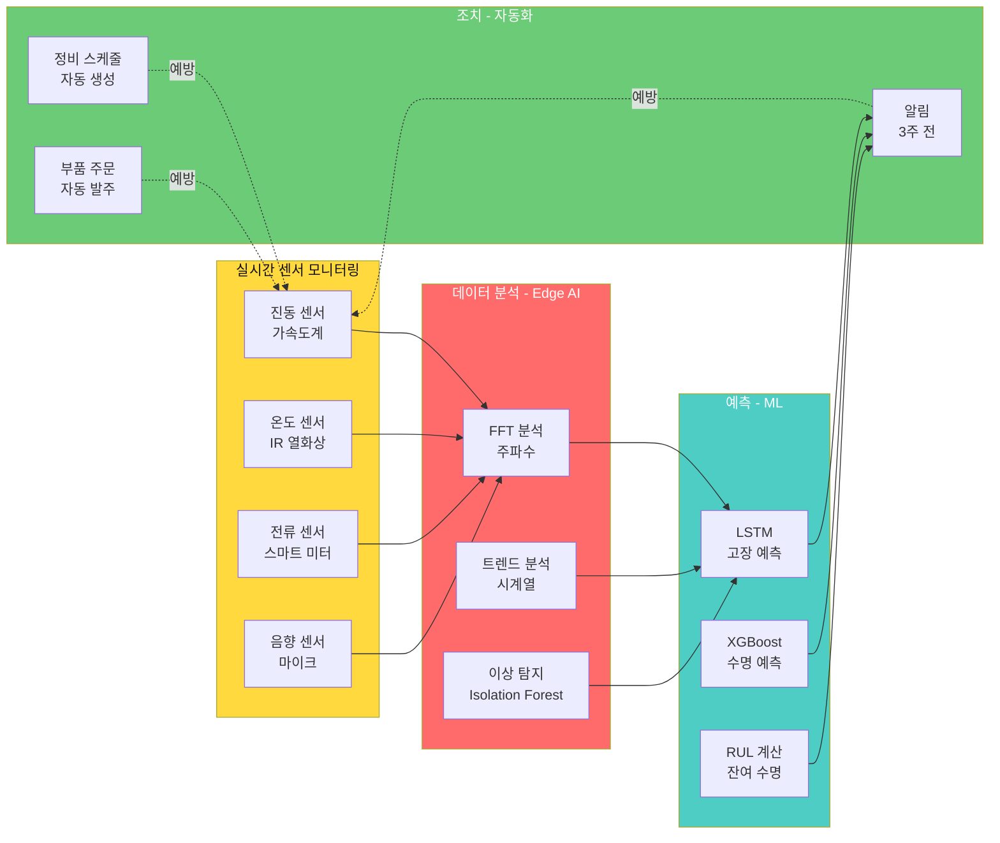
```mermaid
graph LR
    subgraph 센서_모니터링[실시간 센서 모니터링]
        S1[진동 센서<br/>가속도계]
        S2[온도 센서<br/>IR 열화상]
        S3[전류 센서<br/>스마트 미터]
        S4[음향 센서<br/>마이크]
    end
    
    subgraph 데이터_분석[데이터 분석 - Edge AI]
        D1[FFT 분석<br/>주파수]
        D2[트렌드 분석<br/>시계열]
        D3[이상 탐지<br/>Isolation Forest]
    end
    
    subgraph 예측[예측 - ML]
        P1[LSTM<br/>고장 예측]
        P2[XGBoost<br/>수명 예측]
        P3[RUL 계산<br/>잔여 수명]
    end
    
    subgraph 조치[조치 - 자동화]
        A1[알림<br/>3주 전]
        A2[정비 스케줄<br/>자동 생성]
        A3[부품 주문<br/>자동 발주]
    end
    
    S1 & S2 & S3 & S4 --> D1
    D1 & D2 & D3 --> P1
    P1 & P2 & P3 --> A1
    A1 & A2 & A3 -.예방.-> S1
    
    style 센서_모니터링 fill:#FFD93D,color:#111
    style 데이터_분석 fill:#FF6B6B,color:#fff
    style 예측 fill:#4ECDC4,color:#fff
    style 조치 fill:#6BCB77,color:#fff
```

#### 예측 정비 효과

| 항목 | 사후 정비 | 예방 정비 | 예측 정비 |
|------|----------|----------|----------|
| **가동률** | 70% | 85% | **95%** |
| **MTBF** | 500시간 | 800시간 | **1200시간** |
| **MTTR** | 8시간 | 4시간 | **1시간** |
| **정비 비용** | 높음 (긴급) | 중간 | **낮음 (계획)** |
| **2차 손상** | 많음 | 적음 | **거의 없음** |
| **예측 정확도** | - | - | **90% (3주 전)** |

### 4.5 로봇별 적용 분야 및 알고리즘

| 로봇 종류 | 적용 분야 | 핵심 알고리즘 | 생산성 향상 | 가격 (2026) |
|----------|----------|--------------|-----------|------------|
| **6축 산업용 로봇** | 용접, 도장, 핸들링 | IK/FK, 경로 계획 (RRT) | 속도 3배 | 5000만원 |
| **Delta 로봇** | 고속 피킹 (식품, 전자) | 병렬 IK, 시각 서보 | 속도 5배 | 3000만원 |
| **SCARA 로봇** | 조립, 검사 | 평면 경로 최적화 | 속도 4배 | 2000만원 |
| **협동 로봇 (Cobot)** | 정밀 조립, 사람 협업 | 힘 제어, 충돌 감지 | 유연성 10배 | 3000만원 |
| **AGV (자기 유도)** | 자재 운반 (정해진 경로) | PID 제어, 라인 추적 | 인건비 70% 절감 | 2000만원 |
| **AMR (자율)** | 자재 운반 (자율) | SLAM, A* 경로 계획 | 유연성 20배 | 5000만원 |
| **휴머노이드** | 복잡한 작업, 다목적 | 강화학습, 모방 학습 | 범용성 ∞ | 5000만원 (2026) |
| **모바일 매니퓰레이터** | 이동 + 조립 | SLAM + 경로 계획 | 작업 범위 10배 | 8000만원 |

### 4.6 알고리즘별 생산성 기여도

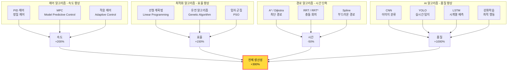
```mermaid
graph TB
    subgraph 제어_알고리즘[제어 알고리즘 - 속도 향상]
        C1[PID 제어<br/>정밀 제어]
        C2[MPC<br/>Model Predictive Control]
        C3[적응 제어<br/>Adaptive Control]
    end
    
    subgraph 최적화_알고리즘[최적화 알고리즘 - 효율 향상]
        O1[선형 계획법<br/>Linear Programming]
        O2[유전 알고리즘<br/>Genetic Algorithm]
        O3[입자 군집<br/>PSO]
    end
    
    subgraph 경로_알고리즘[경로 알고리즘 - 시간 단축]
        P1[A* / Dijkstra<br/>최단 경로]
        P2[RRT / RRT*<br/>충돌 회피]
        P3[Spline<br/>부드러운 경로]
    end
    
    subgraph AI_알고리즘[AI 알고리즘 - 품질 향상]
        A1[CNN<br/>이미지 분류]
        A2[YOLO<br/>실시간 탐지]
        A3[LSTM<br/>시계열 예측]
        A4[강화학습<br/>최적 행동]
    end
    
    C1 & C2 & C3 --> SPEED[속도<br/>+200%]
    O1 & O2 & O3 --> EFF[효율<br/>+150%]
    P1 & P2 & P3 --> TIME[시간<br/>-50%]
    A1 & A2 & A3 & A4 --> QUALITY[품질<br/>+1000%]
    
    SPEED & EFF & TIME & QUALITY --> RESULT[전체 생산성<br/>+300%]
    
    style RESULT fill:#FFD93D,color:#111,stroke:#FF6B6B,stroke-width:4px
```

### 4.7 투자 우선순위 매트릭스


| 투자대상        | 투자비용 (상대) | 효과 (상대) | 분류             | 비고           |
|----------------|:--------------:|:-----------:|:----------------:|----------------|
| AI 품질검사      | 매우 낮음 (0.25)   | 매우 높음 (0.85)   | 우선 투자        | 즉시 실행      |
| 예측정비         | 매우 낮음 (0.2)    | 높음  (0.75)       | 우선 투자        | 즉시 실행      |
| 협동로봇         | 낮음 (0.3)         | 높음 (0.8)         | 우선 투자        | 즉시 실행      |
| AGV 자율운반     | 보통 (0.4)         | 높음 (0.7)         | 우선 투자        | 인건비 절감    |
| 디지털트윈       | 높음 (0.7)         | 높음 (0.8)         | 전략적 투자      | 장기           |
| 6축로봇          | 높음 (0.5)         | 보통 (0.65)        | 전략적 투자      | 장기           |
| MES시스템        | 높음 (0.6)         | 보통 (0.6)         | 전략적 투자      | 장기           |
| 센서네트워크     | 매우 낮음 (0.15)   | 다소 낮음 (0.5)    | 보류(재검토)     |                |
| SCADA           | 보통 (0.45)        | 다소 낮음 (0.55)   | 보류(재검토)     |                |
| ERP통합          | 높음 (0.65)        | 다소 낮음 (0.5)    | 선택 투자(여유)  |                |
| AR교육           | 높음 (0.5)         | 낮음  (0.4)        | 선택 투자(여유)  |                |
| 블록체인         | 높음 (0.7)         | 매우 낮음 (0.3)    | 선택 투자(여유)  |                |


**투자 우선순위 (즉시 실행)**:
1. **AI 품질 검사** (투자: 1억원, 효과: 불량률 10배 개선)
2. **예측 정비** (투자: 5000만원, 효과: 가동률 +15%)
3. **Cobot** (투자: 3000만원, 효과: 유연성 +1000%)
4. **AGV** (투자: 4000만원, 효과: 인건비 -70%)

---

## 5. 글로벌 사례 분석

### 5.1 테슬라 기가팩토리 (Gigafactory)

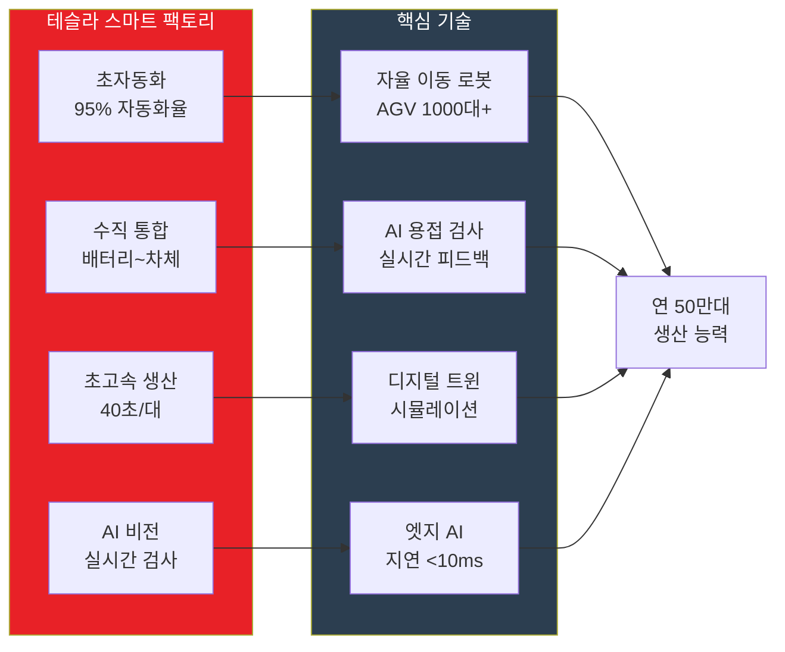
```mermaid
graph LR
    subgraph 테슬라_특징[테슬라 스마트 팩토리]
        T1[초자동화<br/>95% 자동화율]
        T2[수직 통합<br/>배터리~차체]
        T3[초고속 생산<br/>40초/대]
        T4[AI 비전<br/>실시간 검사]
    end
    
    subgraph 핵심_기술[핵심 기술]
        K1[자율 이동 로봇<br/>AGV 1000대+]
        K2[AI 용접 검사<br/>실시간 피드백]
        K3[디지털 트윈<br/>시뮬레이션]
        K4[엣지 AI<br/>지연 <10ms]
    end
    
    T1 --> K1
    T2 --> K2
    T3 --> K3
    T4 --> K4
    
    K1 & K2 & K3 & K4 --> RESULT[연 50만대<br/>생산 능력]
    
    style 테슬라_특징 fill:#E82127,color:#fff
    style 핵심_기술 fill:#2C3E50,color:#fff
```

#### 테슬라 스마트 팩토리 상세 분석

| 항목 | 내용 | 알고리즘/기술 |
|------|------|--------------|
| **생산 속도** | 40초당 1대 (Model 3) | 최적 경로 알고리즘, 병렬 생산 라인 |
| **자동화율** | 95% | 협동 로봇(Cobot) + 산업용 로봇 |
| **품질 관리** | 불량률 0.01% | AI 비전 검사 (YOLO, CNN) |
| **예측 정비** | 고장 전 90% 예측 | 머신러닝 (LSTM, XGBoost) |
| **에너지 효율** | 전통 대비 50% 절감 | 강화학습 최적화 |
| **재고 관리** | JIT (Just-In-Time) | 공급망 최적화 알고리즘 |

**핵심 알고리즘**:
1. **경로 최적화**: Dijkstra, A* 알고리즘 (AGV 이동)
2. **작업 스케줄링**: Genetic Algorithm, 휴리스틱
3. **이상 탐지**: Autoencoder, Isolation Forest
4. **강화학습**: Deep Q-Network (생산 최적화)

---

### 2.2 현대차 싱가폴 스마트 팩토리 (HMGICS)

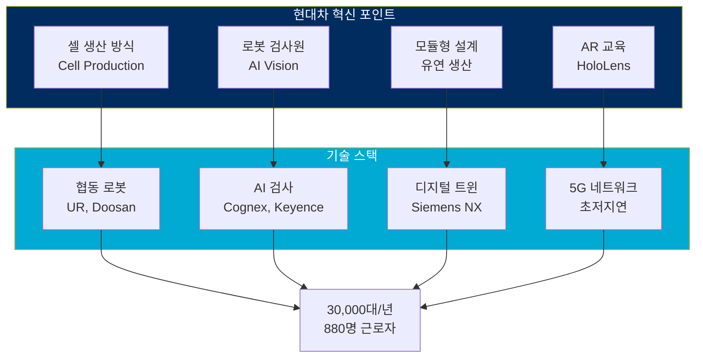
```mermaid
graph TB
    subgraph 현대_혁신[현대차 혁신 포인트]
        H1[셀 생산 방식<br/>Cell Production]
        H2[로봇 검사원<br/>AI Vision]
        H3[모듈형 설계<br/>유연 생산]
        H4[AR 교육<br/>HoloLens]
    end
    
    subgraph 기술_스택[기술 스택]
        S1[협동 로봇<br/>UR, Doosan]
        S2[AI 검사<br/>Cognex, Keyence]
        S3[디지털 트윈<br/>Siemens NX]
        S4[5G 네트워크<br/>초저지연]
    end
    
    H1 --> S1
    H2 --> S2
    H3 --> S3
    H4 --> S4
    
    S1 & S2 & S3 & S4 --> FEATURE[30,000대/년<br/>880명 근로자]
    
    style 현대_혁신 fill:#002C5F,color:#fff
    style 기술_스택 fill:#00AAD2,color:#fff
```

#### 현대차 스마트 팩토리 상세 분석

| 구분 | 전통 공장 (울산) | 싱가포르 HMGICS |
|------|-----------------|-----------------|
| **생산 방식** | 컨베이어 벨트 | **셀 생산** (모듈형) |
| **근로자 수** | 2,000명/동일 생산 | **880명** (56% 감소) |
| **자동화율** | 80% | **95%** |
| **모델 전환 시간** | 2주 | **1일** (유연성 14배) |
| **품질 검사** | 샘플링 | **전수 검사** (AI) |
| **에너지 효율** | 기준 | 40% 절감 |

**핵심 기술**:
1. **셀 생산 방식**: 차량이 이동하며 각 셀에서 작업
2. **AI 검사원**: Microsoft HoloLens + Azure AI
3. **디지털 트윈**: 가상에서 먼저 최적화 후 현실 적용
4. **5G 네트워크**: 초저지연 (<1ms) 로봇 제어

---

### 5.3 샤오미 슈퍼팩토리 (Xiaomi Smart Factory)

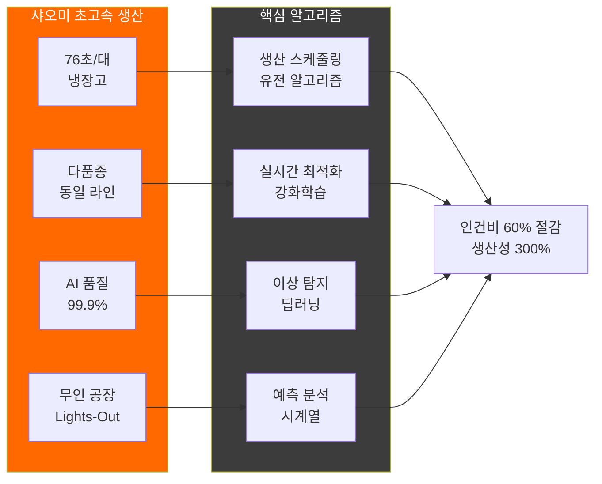
```mermaid
graph LR
    subgraph 샤오미_특징[샤오미 초고속 생산]
        X1[76초/대<br/>냉장고]
        X2[다품종<br/>동일 라인]
        X3[AI 품질<br/>99.9%]
        X4[무인 공장<br/>Lights-Out]
    end
    
    subgraph 알고리즘[핵심 알고리즘]
        A1[생산 스케줄링<br/>유전 알고리즘]
        A2[실시간 최적화<br/>강화학습]
        A3[이상 탐지<br/>딥러닝]
        A4[예측 분석<br/>시계열]
    end
    
    X1 --> A1
    X2 --> A2
    X3 --> A3
    X4 --> A4
    
    A1 & A2 & A3 & A4 --> RESULT[인건비 60% 절감<br/>생산성 300%]
    
    style 샤오미_특징 fill:#FF6900,color:#fff
    style 알고리즘 fill:#3C3C3C,color:#fff
```

#### 샤오미 스마트 팩토리 상세

| 제품 | 생산 시간 | 자동화율 | 핵심 기술 |
|------|----------|---------|----------|
| **냉장고** | 76초/대 | 95% | 로봇 조립 + AI 검사 |
| **스마트폰** | 60초/대 | 98% | 마이크로 조립 로봇 |
| **가전제품** | 다양 | 90% | 유연 생산 라인 |

**혁신 포인트**:
1. **Lights-Out 공장**: 24시간 무인 운영
2. **AI 품질 관리**: 불량률 0.1% 이하
3. **빅데이터 분석**: 모든 공정 데이터 실시간 수집
4. **유연 생산**: 30개 제품을 동일 라인에서 생산

---

### 5.4 아마존 물류 센터 (Amazon Fulfillment Center)

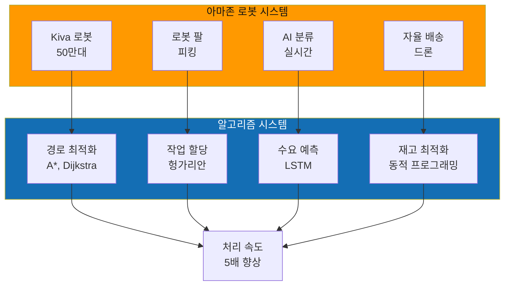
```mermaid
graph TB
    subgraph 아마존_로봇[아마존 로봇 시스템]
        AM1[Kiva 로봇<br/>50만대]
        AM2[로봇 팔<br/>피킹]
        AM3[AI 분류<br/>실시간]
        AM4[자율 배송<br/>드론]
    end
    
    subgraph 알고리즘_시스템[알고리즘 시스템]
        ALG1[경로 최적화<br/>A*, Dijkstra]
        ALG2[작업 할당<br/>헝가리안]
        ALG3[수요 예측<br/>LSTM]
        ALG4[재고 최적화<br/>동적 프로그래밍]
    end
    
    AM1 --> ALG1
    AM2 --> ALG2
    AM3 --> ALG3
    AM4 --> ALG4
    
    ALG1 & ALG2 & ALG3 & ALG4 --> PERF[처리 속도<br/>5배 향상]
    
    style 아마존_로봇 fill:#FF9900,color:#111
    style 알고리즘_시스템 fill:#146EB4,color:#fff
```

---

## 6. 핵심 기술 체계

### 6.1 스마트 팩토리 기술 스택

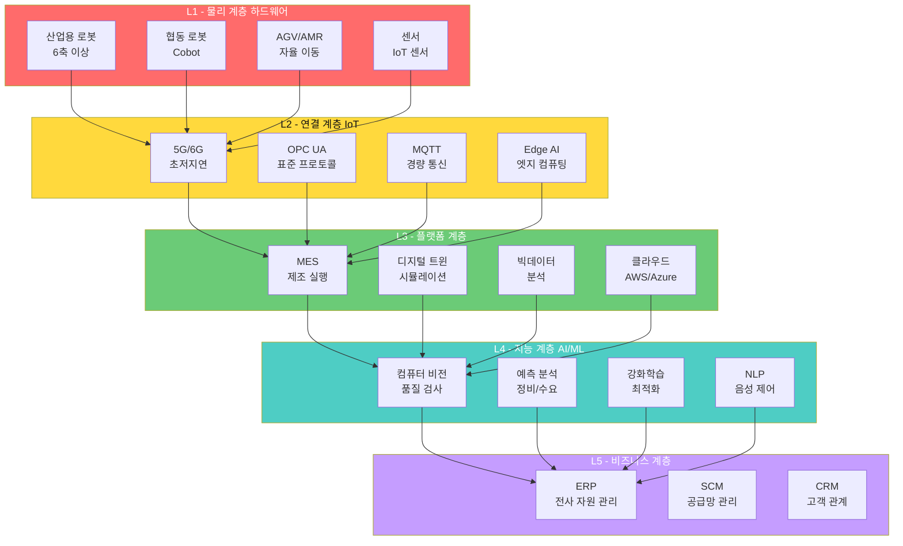
```mermaid
graph TB
    subgraph Layer5[L5 - 비즈니스 계층]
        L5_1[ERP<br/>전사 자원 관리]
        L5_2[SCM<br/>공급망 관리]
        L5_3[CRM<br/>고객 관계]
    end
    
    subgraph Layer4[L4 - 지능 계층 AI/ML]
        L4_1[컴퓨터 비전<br/>품질 검사]
        L4_2[예측 분석<br/>정비/수요]
        L4_3[강화학습<br/>최적화]
        L4_4[NLP<br/>음성 제어]
    end
    
    subgraph Layer3[L3 - 플랫폼 계층]
        L3_1[MES<br/>제조 실행]
        L3_2[디지털 트윈<br/>시뮬레이션]
        L3_3[빅데이터<br/>분석]
        L3_4[클라우드<br/>AWS/Azure]
    end
    
    subgraph Layer2[L2 - 연결 계층 IoT]
        L2_1[5G/6G<br/>초저지연]
        L2_2[OPC UA<br/>표준 프로토콜]
        L2_3[MQTT<br/>경량 통신]
        L2_4[Edge AI<br/>엣지 컴퓨팅]
    end
    
    subgraph Layer1[L1 - 물리 계층 하드웨어]
        L1_1[산업용 로봇<br/>6축 이상]
        L1_2[협동 로봇<br/>Cobot]
        L1_3[AGV/AMR<br/>자율 이동]
        L1_4[센서<br/>IoT 센서]
    end
    
    L1_1 & L1_2 & L1_3 & L1_4 --> L2_1
    L2_1 & L2_2 & L2_3 & L2_4 --> L3_1
    L3_1 & L3_2 & L3_3 & L3_4 --> L4_1
    L4_1 & L4_2 & L4_3 & L4_4 --> L5_1
    
    style Layer1 fill:#FF6B6B,color:#fff
    style Layer2 fill:#FFD93D,color:#111
    style Layer3 fill:#6BCB77,color:#fff
    style Layer4 fill:#4ECDC4,color:#fff
    style Layer5 fill:#C59DFF,color:#fff
```

### 6.2 핵심 알고리즘 분류

| 분류 | 알고리즘 | 적용 사례 | 복잡도 |
|------|---------|----------|--------|
| **경로 최적화** | Dijkstra, A*, Genetic | AGV 이동, 물류 | O(n log n) |
| **작업 스케줄링** | Genetic Algorithm, Simulated Annealing | 생산 계획 | NP-Hard |
| **컴퓨터 비전** | YOLO, R-CNN, Mask R-CNN | 품질 검사 | O(n²) |
| **예측 분석** | LSTM, GRU, ARIMA | 수요 예측, 정비 | O(n) |
| **강화학습** | DQN, PPO, A3C | 생산 최적화 | O(∞) |
| **이상 탐지** | Isolation Forest, Autoencoder | 고장 예측 | O(n log n) |
| **최적화** | 선형 계획법, 동적 프로그래밍 | 재고 관리 | O(n³) |
| **클러스터링** | K-Means, DBSCAN | 불량 패턴 | O(n²) |

---

## 7. 단계별 발전 과정

### 7.1 스마트 팩토리 성숙도 모델

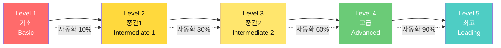
```mermaid
graph LR
    L1[Level 1<br/>기초<br/>Basic] --> L2[Level 2<br/>중간1<br/>Intermediate 1]
    L2 --> L3[Level 3<br/>중간2<br/>Intermediate 2]
    L3 --> L4[Level 4<br/>고급<br/>Advanced]
    L4 --> L5[Level 5<br/>최고<br/>Leading]
    
    L1 -.자동화 10%.-> L2
    L2 -.자동화 30%.-> L3
    L3 -.자동화 60%.-> L4
    L4 -.자동화 90%.-> L5
    
    style L1 fill:#FF6B6B,color:#fff
    style L2 fill:#FFD93D,color:#111
    style L3 fill:#FFE66D,color:#111
    style L4 fill:#6BCB77,color:#fff
    style L5 fill:#4ECDC4,color:#fff
```

### 7.2 단계별 상세 분석

#### Level 1: 기초 (자동화 10%)

| 항목 | 내용 |
|------|------|
| **특징** | 수동 작업 중심, 부분 자동화 |
| **기술** | 기본 PLC, 센서, 반자동 설비 |
| **알고리즘** | 간단한 제어 로직 (if-else) |
| **데이터** | 수기 기록, 엑셀 관리 |
| **인력** | 단순 작업자 90% |
| **투자** | 100만원 ~ 1000만원 |
| **사례** | 중소 제조업 대부분 |

**Level 1 → Level 2 전환 전략**:
1. 반복 작업부터 자동화 (ROI 빠름)
2. 센서 데이터 수집 시작
3. 기본 MES 도입

---

#### Level 2: 중간1 (자동화 30%)

| 항목 | 내용 |
|------|------|
| **특징** | 부분 자동화, 데이터 수집 시작 |
| **기술** | 산업용 로봇 (일부), MES 기본 |
| **알고리즘** | 상태 머신, PID 제어 |
| **데이터** | 센서 데이터 DB 저장 |
| **인력** | 숙련공 70%, 기술자 30% |
| **투자** | 5천만원 ~ 3억원 |
| **사례** | 중견 제조업, 일부 자동화 |

**핵심 알고리즘**:
```
상태 머신 (State Machine):
  - 생산 라인 제어
  - 로봇 작업 시퀀스
  
PID 제어:
  - 온도/압력 제어
  - 모터 속도 제어
```

---

#### Level 3: 중간2 (자동화 60%)

| 항목 | 내용 |
|------|------|
| **특징** | 주요 공정 자동화, 데이터 분석 |
| **기술** | 협동 로봇, IoT 센서, 기본 AI |
| **알고리즘** | 머신러닝 (지도학습), 최적화 |
| **데이터** | 실시간 모니터링, 대시보드 |
| **인력** | 기술자 60%, 엔지니어 40% |
| **투자** | 5억원 ~ 20억원 |
| **사례** | 대기업 일부, IT 제조업 |

**핵심 알고리즘**:
```
머신러닝 (Supervised Learning):
  - 품질 예측: Random Forest, XGBoost
  - 불량 분류: SVM, Neural Network
  
최적화 알고리즘:
  - 생산 스케줄링: Genetic Algorithm
  - 재고 최적화: 동적 프로그래밍
```

---

#### Level 4: 고급 (자동화 90%)

| 항목 | 내용 |
|------|------|
| **특징** | 대부분 자동화, AI 활용 본격화 |
| **기술** | AGV/AMR, 딥러닝, 디지털 트윈 |
| **알고리즘** | 강화학습, 컴퓨터 비전 (CNN) |
| **데이터** | 빅데이터, 예측 분석 |
| **인력** | 엔지니어 80%, 데이터 과학자 20% |
| **투자** | 50억원 ~ 200억원 |
| **사례** | 테슬라, 현대차, 삼성 |

**핵심 알고리즘**:
```
딥러닝 (Deep Learning):
  - 품질 검사: YOLO, Mask R-CNN
  - 이상 탐지: Autoencoder
  
강화학습 (Reinforcement Learning):
  - 생산 최적화: DQN, PPO
  - 로봇 제어: A3C
```

---

#### Level 5: 최고 (자동화 95%+)

| 항목 | 내용 |
|------|------|
| **특징** | 완전 자율 공장, 자가 최적화 |
| **기술** | 자율 로봇, AGI, 6G, 양자컴퓨팅 |
| **알고리즘** | 자율 학습, 멀티 에이전트 |
| **데이터** | 완전 자동 의사결정 |
| **인력** | AI 엔지니어 95%, 관리자 5% |
| **투자** | 500억원 이상 |
| **사례** | 테슬라 기가팩토리, 샤오미 |

**핵심 알고리즘**:
```
자율 학습 (Autonomous Learning):
  - 스스로 최적화: Meta-Learning
  - 환경 적응: Transfer Learning
  
멀티 에이전트 시스템:
  - 로봇 협업: Multi-Agent RL
  - 공정 조율: Game Theory
```

---

## 8. 미래 기술 전망 (2026-2035)

### 8.1 기술 발전 로드맵

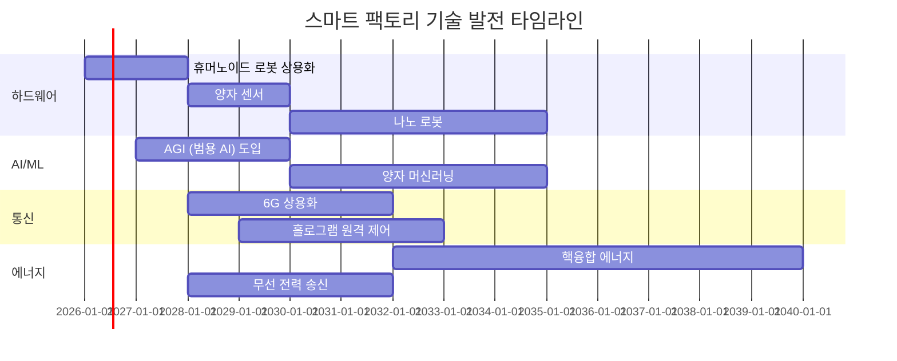
```mermaid
gantt
    title 스마트 팩토리 기술 발전 타임라인
    dateFormat  YYYY
    section 하드웨어
    휴머노이드 로봇 상용화        :2026, 2028
    양자 센서                    :2028, 2030
    나노 로봇                    :2030, 2035
    
    section AI/ML
    AGI (범용 AI) 도입           :2027, 2030
    양자 머신러닝                :2030, 2035
    
    section 통신
    6G 상용화                    :2028, 2032
    홀로그램 원격 제어            :2029, 2033
    
    section 에너지
    핵융합 에너지                :2032, 2040
    무선 전력 송신               :2028, 2032
```

### 8.2 2026-2030: 근미래 기술

#### 8.2.1 휴머노이드 로봇의 등장

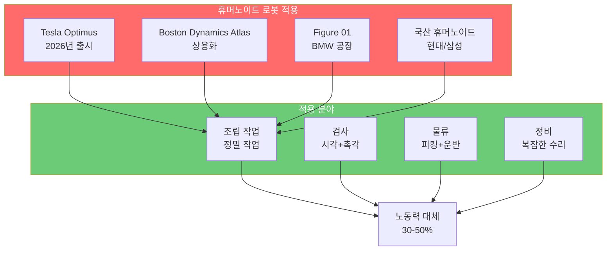
```mermaid
graph TB
    subgraph 휴머노이드_로봇[휴머노이드 로봇 적용]
        H1[Tesla Optimus<br/>2026년 출시]
        H2[Boston Dynamics Atlas<br/>상용화]
        H3[Figure 01<br/>BMW 공장]
        H4[국산 휴머노이드<br/>현대/삼성]
    end
    
    subgraph 적용_분야[적용 분야]
        A1[조립 작업<br/>정밀 작업]
        A2[검사<br/>시각+촉각]
        A3[물류<br/>피킹+운반]
        A4[정비<br/>복잡한 수리]
    end
    
    H1 & H2 & H3 & H4 --> A1
    A1 & A2 & A3 & A4 --> IMPACT[노동력 대체<br/>30-50%]
    
    style 휴머노이드_로봇 fill:#FF6B6B,color:#fff
    style 적용_분야 fill:#6BCB77,color:#fff
```

**휴머노이드 로봇 사양 (예상)**:

| 항목 | 2026년 | 2030년 |
|------|--------|--------|
| **가격** | 5000만원 | 1000만원 |
| **작업 속도** | 인간의 50% | 인간의 150% |
| **정밀도** | ±0.5mm | ±0.1mm |
| **자율성** | 반자율 | 완전 자율 |
| **학습 시간** | 100시간 | 1시간 (Few-shot Learning) |
| **적용률** | 5% | 30% |

**핵심 기술**:
1. **강화학습**: 복잡한 작업 학습
2. **컴퓨터 비전**: 3D 인식, 물체 파악
3. **촉각 센서**: 힘 제어, 섬세한 조립
4. **자연어 처리**: 음성 명령

---

#### 8.2.2 6G 네트워크와 초저지연

| 구분 | 5G (현재) | 6G (2028~) |
|------|----------|-----------|
| **지연 시간** | 1ms | **0.1ms** |
| **속도** | 20Gbps | **1Tbps** |
| **동시 연결** | 100만/km² | **1000만/km²** |
| **신뢰성** | 99.999% | **99.99999%** |
| **적용** | 로봇 제어 | **촉각 인터넷** |

**촉각 인터넷 (Tactile Internet)**:
- 원격으로 로봇 **실시간 제어** (지연 < 0.1ms)
- 햅틱 피드백으로 **촉각 전달**
- 원격 수술, 정밀 조립 가능

---

#### 8.2.3 디지털 트윈 2.0

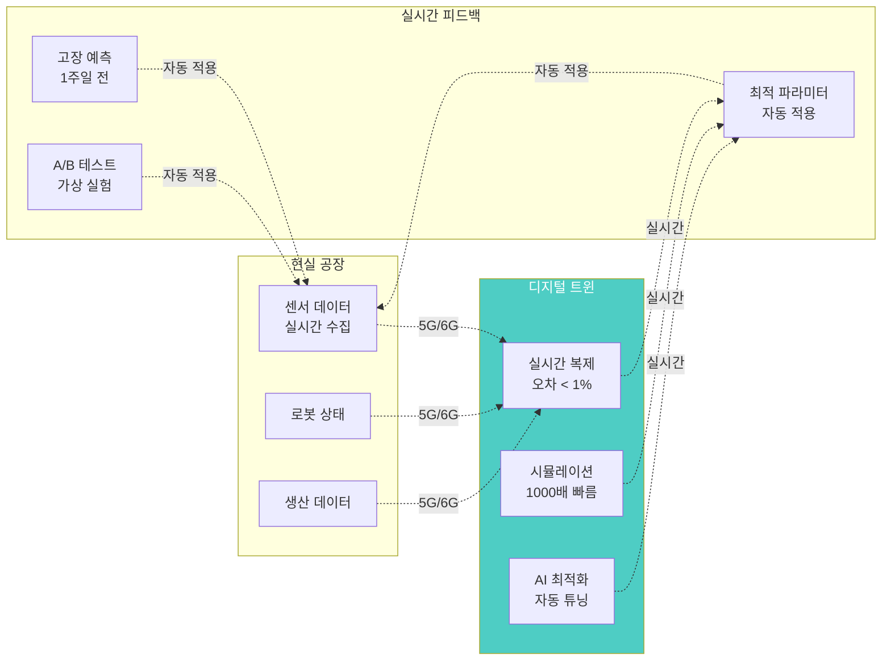
```mermaid
graph LR
    subgraph 현실_공장[현실 공장]
        R1[센서 데이터<br/>실시간 수집]
        R2[로봇 상태]
        R3[생산 데이터]
    end
    
    subgraph 디지털_트윈[디지털 트윈]
        D1[실시간 복제<br/>오차 < 1%]
        D2[시뮬레이션<br/>1000배 빠름]
        D3[AI 최적화<br/>자동 튜닝]
    end
    
    subgraph 피드백[실시간 피드백]
        F1[최적 파라미터<br/>자동 적용]
        F2[고장 예측<br/>1주일 전]
        F3[A/B 테스트<br/>가상 실험]
    end
    
    R1 & R2 & R3 -.5G/6G.-> D1
    D1 & D2 & D3 -.실시간.-> F1
    F1 & F2 & F3 -.자동 적용.-> R1
    
    style 디지털_트윈 fill:#4ECDC4,color:#fff
```

---

### 8.3 2030-2035: 장기 미래 기술

#### 8.3.1 AGI (범용 인공지능)

```mermaid
mindmap
  root((AGI<br/>범용 AI))
    자율 의사결정
      생산 계획 완전 자동
      공급망 최적화
      품질 기준 자동 조정
    자가 학습
      새 제품 학습 1시간
      오류 스스로 수정
      공정 자동 개선
    창의성
      신제품 설계 제안
      공정 혁신
      문제 해결
    다중 도메인
      제조+물류+영업 통합
      전사 최적화
```

**AGI 적용 시나리오**:
1. **자율 공장**: 인간 개입 없이 24/365 운영
2. **즉시 생산 전환**: 신제품을 1시간 내 생산 준비
3. **완전 맞춤형**: 고객 주문 후 1시간 내 생산

---

#### 8.3.2 양자 컴퓨팅

| 문제 | 기존 컴퓨터 | 양자 컴퓨터 |
|------|-----------|-----------|
| **경로 최적화** (1000 지점) | 불가능 | **1초** |
| **생산 스케줄링** (10,000 작업) | 1주일 | **1분** |
| **신약 개발** | 10년 | **1년** |
| **암호 해독** | 불가능 | **즉시** |

**적용 사례**:
1. **초복잡 최적화**: 전체 공급망을 실시간 최적화
2. **신소재 발견**: 시뮬레이션으로 최적 소재 찾기
3. **양자 센서**: 초정밀 측정 (원자 단위)

---

## 9. 핵심 기술 용어 정리

### 9.1 하드웨어 용어

| 용어 | 설명 | 사례 | 가격 (2026) |
|------|------|------|------------|
| **AGV** (Automated Guided Vehicle) | 정해진 경로를 따라 이동하는 자율 차량 | Amazon Kiva | 2000만원 |
| **AMR** (Autonomous Mobile Robot) | 스스로 경로를 찾아 이동하는 로봇 | Mobile Industrial Robots | 5000만원 |
| **Cobot** (Collaborative Robot) | 사람과 협업하는 로봇 (안전 센서) | UR5, Doosan | 3000만원 |
| **6축 로봇** | 산업용 다관절 로봇 (6 DOF) | KUKA, ABB | 5000만원 |
| **휴머노이드** | 사람 형태의 로봇 | Tesla Optimus | 5000만원 (예상) |
| **SCARA** | 수평 이동 로봇 (빠른 조립) | Epson | 2000만원 |
| **Delta 로봇** | 고속 피킹 로봇 | ABB FlexPicker | 3000만원 |

---

### 9.2 소프트웨어/AI 용어

| 용어 | 설명 | 알고리즘 | 적용 |
|------|------|---------|------|
| **MES** (Manufacturing Execution System) | 제조 실행 시스템 (현장 제어) | 상태 머신, 스케줄링 | 생산 관리 |
| **ERP** (Enterprise Resource Planning) | 전사적 자원 관리 | 데이터베이스, 최적화 | 경영 관리 |
| **PLM** (Product Lifecycle Management) | 제품 수명 주기 관리 | 버전 관리, 워크플로우 | 설계~폐기 |
| **SCADA** (Supervisory Control And Data Acquisition) | 감시 제어 데이터 수집 | 실시간 DB, PID | 설비 제어 |
| **디지털 트윈** | 현실 공장의 가상 복제 | 시뮬레이션, AI | 최적화 |
| **예측 정비** (Predictive Maintenance) | 고장 전 미리 수리 | LSTM, XGBoost | 설비 관리 |
| **컴퓨터 비전** | 이미지로 품질 검사 | YOLO, CNN | 품질 관리 |

---

### 9.3 ROS (Robot Operating System)

```mermaid
graph TB
    subgraph ROS_구조[ROS 구조]
        R1[ROS Master<br/>통신 중앙]
        R2[Node<br/>기능 모듈]
        R3[Topic<br/>데이터 스트림]
        R4[Service<br/>요청/응답]
    end
    
    subgraph 주요_패키지[주요 패키지]
        P1[MoveIt<br/>모션 플래닝]
        P2[Navigation<br/>자율 주행]
        P3[Perception<br/>센서 처리]
        P4[Gazebo<br/>시뮬레이션]
    end
    
    R1 --> R2
    R2 --> R3
    R2 --> R4
    
    R3 --> P1
    R3 --> P2
    R3 --> P3
    R3 --> P4
    
    style ROS_구조 fill:#22314E,color:#fff
    style 주요_패키지 fill:#019FD9,color:#fff
```

**ROS 활용 사례**:
1. **모바일 로봇**: AMR, AGV 제어
2. **로봇 팔**: 경로 계획, 충돌 회피
3. **자율 주행**: 센서 융합, SLAM
4. **시뮬레이션**: 가상 테스트 (Gazebo)

**ROS 2 (차세대)**:
- **실시간 성**: RTOS 지원
- **보안**: DDS 보안
- **멀티 로봇**: 대규모 로봇 제어

---

### 9.4 AI/ML 알고리즘 상세

#### 9.4.1 지도학습 (Supervised Learning)

| 알고리즘 | 용도 | 장점 | 단점 |
|---------|------|------|------|
| **Random Forest** | 품질 예측 | 과적합 방지 | 해석 어려움 |
| **XGBoost** | 불량 예측 | 높은 정확도 | 학습 느림 |
| **SVM** | 분류 | 고차원 데이터 | 대규모 데이터 느림 |
| **Neural Network** | 복잡한 패턴 | 유연성 | 많은 데이터 필요 |

---

#### 9.4.2 비지도학습 (Unsupervised Learning)

| 알고리즘 | 용도 | 설명 |
|---------|------|------|
| **K-Means** | 불량 유형 클러스터링 | 데이터를 k개 그룹으로 분류 |
| **DBSCAN** | 이상 탐지 | 밀도 기반 클러스터링 |
| **PCA** | 차원 축소 | 주성분 분석 |
| **Autoencoder** | 이상 탐지 | 정상 데이터 학습 후 이상 탐지 |

---

#### 9.4.3 강화학습 (Reinforcement Learning)

```mermaid
graph LR
    A[환경<br/>Factory] --> B[상태<br/>State]
    B --> C[에이전트<br/>AI]
    C --> D[행동<br/>Action]
    D --> A
    
    A --> E[보상<br/>Reward]
    E --> C
    
    C -.학습.-> F[정책<br/>Policy]
    F --> C
    
    style A fill:#FFD93D,color:#111
    style C fill:#6BCB77,color:#fff
    style F fill:#FF6B6B,color:#fff
```

**주요 알고리즘**:
1. **DQN** (Deep Q-Network): 이산 행동 공간
2. **PPO** (Proximal Policy Optimization): 안정적 학습
3. **A3C** (Asynchronous Advantage Actor-Critic): 병렬 학습
4. **DDPG** (Deep Deterministic Policy Gradient): 연속 제어

**적용 사례**:
- 생산 스케줄링 최적화
- 로봇 제어 (모션 플래닝)
- 에너지 관리 최적화

---

## 10. 커리어 로드맵 (취업/창업)

### 10.1 스마트 팩토리 직업 분류

```mermaid
mindmap
  root((스마트 팩토리<br/>직업))
    하드웨어
      로봇 엔지니어
      전기/전자 엔지니어
      기계 설계 엔지니어
      IoT 엔지니어
    소프트웨어
      임베디드 개발자
      MES/ERP 개발자
      풀스택 개발자
      클라우드 엔지니어
    AI/ML
      머신러닝 엔지니어
      컴퓨터 비전 엔지니어
      데이터 과학자
      AI 연구원
    운영/관리
      스마트팩토리 컨설턴트
      생산 관리자
      품질 관리자
      프로젝트 매니저
```

---

### 10.2 직무별 필요 역량

#### 10.2.1 로봇 엔지니어

| 역량 | 중요도 | 학습 방법 | 학습 기간 |
|------|--------|----------|----------|
| **ROS/ROS2** | ⭐⭐⭐⭐⭐ | 공식 튜토리얼, 프로젝트 | 6개월 |
| **Python** | ⭐⭐⭐⭐⭐ | Coursera, 실습 | 3개월 |
| **C++** | ⭐⭐⭐⭐ | 임베디드 프로젝트 | 6개월 |
| **제어 이론** | ⭐⭐⭐⭐ | 대학 교재, 시뮬레이션 | 1년 |
| **컴퓨터 비전** | ⭐⭐⭐ | OpenCV, PyTorch | 6개월 |
| **SLAM** | ⭐⭐⭐ | ROS Navigation | 6개월 |

**학습 로드맵**:
```
1개월: Python 기초
2-4개월: ROS 기초 (turtlesim, 노드 통신)
5-7개월: 로봇 제어 (MoveIt, 경로 계획)
8-12개월: 프로젝트 (자율 이동 로봇)
```

**추천 자격증**:
- ROS Industrial 인증
- ABB, KUKA 로봇 교육
- 산업용 로봇 조종사 자격

**연봉 (2026 기준)**:
- 신입: 4,000만원
- 3년차: 6,000만원
- 5년차: 8,000만원+

---

#### 10.2.2 AI/머신러닝 엔지니어

| 역량 | 중요도 | 핵심 기술 |
|------|--------|----------|
| **Python** | ⭐⭐⭐⭐⭐ | NumPy, Pandas, Scikit-learn |
| **딥러닝** | ⭐⭐⭐⭐⭐ | PyTorch, TensorFlow |
| **컴퓨터 비전** | ⭐⭐⭐⭐⭐ | YOLO, R-CNN, Segmentation |
| **MLOps** | ⭐⭐⭐⭐ | Docker, Kubernetes, MLflow |
| **클라우드** | ⭐⭐⭐ | AWS, Azure, GCP |
| **수학** | ⭐⭐⭐⭐ | 선형대수, 확률통계, 최적화 |

**학습 로드맵**:
```
1-3개월: Python + 머신러닝 기초
4-6개월: 딥러닝 (CNN, RNN, Transformer)
7-9개월: 컴퓨터 비전 (품질 검사 프로젝트)
10-12개월: MLOps (배포, 모니터링)
```

**프로젝트 아이디어**:
1. **불량 검사 AI**: YOLO로 제품 불량 탐지
2. **예측 정비**: LSTM으로 설비 고장 예측
3. **생산 최적화**: 강화학습으로 스케줄링

**연봉 (2026 기준)**:
- 신입: 5,000만원
- 3년차: 8,000만원
- 5년차: 1억원+

---

#### 10.2.3 임베디드/IoT 엔지니어

| 역량 | 중요도 | 핵심 기술 |
|------|--------|----------|
| **C/C++** | ⭐⭐⭐⭐⭐ | RTOS, 펌웨어 |
| **마이크로컨트롤러** | ⭐⭐⭐⭐⭐ | STM32, ESP32, 아두이노 |
| **통신 프로토콜** | ⭐⭐⭐⭐ | MQTT, OPC UA, Modbus |
| **리눅스** | ⭐⭐⭐⭐ | 커널, 디바이스 드라이버 |
| **센서** | ⭐⭐⭐⭐ | I2C, SPI, CAN |
| **엣지 AI** | ⭐⭐⭐ | TensorFlow Lite, TinyML |

**학습 로드맵**:
```
1-3개월: C/C++ + 아두이노
4-6개월: STM32 + RTOS
7-9개월: 통신 프로토콜 (MQTT, OPC UA)
10-12개월: IoT 프로젝트 (센서 네트워크)
```

**연봉 (2026 기준)**:
- 신입: 4,500만원
- 3년차: 6,500만원
- 5년차: 9,000만원

---

### 10.3 창업 아이디어 (스마트 팩토리)

#### 10.3.1 시장 기회

```mermaid
graph TB
    subgraph 시장_규모[시장 규모 2026]
        M1[글로벌<br/>$300B]
        M2[한국<br/>20조원]
        M3[성장률<br/>연 15%]
    end
    
    subgraph 기회[창업 기회]
        O1[중소기업<br/>Level 1→2]
        O2[AI 솔루션<br/>SaaS]
        O3[로봇 렌탈<br/>RaaS]
        O4[컨설팅<br/>전환 지원]
    end
    
    M1 & M2 & M3 --> O1
    O1 & O2 & O3 & O4 --> SUCCESS[창업 성공]
    
    style 시장_규모 fill:#FFD93D,color:#111
    style 기회 fill:#6BCB77,color:#fff
```

---

#### 10.3.2 창업 아이템 TOP 10

| 순위 | 아이템 | 시장성 | 기술 난이도 | 초기 투자 |
|-----|--------|--------|-----------|----------|
| 1 | **AI 품질 검사 SaaS** | ⭐⭐⭐⭐⭐ | ⭐⭐⭐ | 5000만원 |
| 2 | **로봇 렌탈 (RaaS)** | ⭐⭐⭐⭐⭐ | ⭐⭐⭐⭐ | 2억원 |
| 3 | **스마트 팩토리 컨설팅** | ⭐⭐⭐⭐ | ⭐⭐ | 1000만원 |
| 4 | **디지털 트윈 플랫폼** | ⭐⭐⭐⭐ | ⭐⭐⭐⭐⭐ | 3억원 |
| 5 | **예측 정비 솔루션** | ⭐⭐⭐⭐ | ⭐⭐⭐⭐ | 1억원 |
| 6 | **협동 로봇 교육** | ⭐⭐⭐ | ⭐⭐ | 3000만원 |
| 7 | **IoT 센서 플랫폼** | ⭐⭐⭐⭐ | ⭐⭐⭐ | 5000만원 |
| 8 | **MES/ERP 커스터마이징** | ⭐⭐⭐ | ⭐⭐⭐ | 2000만원 |
| 9 | **AR/VR 교육 솔루션** | ⭐⭐⭐ | ⭐⭐⭐⭐ | 1억원 |
| 10 | **휴머노이드 로봇 서비스** | ⭐⭐⭐⭐⭐ | ⭐⭐⭐⭐⭐ | 10억원 |

---

#### 10.3.3 추천 창업 아이템: AI 품질 검사 SaaS

**비즈니스 모델**:
```mermaid
graph LR
    A[중소 제조업체] -->|월 100만원| B[AI 품질 검사<br/>SaaS]
    B -->|클라우드 서비스| C[실시간 검사]
    C -->|불량률 감소| D[고객 만족]
    D -->|추천| A
    
    B -->|카메라 + AI| E[하드웨어<br/>200만원]
    E -->|설치| A
    
    style B fill:#6BCB77,color:#fff
```

**수익 모델**:
- **초기 설치**: 200만원 (카메라 + 엣지 디바이스)
- **월 구독료**: 100만원 (AI 서비스)
- **목표**: 100개 고객 → 연 12억원 매출

**필요 역량**:
1. **컴퓨터 비전**: YOLO, CNN
2. **클라우드**: AWS, Docker
3. **영업**: 제조업 네트워크

**경쟁 우위**:
- 저렴한 가격 (대기업 대비 1/10)
- 빠른 커스터마이징 (2주)
- SaaS 모델 (초기 비용 낮음)

---

### 10.4 학습 로드맵 (단계별)

#### 10.4.1 초급 (0-6개월)

```mermaid
gantt
    title 초급 학습 로드맵 (0-6개월)
    dateFormat  YYYY-MM
    section 기초
    Python 기초                :2026-01, 2026-02
    아두이노/라즈베리파이      :2026-02, 2026-03
    section 중급
    ROS 기초                   :2026-03, 2026-04
    머신러닝 기초              :2026-04, 2026-05
    section 프로젝트
    미니 프로젝트 (로봇팔)     :2026-05, 2026-06
```

**학습 목표**:
- [ ] Python 기본 문법
- [ ] 아두이노로 센서 제어
- [ ] ROS 기본 개념 (노드, 토픽)
- [ ] 머신러닝 기초 (Scikit-learn)
- [ ] 간단한 로봇 프로젝트 완성

---

#### 10.4.2 중급 (6-12개월)

```mermaid
gantt
    title 중급 학습 로드맵 (6-12개월)
    dateFormat  YYYY-MM
    section 심화
    딥러닝 (PyTorch)           :2026-07, 2026-08
    컴퓨터 비전 (YOLO)         :2026-08, 2026-09
    ROS 고급 (Navigation)      :2026-09, 2026-10
    section 프로젝트
    품질 검사 AI               :2026-10, 2026-11
    자율 이동 로봇             :2026-11, 2026-12
```

**학습 목표**:
- [ ] 딥러닝 모델 학습 (CNN, RNN)
- [ ] YOLO로 물체 탐지
- [ ] ROS Navigation으로 자율 주행
- [ ] 포트폴리오 프로젝트 2개

---

#### 10.4.3 고급 (12-24개월)

```mermaid
gantt
    title 고급 학습 로드맵 (12-24개월)
    dateFormat  YYYY-MM
    section 전문화
    강화학습                   :2027-01, 2027-03
    MLOps                      :2027-03, 2027-05
    디지털 트윈               :2027-05, 2027-07
    section 실전
    인턴/현장 경험            :2027-07, 2027-12
```

**학습 목표**:
- [ ] 강화학습으로 로봇 제어
- [ ] MLOps로 AI 모델 배포
- [ ] 디지털 트윈 시뮬레이션
- [ ] 현장 경험 (인턴 or 프로젝트)

---

### 10.5 포트폴리오 프로젝트 추천

#### 레벨 1: 초급 프로젝트

| 프로젝트 | 기술 스택 | 기간 | 난이도 |
|---------|----------|------|--------|
| **4축 로봇팔 제어** | 아두이노, 서보, 앱인벤터 | 2주 | ⭐ |
| **컨베이어 벨트 자동화** | 아두이노, 센서, DC 모터 | 2주 | ⭐ |
| **AI 물체 인식** | Teachable Machine, 웹캠 | 1주 | ⭐ |

#### 레벨 2: 중급 프로젝트

| 프로젝트 | 기술 스택 | 기간 | 난이도 |
|---------|----------|------|--------|
| **AI 품질 검사 시스템** | YOLO, OpenCV, 라즈베리파이 | 4주 | ⭐⭐⭐ |
| **자율 이동 로봇 (AMR)** | ROS, SLAM, LiDAR | 8주 | ⭐⭐⭐⭐ |
| **예측 정비 시스템** | LSTM, 센서 데이터, 대시보드 | 6주 | ⭐⭐⭐ |

#### 레벨 3: 고급 프로젝트

| 프로젝트 | 기술 스택 | 기간 | 난이도 |
|---------|----------|------|--------|
| **디지털 트윈** | Unity, ROS, 센서 | 12주 | ⭐⭐⭐⭐⭐ |
| **강화학습 로봇 제어** | PyTorch, Gym, 시뮬레이션 | 10주 | ⭐⭐⭐⭐⭐ |
| **완전 자동 물류 시스템** | ROS2, AI, AGV, 클라우드 | 16주 | ⭐⭐⭐⭐⭐ |

---

## 11. 요약 및 결론

### 11.1 핵심 메시지

```mermaid
mindmap
  root((스마트 팩토리<br/>2026-2035))
    기술 혁명
      휴머노이드 로봇
      AGI
      6G
      양자 컴퓨팅
    인력 변화
      단순 작업 감소
      고급 기술 증가
      AI 엔지니어 수요 폭증
    기회
      창업: AI SaaS
      취업: 로봇 엔지니어
      전환: 재교육
    대응 전략
      평생 학습
      AI 활용 능력
      문제 해결 능력
      창의성
```

### 11.2 액션 플랜 (당장 시작)

#### 1개월 내 실행

- [ ] **Python 기초** 완료 (Coursera)
- [ ] **아두이노 키트** 구매 및 실습
- [ ] **스마트 팩토리 견학** (가능하면)
- [ ] **GitHub** 계정 만들고 프로젝트 시작

#### 3개월 내 실행

- [ ] **ROS 튜토리얼** 완료
- [ ] **머신러닝 기초** (Scikit-learn)
- [ ] **미니 프로젝트** 1개 완성 (로봇팔)
- [ ] **온라인 커뮤니티** 참여 (ROS Discourse)

#### 6개월 내 실행

- [ ] **중급 프로젝트** 완성 (AI 품질 검사)
- [ ] **포트폴리오** 정리 (GitHub + 블로그)
- [ ] **네트워킹** (컨퍼런스, 밋업)
- [ ] **인턴 or 프리랜서** 시도

---

### 11.3 최종 조언

```
"스마트 팩토리는 더 이상 먼 미래가 아닙니다.

지금 배우고, 지금 만들고, 지금 시작하세요.

2035년, 여러분은 스마트 팩토리를 이끄는
핵심 인재가 되어 있을 것입니다.

알고리즘으로 생각하고,
AI를 도구로 사용하며,
로봇과 협업하는 능력.

이것이 미래 제조업의 핵심 역량입니다.

자, 28시간의 여정을 넘어,
평생의 학습을 시작합니다! 🚀"
```

---

**Last Updated**: 2026-01-23  
**Version**: 1.0  
**제작**: Smart Factory Education Team  
**참고**: 테슬라, 현대차, 샤오미 공식 자료, 산업 리포트

---

## 📚 추가 학습 자료

### 온라인 강의

1. **ROS**: [ROS Wiki](http://wiki.ros.org/), Coursera
2. **AI/ML**: fast.ai, Andrew Ng 강의
3. **컴퓨터 비전**: Stanford CS231n
4. **강화학습**: David Silver 강의

### 추천 도서

1. "로봇 프로그래밍" (표윤석)
2. "핸즈온 머신러닝" (오렐리앙 제롱)
3. "스마트 팩토리 구축 실무" (산업통상자원부)

### 커뮤니티

1. **ROS Discourse**: discourse.ros.org
2. **Reddit**: r/robotics, r/MachineLearning
3. **GitHub**: awesome-robotics

### 컨퍼런스

1. **ROSCon**: ROS 개발자 컨퍼런스
2. **ICRA**: 로봇 공학 국제 학회
3. **스마트 팩토리 엑스포**: 한국 전시회
