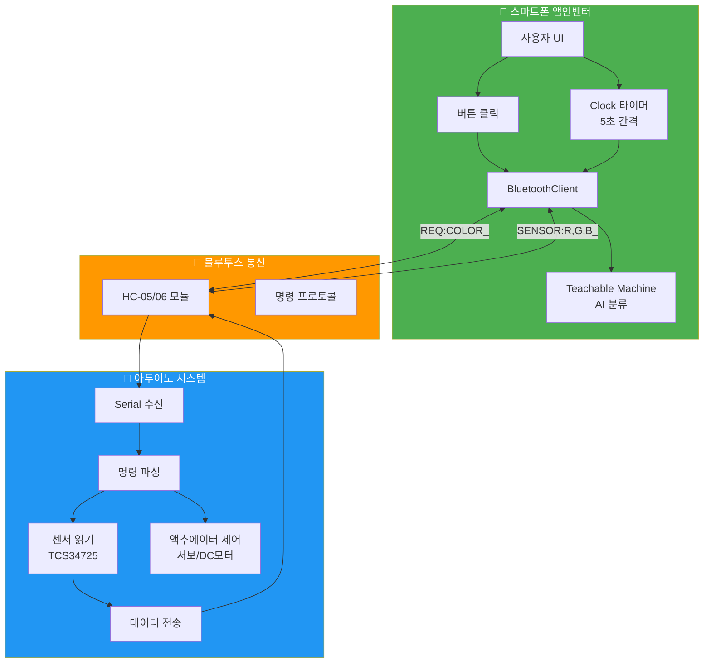
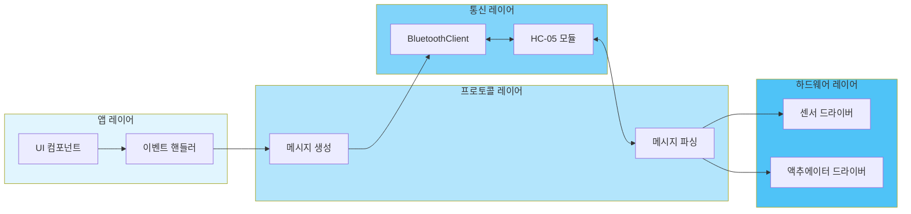
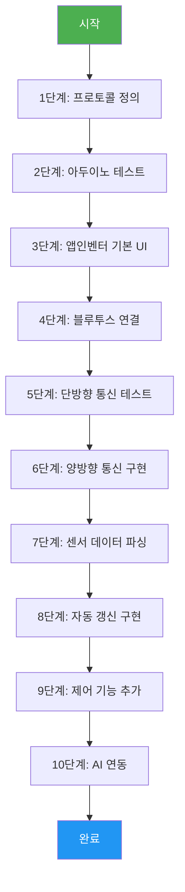
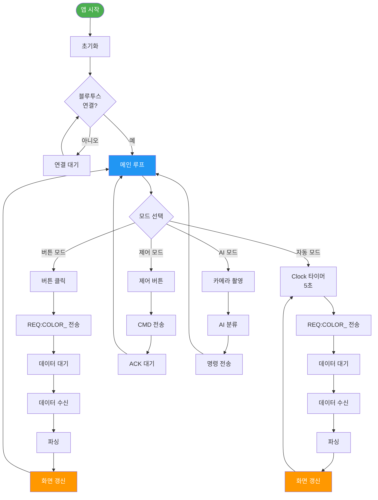
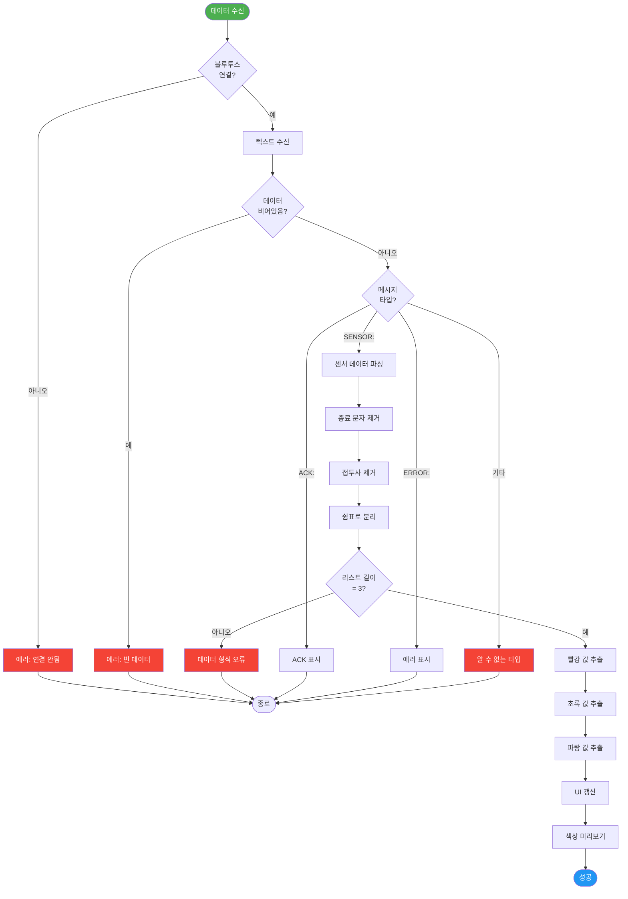
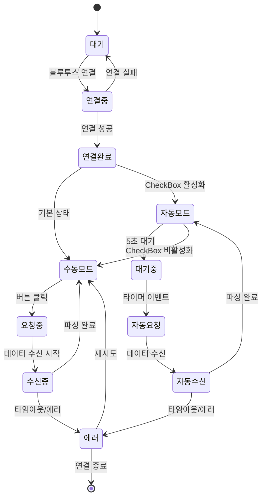

# 앱인벤터 ↔ 아두이노 센서 통신 프로토콜 가이드

> **AI 비전 + 센서 데이터 양방향 통신 완전 가이드**

## 📌 문서 개요

이 문서는 **앱인벤터**와 **아두이노** 간 센서 데이터를 주고받는 **양방향 블루투스 통신 프로토콜**을 정의합니다.

### 주요 특징
- ✅ 센서값 읽기 (아두이노 → 앱인벤터)
- ✅ 제어 명령 쓰기 (앱인벤터 → 아두이노)
- ✅ 버튼 방식 + 자동 갱신 방식 (Clock 5초)
- ✅ 색상 센서 예시 (Red, Green, Blue)
- ✅ Teachable Machine 연동

---

## 📋 목차

1. [통신 프로토콜 정의](#1-통신-프로토콜-정의)
2. [시스템 아키텍처](#2-시스템-아키텍처)
3. [아두이노 구현](#3-아두이노-구현)
4. [앱인벤터 구현](#4-앱인벤터-구현)
5. [개발 프로세스](#5-개발-프로세스)
6. [순서도](#6-순서도)
7. [테스트 방법](#7-테스트-방법)

---

## 1. 통신 프로토콜 정의

### 1.1 프로토콜 규약

#### 기본 원칙
```
1. 모든 메시지는 언더스코어(_)로 종료
2. 데이터는 쉼표(,)로 구분
3. ASCII 텍스트 전송
4. 줄바꿈 없음 (단일 라인)
```

#### 메시지 구조
```
[명령타입]:[데이터1],[데이터2],[데이터3]_

예시:
  SENSOR:255,128,64_     → 센서 데이터 전송
  CMD:MOTOR_ON_          → 제어 명령
  REQ:COLOR_             → 데이터 요청
```

### 1.2 명령 코드 테이블

#### 앱인벤터 → 아두이노 (제어 명령)

| 명령 | 형식 | 설명 | 예시 |
|------|------|------|------|
| **데이터 요청** | `REQ:COLOR_` | 색상 센서값 요청 | `REQ:COLOR_` |
| **모터 제어** | `CMD:MOTOR_ON_` | DC 모터 켜기 | `CMD:MOTOR_ON_` |
| **서보 제어** | `CMD:SERVO,90_` | 서보 90도 이동 | `CMD:SERVO,90_` |
| **LED 제어** | `CMD:LED,255,0,0_` | RGB LED 빨강 | `CMD:LED,255,0,0_` |
| **시스템 리셋** | `CMD:RESET_` | 시스템 초기화 | `CMD:RESET_` |

#### 아두이노 → 앱인벤터 (센서 데이터)

| 데이터 타입 | 형식 | 설명 | 예시 |
|------------|------|------|------|
| **색상 센서** | `SENSOR:R,G,B_` | RGB 값 (0-255) | `SENSOR:255,128,64_` |
| **거리 센서** | `DISTANCE:CM_` | 거리 (cm) | `DISTANCE:45_` |
| **온습도** | `DHT:TEMP,HUMID_` | 온도/습도 | `DHT:25.5,60.2_` |
| **상태 응답** | `ACK:OK_` | 명령 수신 확인 | `ACK:OK_` |
| **에러** | `ERROR:CODE_` | 에러 코드 | `ERROR:101_` |

### 1.3 색상 센서 프로토콜 (예시)

#### 전송 형식
```
SENSOR:RED,GREEN,BLUE_

- RED:   0-255 (빨강 강도)
- GREEN: 0-255 (초록 강도)
- BLUE:  0-255 (파랑 강도)
```

#### 실제 예시
```
SENSOR:255,0,0_      → 순수 빨강
SENSOR:0,255,0_      → 순수 초록
SENSOR:0,0,255_      → 순수 파랑
SENSOR:255,255,0_    → 노랑
SENSOR:128,64,32_    → 갈색
```

---

## 2. 시스템 아키텍처

### 2.1 전체 구조도



### 2.2 통신 레이어



---

## 3. 아두이노 구현

### 3.1 핵심 함수

#### `파일명: arduino_sensor_communication.ino`

```cpp
/*
 * 앱인벤터 센서 통신 프로토콜 구현
 * 기능: 색상 센서 데이터 전송 + 제어 명령 수신
 */

#include <SoftwareSerial.h>
#include <Wire.h>
#include "Adafruit_TCS34725.h"

// ==================== 설정 ====================
#define BT_RX 10
#define BT_TX 11
#define BAUD_RATE 9600

// ==================== 객체 ====================
SoftwareSerial BTSerial(BT_RX, BT_TX);
Adafruit_TCS34725 colorSensor = Adafruit_TCS34725(TCS34725_INTEGRATIONTIME_50MS, TCS34725_GAIN_4X);

// ==================== 전역 변수 ====================
String receivedData = "";
bool dataComplete = false;

// 센서 데이터
uint16_t red = 0;
uint16_t green = 0;
uint16_t blue = 0;

// ==================== 초기화 ====================
void setup() {
  Serial.begin(BAUD_RATE);
  BTSerial.begin(BAUD_RATE);
  
  // 색상 센서 초기화
  if (colorSensor.begin()) {
    Serial.println("[시스템] 색상 센서 초기화 완료");
  } else {
    Serial.println("[에러] 색상 센서 연결 실패");
  }
  
  Serial.println("[시스템] 준비 완료");
}

// ==================== 메인 루프 ====================
void loop() {
  // 블루투스 데이터 수신
  processBluetoothData();
  
  // 명령 처리
  if (dataComplete) {
    handleCommand(receivedData);
    receivedData = "";
    dataComplete = false;
  }
}

// ==================== 핵심 함수 1: 데이터 수신 ====================
void processBluetoothData() {
  while (BTSerial.available()) {
    char inChar = (char)BTSerial.read();
    
    // 종료 문자 확인
    if (inChar == '_') {
      dataComplete = true;
      break;
    }
    
    receivedData += inChar;
  }
}

// ==================== 핵심 함수 2: 명령 처리 ====================
void handleCommand(String cmd) {
  Serial.print("[수신] ");
  Serial.println(cmd);
  
  // 공백 제거
  cmd.trim();
  
  // 명령 타입 분리
  if (cmd.startsWith("REQ:")) {
    handleRequest(cmd.substring(4));
  } 
  else if (cmd.startsWith("CMD:")) {
    handleControlCommand(cmd.substring(4));
  } 
  else {
    sendError(100); // 알 수 없는 명령
  }
}

// ==================== 핵심 함수 3: 데이터 요청 처리 ====================
void handleRequest(String reqType) {
  if (reqType == "COLOR") {
    sendColorData();
  } 
  else if (reqType == "ALL") {
    sendAllSensorData();
  } 
  else {
    sendError(101); // 알 수 없는 요청 타입
  }
}

// ==================== 핵심 함수 4: 색상 센서 데이터 전송 ====================
void sendColorData() {
  // 센서 읽기
  colorSensor.getRawData(&red, &green, &blue, NULL);
  
  // 0-255 범위로 정규화
  uint8_t r = map(red, 0, 65535, 0, 255);
  uint8_t g = map(green, 0, 65535, 0, 255);
  uint8_t b = map(blue, 0, 65535, 0, 255);
  
  // 프로토콜 형식으로 전송
  String message = "SENSOR:";
  message += String(r);
  message += ",";
  message += String(g);
  message += ",";
  message += String(b);
  message += "_";
  
  BTSerial.print(message);
  
  // 디버그 출력
  Serial.print("[전송] ");
  Serial.println(message);
}

// ==================== 핵심 함수 5: 제어 명령 처리 ====================
void handleControlCommand(String ctrlCmd) {
  if (ctrlCmd.startsWith("LED,")) {
    // LED 제어 (예시)
    int firstComma = ctrlCmd.indexOf(',');
    int secondComma = ctrlCmd.indexOf(',', firstComma + 1);
    
    int r = ctrlCmd.substring(4, firstComma).toInt();
    int g = ctrlCmd.substring(firstComma + 1, secondComma).toInt();
    int b = ctrlCmd.substring(secondComma + 1).toInt();
    
    setRGBLed(r, g, b);
    sendAck();
  } 
  else if (ctrlCmd == "MOTOR_ON") {
    // 모터 켜기
    digitalWrite(MOTOR_PIN, HIGH);
    sendAck();
  } 
  else if (ctrlCmd == "MOTOR_OFF") {
    // 모터 끄기
    digitalWrite(MOTOR_PIN, LOW);
    sendAck();
  } 
  else if (ctrlCmd.startsWith("SERVO,")) {
    // 서보 제어
    int angle = ctrlCmd.substring(6).toInt();
    setServoAngle(angle);
    sendAck();
  } 
  else if (ctrlCmd == "RESET") {
    // 시스템 리셋
    systemReset();
    sendAck();
  } 
  else {
    sendError(102); // 알 수 없는 제어 명령
  }
}

// ==================== 보조 함수: ACK 전송 ====================
void sendAck() {
  BTSerial.print("ACK:OK_");
  Serial.println("[전송] ACK:OK_");
}

// ==================== 보조 함수: 에러 전송 ====================
void sendError(int errorCode) {
  String message = "ERROR:";
  message += String(errorCode);
  message += "_";
  
  BTSerial.print(message);
  Serial.print("[에러] 코드 ");
  Serial.println(errorCode);
}

// ==================== 보조 함수: 전체 센서 데이터 ====================
void sendAllSensorData() {
  // 여러 센서 데이터를 한 번에 전송
  sendColorData();
  delay(50);
  // 필요시 다른 센서 데이터 추가
}

// ==================== 액추에이터 제어 함수 (예시) ====================
void setRGBLed(int r, int g, int b) {
  // RGB LED 제어 로직
  Serial.print("[LED] R:");
  Serial.print(r);
  Serial.print(" G:");
  Serial.print(g);
  Serial.print(" B:");
  Serial.println(b);
}

void setServoAngle(int angle) {
  // 서보 모터 제어 로직
  Serial.print("[서보] 각도:");
  Serial.println(angle);
}

void systemReset() {
  // 시스템 초기화 로직
  Serial.println("[시스템] 리셋 완료");
}
```

### 3.2 에러 코드 정의

| 코드 | 의미 | 대응 방법 |
|------|------|----------|
| **100** | 알 수 없는 명령 | 명령 형식 확인 |
| **101** | 알 수 없는 요청 타입 | REQ: 뒤의 타입 확인 |
| **102** | 알 수 없는 제어 명령 | CMD: 뒤의 명령 확인 |
| **200** | 센서 읽기 실패 | 센서 연결 확인 |
| **201** | 액추에이터 제어 실패 | 하드웨어 연결 확인 |

---

## 4. 앱인벤터 구현

### 4.1 필요한 컴포넌트

| 컴포넌트 | 이름 | 용도 |
|---------|------|------|
| **BluetoothClient** | BluetoothClient1 | 블루투스 통신 |
| **Clock** | Clock_AutoUpdate | 5초마다 자동 갱신 |
| **Button** | Btn_ReadSensor | 수동으로 센서값 요청 |
| **Button** | Btn_Connect | 블루투스 연결 |
| **Label** | Label_Red | 빨강 값 표시 |
| **Label** | Label_Green | 초록 값 표시 |
| **Label** | Label_Blue | 파랑 값 표시 |
| **Label** | Label_Status | 연결 상태 표시 |
| **Canvas** | Canvas_ColorPreview | 색상 미리보기 |
| **ListPicker** | ListPicker_BT | 블루투스 기기 선택 |

### 4.2 화면 레이아웃

```
┌────────────────────────────────┐
│  [블루투스 선택 ▼]             │ ← ListPicker_BT
│  [연결]           [상태: 대기] │ ← Btn_Connect, Label_Status
├────────────────────────────────┤
│  📊 센서 데이터                 │
│  ┌──────────────────────────┐  │
│  │ 빨강: 255                │  │ ← Label_Red
│  │ 초록: 128                │  │ ← Label_Green
│  │ 파랑:  64                │  │ ← Label_Blue
│  │                          │  │
│  │ [색상 미리보기]           │  │ ← Canvas_ColorPreview
│  └──────────────────────────┘  │
│                                │
│  [센서값 읽기]                  │ ← Btn_ReadSensor
│  □ 자동 갱신 (5초)             │ ← CheckBox_Auto
├────────────────────────────────┤
│  🎮 제어 패널                   │
│  [모터 켜기]   [모터 끄기]      │
│  [LED 빨강]    [LED 파랑]      │
└────────────────────────────────┘
```

### 4.3 앱인벤터 블록 코드

#### **블록 1: 초기화**

```
[Screen1.Initialize 이벤트]
├─ [전역 변수 초기화]
│  ├─ set global SENSOR_List to create empty list
│  ├─ set global isConnected to false
│  └─ set global redValue to 0
│     set global greenValue to 0
│     set global blueValue to 0
│
├─ [Clock 설정]
│  ├─ set Clock_AutoUpdate.TimerInterval to 5000  (5초)
│  └─ set Clock_AutoUpdate.TimerEnabled to false
│
└─ [상태 초기화]
   └─ set Label_Status.Text to "연결 대기 중"
```

#### **블록 2: 블루투스 연결**

```
[ListPicker_BT.BeforePicking 이벤트]
└─ set ListPicker_BT.Elements to BluetoothClient1.AddressesAndNames

[ListPicker_BT.AfterPicking 이벤트]
├─ if call BluetoothClient1.Connect
│     address: ListPicker_BT.Selection
│  then
│  ├─ set global isConnected to true
│  ├─ set Label_Status.Text to "연결됨"
│  ├─ set Label_Status.BackgroundColor to green
│  └─ call Notifier1.ShowToast
│        message: "블루투스 연결 성공"
│  else
│  ├─ set global isConnected to false
│  ├─ set Label_Status.Text to "연결 실패"
│  └─ set Label_Status.BackgroundColor to red
```

#### **블록 3: 센서값 요청 (버튼 방식)**

```
[Btn_ReadSensor.Click 이벤트]
├─ if global isConnected
│  then
│  ├─ call BluetoothClient1.SendText
│  │     text: "REQ:COLOR_"
│  └─ set Label_Status.Text to "센서값 요청 중..."
│  else
│  └─ call Notifier1.ShowToast
│        message: "블루투스가 연결되지 않았습니다"
```

#### **블록 4: 자동 갱신 (Clock 5초)**

```
[CheckBox_Auto.Changed 이벤트]
├─ if CheckBox_Auto.Checked
│  then
│  ├─ set Clock_AutoUpdate.TimerEnabled to true
│  └─ set Label_Status.Text to "자동 갱신 활성화"
│  else
│  ├─ set Clock_AutoUpdate.TimerEnabled to false
│  └─ set Label_Status.Text to "자동 갱신 비활성화"

[Clock_AutoUpdate.Timer 이벤트]
├─ if global isConnected
│  then
│  └─ call BluetoothClient1.SendText
│        text: "REQ:COLOR_"
```

#### **블록 5: 데이터 수신 및 파싱**

```
[BluetoothClient1.DataReceived 이벤트]
│  numberOfBytes: (무시)
├─ set local receivedText to call BluetoothClient1.ReceiveText
│     numberOfBytes: -1
│
├─ [디버그 출력]
│  └─ set Label_Debug.Text to receivedText
│
├─ [메시지 타입 확인]
│  └─ if call starts with
│        text: receivedText
│        piece: "SENSOR:"
│     then
│     └─ call parseSensorData
│           data: receivedText
│
│     else if call starts with
│        text: receivedText
│        piece: "ACK:"
│     then
│     └─ set Label_Status.Text to "명령 수신 확인"
│
│     else if call starts with
│        text: receivedText
│        piece: "ERROR:"
│     then
│     └─ call Notifier1.ShowAlert
│           notice: join "에러 발생: " receivedText

[프로시저 parseSensorData (data)]
├─ [종료 문자 제거]
│  └─ set local cleanData to call replace all
│        text: data
│        segment: "_"
│        replacement: ""
│
├─ ["SENSOR:" 제거]
│  └─ set local dataOnly to call replace all
│        text: cleanData
│        segment: "SENSOR:"
│        replacement: ""
│
├─ [쉼표로 분리]
│  └─ set global SENSOR_List to call split
│        text: dataOnly
│        at: ","
│
├─ [리스트 길이 확인]
│  └─ if length of list SENSOR_List = 3
│     then
│     ├─ set global redValue to select list item
│     │     list: SENSOR_List
│     │     index: 1
│     │
│     ├─ set global greenValue to select list item
│     │     list: SENSOR_List
│     │     index: 2
│     │
│     ├─ set global blueValue to select list item
│     │     list: SENSOR_List
│     │     index: 3
│     │
│     └─ call updateDisplay
│
│     else
│     └─ call Notifier1.ShowToast
│           message: "데이터 형식 오류"

[프로시저 updateDisplay]
├─ set Label_Red.Text to join "빨강: " global redValue
├─ set Label_Green.Text to join "초록: " global greenValue
├─ set Label_Blue.Text to join "파랑: " global blueValue
│
├─ [Canvas 색상 미리보기]
│  └─ set Canvas_ColorPreview.BackgroundColor to 
│        call make color
│           red: global redValue
│           green: global greenValue
│           blue: global blueValue
│
└─ set Label_Status.Text to "센서값 갱신 완료"
```

#### **블록 6: 제어 명령 전송**

```
[Btn_MotorOn.Click 이벤트]
├─ if global isConnected
│  then
│  └─ call BluetoothClient1.SendText
│        text: "CMD:MOTOR_ON_"
│  else
│  └─ call Notifier1.ShowToast
│        message: "블루투스 연결 필요"

[Btn_LED_Red.Click 이벤트]
├─ if global isConnected
│  then
│  └─ call BluetoothClient1.SendText
│        text: "CMD:LED,255,0,0_"

[Btn_LED_Blue.Click 이벤트]
├─ if global isConnected
│  then
│  └─ call BluetoothClient1.SendText
│        text: "CMD:LED,0,0,255_"
```

### 4.4 Teachable Machine 연동 (추가)

```
[Btn_Capture.Click 이벤트]
└─ call Camera1.TakePicture

[Camera1.AfterPicture 이벤트]
│  image: (카메라에서 받은 이미지)
└─ call TeachableMachine1.ClassifyImage
      image: Camera1.Image

[TeachableMachine1.GotClassification 이벤트]
│  classification: (분류 결과)
│  confidence: (신뢰도)
├─ set Label_AIResult.Text to classification
│
├─ [분류 결과에 따른 동작]
│  └─ if classification = "RED"
│     then
│     └─ call BluetoothClient1.SendText
│           text: "CMD:SERVO,45_"
│
│     else if classification = "BLUE"
│     then
│     └─ call BluetoothClient1.SendText
│           text: "CMD:SERVO,135_"
│
│     else if classification = "GREEN"
│     then
│     └─ call BluetoothClient1.SendText
│           text: "CMD:SERVO,90_"
```

---

## 5. 개발 프로세스

### 5.1 단계별 개발 순서



### 5.2 상세 개발 가이드

#### **1단계: 프로토콜 정의 (30분)**

```
할 일:
1. 통신 규약 문서 작성
2. 명령 코드 테이블 정리
3. 데이터 형식 합의
4. 에러 코드 정의

체크리스트:
□ 종료 문자 정의 (_)
□ 구분자 정의 (,)
□ 메시지 최대 길이 결정
□ 타임아웃 시간 결정
```

#### **2단계: 아두이노 테스트 (1시간)**

```
할 일:
1. 센서 라이브러리 설치
2. 센서 단독 테스트
3. Serial Monitor로 데이터 확인
4. 블루투스 모듈 연결

테스트 코드:
void loop() {
  if (Serial.available()) {
    String cmd = Serial.readStringUntil('_');
    if (cmd == "REQ:COLOR") {
      sendColorData();
    }
  }
}

체크리스트:
□ 센서 초기화 성공
□ 센서 데이터 정상 출력
□ 블루투스 모듈 페어링
□ Serial → Bluetooth 전환 확인
```

#### **3단계: 앱인벤터 기본 UI (30분)**

```
할 일:
1. MIT App Inventor 프로젝트 생성
2. UI 컴포넌트 배치
3. 전역 변수 초기화
4. 화면 레이아웃 구성

체크리스트:
□ BluetoothClient 추가
□ Clock 컴포넌트 추가
□ 버튼/레이블 배치
□ Canvas 추가 (색상 미리보기)
```

#### **4단계: 블루투스 연결 (30분)**

```
할 일:
1. ListPicker로 기기 선택
2. 연결 로직 구현
3. 연결 상태 표시
4. 에러 처리

테스트:
1. HC-05/06 검색 확인
2. 연결 성공 메시지
3. 연결 실패 처리
```

#### **5단계: 단방향 통신 테스트 (30분)**

```
할 일:
1. 버튼으로 명령 전송
2. Serial Monitor로 수신 확인
3. ACK 응답 처리

테스트 명령:
- REQ:COLOR_
- CMD:MOTOR_ON_
- CMD:LED,255,0,0_
```

#### **6단계: 양방향 통신 구현 (1시간)**

```
할 일:
1. BluetoothClient.DataReceived 이벤트
2. 데이터 수신 로직
3. 디버그 출력

테스트:
1. 아두이노에서 "SENSOR:255,128,64_" 수동 전송
2. 앱에서 수신 확인
3. Label에 표시
```

#### **7단계: 센서 데이터 파싱 (1시간)**

```
할 일:
1. 문자열 파싱 로직
2. 쉼표(,)로 분리
3. 배열에 저장
4. UI 업데이트

주의사항:
- 종료 문자 제거
- "SENSOR:" 접두사 제거
- 리스트 길이 확인
- 타입 변환 (문자 → 숫자)
```

#### **8단계: 자동 갱신 구현 (30분)**

```
할 일:
1. Clock 타이머 설정 (5000ms)
2. CheckBox로 On/Off
3. 주기적 데이터 요청

테스트:
1. 자동 갱신 활성화
2. 5초마다 센서값 갱신 확인
3. 수동/자동 모드 전환
```

#### **9단계: 제어 기능 추가 (1시간)**

```
할 일:
1. 모터 제어 버튼
2. LED 제어 버튼
3. 서보 제어 슬라이더
4. ACK 응답 처리

테스트:
1. 모터 켜기/끄기
2. LED 색상 변경
3. 서보 각도 조정
```

#### **10단계: AI 연동 (선택, 2시간)**

```
할 일:
1. Teachable Machine 모델 학습
2. 모델 URL 설정
3. 카메라 촬영 구현
4. 분류 결과 처리

테스트:
1. 빨강 물체 → 왼쪽 분류
2. 파랑 물체 → 오른쪽 분류
3. 초록 물체 → 중앙 분류
```

---

## 6. 순서도

### 6.1 전체 시스템 흐름도



### 6.2 데이터 수신 상세 순서도



### 6.3 자동 갱신 상태 다이어그램



---

## 7. 테스트 방법

### 7.1 단계별 테스트

#### **테스트 1: 아두이노 단독 (Serial Monitor)**

```
목표: 센서 데이터 확인

절차:
1. 아두이노 코드 업로드
2. Serial Monitor 열기 (9600 baud)
3. "REQ:COLOR_" 입력
4. 출력 확인: "SENSOR:255,128,64_"

성공 기준:
✓ 센서 초기화 메시지
✓ 명령 수신 확인
✓ 올바른 형식의 센서 데이터
```

#### **테스트 2: 블루투스 에코 테스트**

```
목표: 블루투스 통신 확인

절차:
1. 아두이노에 간단한 에코 코드 업로드
2. 앱에서 연결
3. 명령 전송
4. 응답 확인

에코 코드:
void loop() {
  if (BTSerial.available()) {
    String data = BTSerial.readStringUntil('_');
    BTSerial.print("ECHO:");
    BTSerial.print(data);
    BTSerial.print("_");
  }
}

성공 기준:
✓ 연결 성공
✓ 전송한 명령이 그대로 돌아옴
```

#### **테스트 3: 버튼 방식 센서 읽기**

```
목표: 수동 데이터 요청/수신

절차:
1. 앱에서 블루투스 연결
2. "센서값 읽기" 버튼 클릭
3. Label에 표시된 값 확인
4. Canvas 색상 확인

체크리스트:
□ 버튼 클릭 시 명령 전송
□ 데이터 수신 확인
□ 파싱 성공
□ UI 갱신
□ 색상 미리보기 정확
```

#### **테스트 4: 자동 갱신 (Clock 5초)**

```
목표: 주기적 데이터 갱신

절차:
1. CheckBox "자동 갱신" 활성화
2. 5초마다 갱신되는지 확인
3. Serial Monitor로 요청 횟수 확인
4. CheckBox 비활성화 시 중지 확인

체크리스트:
□ 5초 간격 정확
□ 연속 갱신 성공
□ 데이터 누락 없음
□ 중지 기능 정상
```

#### **테스트 5: 제어 명령**

```
목표: 액추에이터 제어

절차:
1. "모터 켜기" 버튼 클릭
2. 아두이노에서 모터 동작 확인
3. ACK 응답 확인
4. 다른 제어 명령 테스트

체크리스트:
□ 명령 전송 성공
□ 하드웨어 동작 확인
□ ACK 수신
□ 에러 처리
```

#### **테스트 6: AI 연동 (Teachable Machine)**

```
목표: AI 분류 후 자동 제어

절차:
1. Teachable Machine 모델 학습
2. 모델 URL 앱에 설정
3. 빨강 물체 촬영 → 서보 45도
4. 파랑 물체 촬영 → 서보 135도
5. 초록 물체 촬영 → 서보 90도

체크리스트:
□ 카메라 촬영 성공
□ AI 분류 정확
□ 명령 전송 자동화
□ 서보 동작 확인
```

### 7.2 통합 테스트 시나리오

#### **시나리오 A: 색상 분류 자동화**

```
1. 앱 시작
2. 블루투스 연결
3. 자동 갱신 활성화
4. 색상 센서 앞에 빨강 물체
   → 센서값: SENSOR:255,0,0_
   → LED 빨강 점등
5. 파랑 물체로 교체
   → 센서값: SENSOR:0,0,255_
   → LED 파랑 점등

성공 기준:
✓ 5초마다 색상 자동 감지
✓ 색상에 따라 LED 자동 변경
✓ 데이터 누락 없음
```

#### **시나리오 B: 수동 제어 + AI 분류**

```
1. 수동으로 센서값 확인
2. 카메라로 물체 촬영
3. AI 분류 결과 확인
4. 분류 결과에 따라 서보 이동
5. 물체를 해당 위치에 배치

성공 기준:
✓ 센서 + AI 데이터 일치
✓ 서보 이동 정확
✓ 전체 프로세스 5초 이내
```

### 7.3 성능 테스트

#### **테스트 항목**

| 항목 | 목표 | 측정 방법 |
|------|------|----------|
| **응답 시간** | < 500ms | 명령 전송 ~ 데이터 수신 |
| **데이터 정확도** | 100% | 50회 연속 전송 성공률 |
| **자동 갱신 간격** | 5초 ± 0.1초 | Clock 타이머 정확도 |
| **연결 안정성** | > 10분 | 장시간 연결 유지 |
| **메모리 누수** | 없음 | 장시간 실행 시 메모리 |

---

## 8. 문제 해결 (Troubleshooting)

### 8.1 자주 발생하는 문제

#### **문제 1: 데이터 파싱 오류**

```
증상:
- "데이터 형식 오류" 메시지
- 빈 값이 표시됨
- 리스트 길이가 3이 아님

원인:
- 종료 문자(_) 누락
- 쉼표(,) 개수 불일치
- 공백 문자 포함

해결:
1. Serial Monitor로 원본 데이터 확인
2. 종료 문자 확인: "SENSOR:255,128,64_"
3. 아두이노 코드에서 trim() 추가
```

#### **문제 2: 자동 갱신이 멈춤**

```
증상:
- 처음 몇 번만 갱신되고 멈춤
- CheckBox는 활성화 상태

원인:
- 블루투스 연결 끊김
- 에러 발생 시 Clock 중지

해결:
1. 연결 상태 확인 로직 추가
2. 에러 발생 시에도 Clock 유지
3. 재연결 기능 구현
```

#### **문제 3: 센서값이 이상함**

```
증상:
- 항상 0,0,0
- 값이 튀거나 불안정

원인:
- 센서 초기화 실패
- 전원 부족
- 센서 고장

해결:
1. setup()에서 센서 초기화 확인
2. 외부 5V 전원 연결
3. 센서 연결 핀 확인
```

#### **문제 4: 블루투스 연결 안됨**

```
증상:
- 기기 목록이 비어있음
- 연결 시도 시 실패

원인:
- 블루투스 권한 없음
- HC-05 전원 안 들어옴
- 페어링 안 됨

해결:
1. 앱 권한 확인 (위치/블루투스)
2. HC-05 LED 깜빡임 확인
3. 스마트폰 설정에서 페어링 (1234)
```

### 8.2 디버깅 팁

#### **Serial Monitor 활용**

```cpp
// 상세 디버그 모드
#define DEBUG_MODE 1

void loop() {
  if (BTSerial.available()) {
    String cmd = BTSerial.readStringUntil('_');
    
    #if DEBUG_MODE
      Serial.print("[수신] 원본: ");
      Serial.println(cmd);
      Serial.print("[길이] ");
      Serial.println(cmd.length());
      Serial.print("[16진수] ");
      for (int i = 0; i < cmd.length(); i++) {
        Serial.print(cmd[i], HEX);
        Serial.print(" ");
      }
      Serial.println();
    #endif
    
    handleCommand(cmd);
  }
}
```

#### **앱인벤터 디버그 Label**

```
화면에 Label_Debug 추가:

[BluetoothClient1.DataReceived 이벤트]
├─ set Label_Debug.Text to 
│     join "수신: " receivedText
│     join " / 길이: " length of receivedText
│     join " / 시간: " Clock1.Now
```

---

## 9. 확장 아이디어

### 9.1 기능 확장

#### **다중 센서 지원**

```
프로토콜 확장:
- SENSOR:COLOR,255,128,64_
- SENSOR:DISTANCE,45_
- SENSOR:TEMP,25.5,60.2_

아두이노 수정:
void handleRequest(String reqType) {
  if (reqType == "COLOR") {
    sendColorData();
  } else if (reqType == "DISTANCE") {
    sendDistanceData();
  } else if (reqType == "TEMP") {
    sendTempData();
  } else if (reqType == "ALL") {
    sendAllSensors();
  }
}
```

#### **데이터 로깅**

```
앱인벤터:
- TinyDB에 센서 데이터 저장
- 시간 스탬프 추가
- CSV 파일로 내보내기
- 차트로 시각화 (Chart 컴포넌트)
```

#### **클라우드 연동**

```
- Firebase 실시간 데이터베이스
- Google Sheets 저장
- REST API로 서버 전송
```

### 9.2 실전 프로젝트

#### **프로젝트 1: 스마트 쓰레기 분류**

```
시스템:
1. AI 카메라로 쓰레기 분류
2. 색상 센서로 재질 확인
3. 분류 결과에 따라 로봇 팔 이동
4. 해당 통에 쓰레기 투입

센서:
- Teachable Machine (플라스틱/종이/캔)
- 색상 센서 (투명/유색)
- 거리 센서 (물체 감지)

프로토콜:
- REQ:ALL_ → 모든 센서 데이터
- AI 분류 결과 + 센서 데이터 → 최종 결정
```

#### **프로젝트 2: 스마트 팩토리 품질 검사**

```
시스템:
1. 컨베이어에서 제품 도착
2. 색상 센서로 불량 감지
3. AI로 외관 검사
4. 불량품은 별도 분류

센서:
- 적외선 센서 (제품 감지)
- 색상 센서 (색상 품질)
- AI 카메라 (외관 검사)

자동화:
- 5초마다 센서값 확인
- 불량 감지 시 자동 분류
- 데이터 클라우드 저장
```

---

## 10. 참고 자료

### 10.1 관련 문서

- **[02_블루투스_프로토콜.md](./02_블루투스_프로토콜.md)** - 기본 블루투스 통신
- **[07_앱인벤터_Teachable_Machine_연동가이드.md](./07_앱인벤터_Teachable_Machine_연동가이드.md)** - AI 연동
- **[app_inventor/README.md](../app_inventor/README.md)** - 앱인벤터 사용법

### 10.2 예제 코드

#### **아두이노 예제**

```
arduino_code/day2_conveyor_system/
  - 02_color_sensor_test/        (색상 센서 기본)
  - 08_dual_comm_system/          (Serial + Bluetooth)
  - 09_multi_color_classification/ (색상 분류)
```

#### **앱인벤터 예제**

```
app_inventor/source/
  - Robot_Arm_STT_TeachableMachine.aia  (AI + 음성)
  - factory.aia                         (공장 자동화)
```

### 10.3 라이브러리

#### **아두이노 라이브러리**

```cpp
#include <SoftwareSerial.h>      // 블루투스 통신
#include <Wire.h>                // I2C 통신
#include "Adafruit_TCS34725.h"   // 색상 센서
```

**설치 방법:**
```
Arduino IDE → 스케치 → 라이브러리 포함하기 → 라이브러리 관리
  - Adafruit TCS34725 검색 → 설치
  - Adafruit BusIO (의존성) → 설치
```

#### **앱인벤터 확장**

```
TM/br.ufsc.gqs.teachablemachineimageclassifier.aix
  - Teachable Machine 확장 기능
  - 이미지 분류
  - 실시간 인식
```

---

## 💬 FAQ

**Q1: 센서 데이터가 너무 빨리 변해요. 어떻게 안정화하나요?**

```cpp
// 이동 평균 필터
#define SAMPLES 10
uint16_t redHistory[SAMPLES];
int index = 0;

void updateSensor() {
  colorSensor.getRawData(&red, &green, &blue, NULL);
  redHistory[index] = red;
  index = (index + 1) % SAMPLES;
  
  // 평균 계산
  uint32_t sum = 0;
  for (int i = 0; i < SAMPLES; i++) {
    sum += redHistory[i];
  }
  red = sum / SAMPLES;
}
```

**Q2: 블루투스가 자주 끊겨요.**

```
해결 방법:
1. 외부 5V 전원 사용 (USB만으로 부족)
2. 블루투스 모듈과 아두이노 GND 공통 연결
3. 장애물 제거 (통신 거리 5m 이내)
4. 앱에서 재연결 로직 추가
```

**Q3: 앱인벤터에서 색상이 이상하게 표시돼요.**

```
make color 블록 값 범위 확인:
- 0-255 (정상)
- -1 (에러)

해결:
[프로시저 updateDisplay]
├─ if and
│     global redValue >= 0
│     global redValue <= 255
│  then
│  └─ set Canvas.BackgroundColor to make color
│        red: global redValue
│        green: global greenValue
│        blue: global blueValue
```

**Q4: Clock 5초가 정확하지 않아요.**

```
원인:
- 데이터 처리 시간 포함
- 블루투스 지연

정확한 타이밍:
1. Clock.TimerInterval = 5000
2. Clock.Timer 이벤트 시작 시 시간 기록
3. 다음 이벤트까지 경과 시간 계산
4. 필요 시 TimerInterval 동적 조정
```

---

## ✅ 체크리스트

### 개발 완료 체크리스트

#### 아두이노
- [ ] 센서 라이브러리 설치 완료
- [ ] 센서 초기화 성공
- [ ] 프로토콜 파싱 구현
- [ ] 데이터 전송 형식 준수
- [ ] 에러 코드 구현
- [ ] 제어 명령 처리
- [ ] Serial Monitor 테스트 완료

#### 앱인벤터
- [ ] BluetoothClient 추가
- [ ] Clock 컴포넌트 설정
- [ ] UI 레이아웃 완성
- [ ] 연결 로직 구현
- [ ] 데이터 파싱 구현
- [ ] 버튼 방식 구현
- [ ] 자동 갱신 구현
- [ ] 색상 미리보기 구현

#### 통합 테스트
- [ ] 단방향 통신 성공
- [ ] 양방향 통신 성공
- [ ] 버튼 방식 테스트
- [ ] 자동 갱신 테스트
- [ ] 제어 명령 테스트
- [ ] AI 연동 테스트 (선택)
- [ ] 장시간 안정성 테스트

---

**작성자:** Smart Factory Arms Project  
**최종 수정:** 2026-01-31  
**버전:** 1.0 (완전판)

**다음 문서:**
- **10_앱인벤터_아두이노_실전예제.md** ← 실전 프로젝트
- **11_Teachable_Machine_고급활용.md** ← AI 고급 기법
