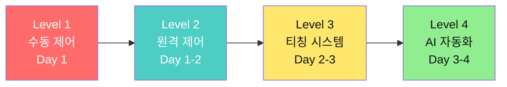
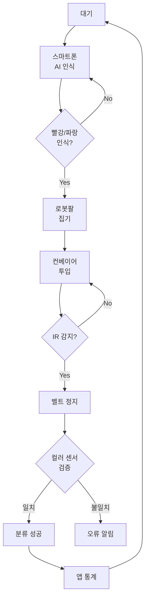
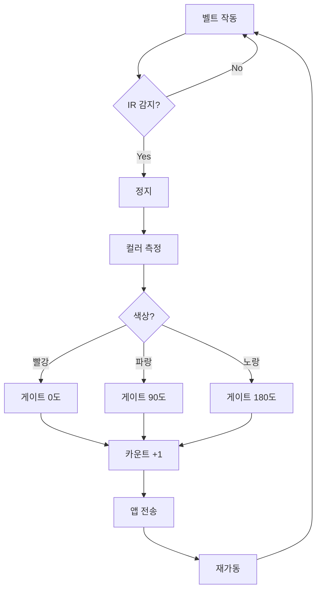
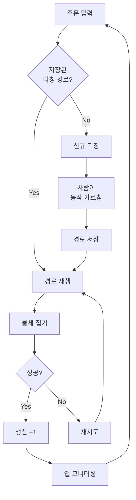
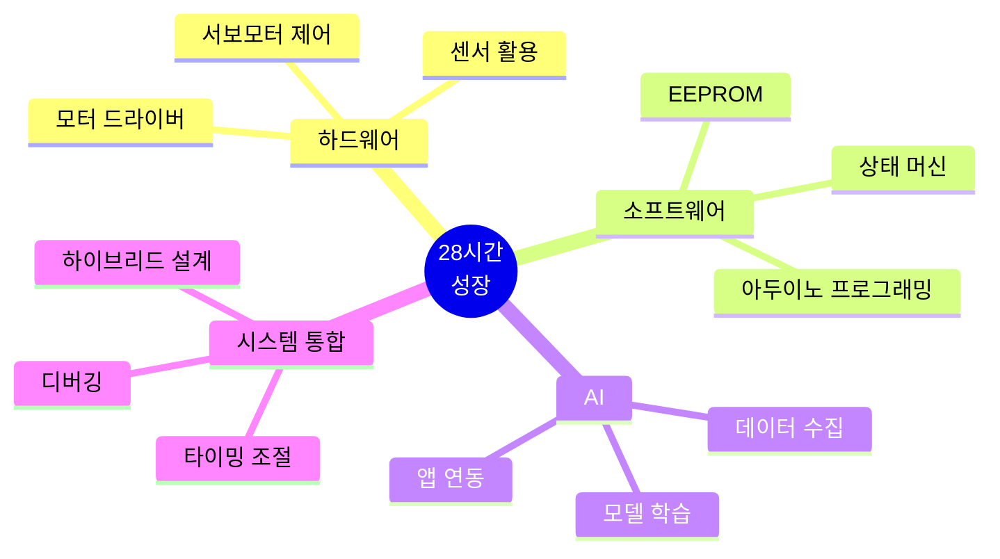

# 스마트 물류 팩토리 28차시 교육 커리큘럼

> **"수동 제어 → 원격 제어 → 티칭(따라하기) → AI 자동화"**  
> 실제 산업 현장의 로봇 도입 과정을 그대로 경험합니다.

---

## 📊 교육 개요

| 항목 | 내용 |
|------|------|
| **대상** | 대학생 42명 (21팀, 2인 1조) |
| **총 시간** | 28시간 (4일 × 7시간) |
| **교구재** | [BP Lab AI 로봇팔](https://bplab.kr/order/?idx=178) (4축) + 스마트 팩토리 (팀당 1세트) |
| **교육 철학** | 바이브 코딩 (학생은 기획, AI는 코딩) |
| **최종 목표** | AI 기반 스마트 물류 시스템 완성 |

### 🎯 4단계 학습 로드맵



**산업 현장 벤치마킹**:
- Tesla Gigafactory: 로봇 자동화 라인
- 현대차 싱가폴 공장: AI 비전 + 협동 로봇
- Amazon Fulfillment Center: 피킹 로봇 + 재고 관리

---

## 📅 28차시 전체 일정 및 결과물 (한눈에 보기)

| Day | 교시 | 시간 | 주제 | 핵심 활동 | **결과물** | 난이도 |
|-----|------|------|------|----------|-----------|--------|
| **1일** | 0 | 30m | 개발 환경 셋팅 | 아두이노 IDE 설치, 테스트 | ✅ Blink LED 성공 | ⭐ |
| | 1 | 1h | 디지털 출력 기초 | LED, 부저 제어 | ✅ 신호등 시스템 | ⭐ |
| | 2 | 1h | 서보모터 1축 제어 | 단일 서보 각도 제어 | ✅ 그리퍼 열고닫기 | ⭐ |
| | 3 | 1.5h | 4축 로봇팔 **수동 제어** | 코드로 각도 직접 입력 | ✅ 홈/집기/놓기 동작 | ⭐⭐ |
| | 4 | 1h | 블루투스 통신 | HC-06 명령어 수신 | ✅ 시리얼 명령 제어 | ⭐⭐ |
| | 5 | 1.5h | 앱인벤터 **원격 제어** | 버튼 UI + 블루투스 | ✅ 스마트폰 제어 앱 | ⭐⭐ |
| | 6 | 1h | 포지션 저장 시스템 | EEPROM 활용 | ✅ 3개 동작 저장/불러오기 | ⭐⭐⭐ |
| | 7 | 0.5h | Day 1 성찰 | 시연, 발표, 문서화 | ✅ 성찰 일지 + 영상 | - |
| **2일** | 1 | 1h | 센서 기초 (디지털) | IR, 버튼 센서 | ✅ 물체 감지 시스템 | ⭐ |
| | 2 | 1h | 센서 기초 (아날로그) | 초음파, 가변저항 | ✅ 거리 측정 시스템 | ⭐⭐ |
| | 3 | 1.5h | DC 모터 제어 | L298N + PWM 속도 제어 | ✅ 컨베이어 벨트 제어 | ⭐⭐ |
| | 4 | 1h | 컬러 센서 | TCS3200 RGB 인식 | ✅ 색상별 분류 (빨/파/노) | ⭐⭐⭐ |
| | 5 | 1.5h | **티칭 시스템 1단계** | 로봇팔 위치 기록 | ✅ 수동으로 움직여서 저장 | ⭐⭐⭐ |
| | 6 | 1.5h | **티칭 시스템 2단계** | 재생 기능 | ✅ 저장된 동작 반복 실행 | ⭐⭐⭐⭐ |
| | 7 | 0.5h | Day 2 성찰 | 티칭 vs 코딩 비교 | ✅ 피지컬 AI 이해도 | - |
| **3일** | 1 | 1h | AI 데이터 수집 | TM 학습 이미지 촬영 | ✅ 300장 데이터셋 | ⭐⭐ |
| | 2 | 1h | AI 모델 학습 | Teachable Machine | ✅ 물체 인식 모델 (90%+) | ⭐⭐ |
| | 3 | 1.5h | 앱인벤터 AI 연동 | TMIC Extension | ✅ 실시간 AI 인식 앱 | ⭐⭐⭐ |
| | 4 | 1h | 통합 시나리오 설계 | 플로우차트 작성 | ✅ 시스템 설계 문서 | ⭐⭐ |
| | 5 | 2h | **하이브리드 자동화** | AI + 센서 + 로봇팔 통합 | ✅ AI 기반 입고 시스템 | ⭐⭐⭐⭐ |
| | 6 | 1h | 모니터링 대시보드 | 실시간 차트 + 통계 | ✅ 관리자 앱 | ⭐⭐⭐ |
| | 7 | 0.5h | Day 3 발표 준비 | PPT, 시연 영상 | ✅ 발표 자료 초안 | - |
| **4일** | 1 | 1h | 최종 시스템 완성 | 디버깅, 최적화 | ✅ 안정적 작동 | ⭐⭐⭐⭐ |
| | 2 | 2h | 팀별 발표 (21팀) | 5분 발표 + 시연 | ✅ 발표 완료 | - |
| | 3 | 1h | 우수작 재시연 + 시상 | 상위 5팀 추가 시연 | ✅ 수상 | - |

**총 28시간 = 실습 25.5h + 성찰 2.5h**

---

## 🔧 교구재 상세 정보

### 로봇팔: [BP Lab AI 로봇팔 키트](https://bplab.kr/order/?idx=178)

| 항목 | 사양 | 특징 |
|------|------|------|
| **제품명** | 인공지능(AI) 로봇팔 만들기 키트 | 교육용 4축 로봇팔 |
| **메인보드** | 아두이노 UNO 호환보드 | USB 업로드, 5V/3.3V 출력 |
| **서보모터** | SG90 또는 MG90S × 4개 | 0-180도, 토크 1.8kg·cm |
| **자유도** | 4DOF (베이스, 어깨, 팔꿈치, 그리퍼) | 4축 제어 |
| **전원** | USB 또는 외부 12V | 외부 전원 권장 |
| **센서** | 키트 포함 (IR, 초음파 등) | 확장 가능 |
| **메뉴얼** | 포함 | 조립 가이드 |
| **가격** | 99,000원 | 학교 구매 시 협의 가능 |

### 4축 로봇팔 특성 및 대응 전략

| 축 | 기능 | 제약사항 | 해결 전략 |
|---|------|----------|----------|
| **1축 (베이스)** | 좌우 회전 (0-180°) | 비교적 안정적 | ✅ 적극 활용 |
| **2축 (어깨)** | 상하 움직임 (0-180°) | 부하 시 떨림, 어깨에 힘 집중 | ⚠️ 가벼운 물체만 (50g 이하) |
| **3축 (팔꿈치)** | 팔 굽힘 (0-180°) | 어깨 부하 증가 | ⚠️ **45-135도 제한 사용** |
| **4축 (그리퍼)** | 집기 (0-90°) | 안정적 | ✅ 적극 활용 |

**권장 물체**: 스펀지 블록, 종이컵, 탁구공, 가벼운 박스

---

## 📘 Day 1: 수동 제어 → 원격 제어 (7.5시간)

### 🎯 Day 1 최종 목표
> **스마트폰 앱으로 로봇팔을 무선 제어하고, 3가지 동작을 저장/불러오기**

### 📋 Day 1 세부 커리큘럼

---

#### 0교시 (30분): 개발 환경 셋팅

**목표**: 아두이노 IDE 설치 및 첫 프로그램 업로드

**강의 내용** (10분):
- 아두이노 UNO 구조 (디지털 핀, 아날로그 핀, 전원)
- USB 드라이버 설치
- 보드 선택 및 포트 설정

**실습** (20분):

| 단계 | 활동 | 결과 확인 |
|------|------|----------|
| 1 | 아두이노 IDE 다운로드 (arduino.cc) | 설치 완료 |
| 2 | USB 케이블로 연결 | COM 포트 인식 |
| 3 | 보드 선택: Arduino UNO | 도구 메뉴 확인 |
| 4 | Blink 예제 업로드 | 내장 LED 깜빡임 |

**결과물**: ✅ **Blink LED 성공 (내장 LED 1초 간격 깜빡임)**

---

#### 1교시 (1시간): 디지털 출력 기초

**목표**: LED와 부저를 제어하여 신호등 시스템 만들기

**강의 내용** (15분):
- `pinMode()`, `digitalWrite()`, `delay()`
- HIGH(5V), LOW(0V) 개념

**실습 1: LED 제어** (15분):

```cpp
int ledPin = 13;

void setup() {
  pinMode(ledPin, OUTPUT);
}

void loop() {
  digitalWrite(ledPin, HIGH);  // 켜기
  delay(1000);
  digitalWrite(ledPin, LOW);   // 끄기
  delay(1000);
}
```

**학생 활동**:
- LED를 3개 핀(9, 10, 11)에 연결
- 빨강 → 노랑 → 초록 순서로 신호등 만들기

**실습 2: 신호등 시스템** (30분):

```cpp
int redPin = 9;
int yellowPin = 10;
int greenPin = 11;

void setup() {
  pinMode(redPin, OUTPUT);
  pinMode(yellowPin, OUTPUT);
  pinMode(greenPin, OUTPUT);
}

void loop() {
  // 빨강 신호 (3초)
  digitalWrite(redPin, HIGH);
  delay(3000);
  digitalWrite(redPin, LOW);
  
  // 노랑 신호 (1초)
  digitalWrite(yellowPin, HIGH);
  delay(1000);
  digitalWrite(yellowPin, LOW);
  
  // 초록 신호 (3초)
  digitalWrite(greenPin, HIGH);
  delay(3000);
  digitalWrite(greenPin, LOW);
}
```

**결과물**: ✅ **신호등 시스템 (빨강 3초 → 노랑 1초 → 초록 3초 반복)**

---

#### 2교시 (1시간): 서보모터 1축 제어

**목표**: 그리퍼 서보모터 1개를 제어하여 열고 닫기

**강의 내용** (15분):
- PWM (Pulse Width Modulation) 개념
- `Servo.h` 라이브러리
- `attach()`, `write()` 함수

**실습 1: 단일 서보 제어** (20분):

```cpp
#include <Servo.h>

Servo gripper;

void setup() {
  gripper.attach(9);  // 9번 핀
}

void loop() {
  gripper.write(0);    // 열기 (0도)
  delay(1000);
  
  gripper.write(90);   // 닫기 (90도)
  delay(1000);
}
```

**실습 2: 부드러운 움직임** (25분):

```cpp
#include <Servo.h>

Servo gripper;

void setup() {
  gripper.attach(9);
  Serial.begin(9600);
}

void loop() {
  // 천천히 열기
  for (int angle = 0; angle <= 90; angle++) {
    gripper.write(angle);
    delay(15);  // 부드럽게
  }
  delay(1000);
  
  // 천천히 닫기
  for (int angle = 90; angle >= 0; angle--) {
    gripper.write(angle);
    delay(15);
  }
  delay(1000);
}
```

**학생 활동**:
- 각도를 변경하며 실험 (0, 30, 60, 90도)
- 속도 조절 (delay 값 변경)

**결과물**: ✅ **그리퍼 부드럽게 열고닫기 (0도 ↔ 90도)**

---

#### 3교시 (1.5시간): 4축 로봇팔 수동 제어 (Level 1)

**목표**: 코드로 4개 서보모터를 동시 제어하여 물체 집기

**강의 내용** (20분):
- 4축 로봇팔 구조 이해
- 각 축의 역할 및 안전 각도
- 홈 포지션 중요성

**4축 핀 배치**:

| 축 | 핀 번호 | 기능 | 안전 각도 |
|----|---------|------|----------|
| 1축 (베이스) | 6번 | 좌우 회전 | 0-180도 |
| 2축 (어깨) | 9번 | 상하 이동 | 60-120도 권장 |
| 3축 (팔꿈치) | 10번 | 팔 굽힘 | 45-135도 권장 |
| 4축 (그리퍼) | 11번 | 집기 | 0-90도 |

**실습 1: 홈 포지션** (20분):

```cpp
#include <Servo.h>

Servo base;      // 1축
Servo shoulder;  // 2축
Servo elbow;     // 3축
Servo gripper;   // 4축

void setup() {
  base.attach(6);
  shoulder.attach(9);
  elbow.attach(10);
  gripper.attach(11);
  
  goHome();
}

void loop() {
  // 홈 포지션 유지
}

void goHome() {
  base.write(90);      // 중앙
  shoulder.write(90);  // 수평
  elbow.write(90);     // 직각
  gripper.write(0);    // 열림
  delay(1500);
}
```

**실습 2: 집기 동작 (Level 1 - 수동 제어)** (50분):

```cpp
#include <Servo.h>

Servo base, shoulder, elbow, gripper;

void setup() {
  base.attach(6);
  shoulder.attach(9);
  elbow.attach(10);
  gripper.attach(11);
  
  goHome();
}

void loop() {
  pickObject();   // 집기
  delay(2000);
  
  placeLeft();    // 왼쪽에 놓기
  delay(2000);
  
  goHome();       // 홈으로
  delay(3000);
}

// 홈 포지션
void goHome() {
  base.write(90);
  shoulder.write(90);
  elbow.write(90);
  gripper.write(0);
  delay(1500);
}

// 집기 동작 (앞쪽 물체)
void pickObject() {
  gripper.write(0);      // 그리퍼 열기
  delay(500);
  
  shoulder.write(110);   // 어깨 내리기 (팔꿈치 고정!)
  delay(1000);
  
  gripper.write(70);     // 그리퍼 닫기 (집기)
  delay(500);
  
  shoulder.write(90);    // 어깨 올리기
  delay(1000);
}

// 왼쪽에 놓기
void placeLeft() {
  base.write(45);        // 왼쪽 회전
  delay(1000);
  
  shoulder.write(110);   // 내리기
  delay(1000);
  
  gripper.write(0);      // 놓기
  delay(500);
  
  shoulder.write(90);    // 올리기
  delay(1000);
}
```

**학생 활동**:
1. **각도 실험**: 팀별로 최적 각도 찾기
2. **물체 테스트**: 스펀지 블록 집기 시도
3. **타이밍 조절**: delay 값 조정
4. **오른쪽 놓기 함수 추가**: `placeRight()` 직접 작성

**결과물**: ✅ **로봇팔 수동 제어 (홈/집기/놓기 3가지 동작 + 영상)**

---

#### 4교시 (1시간): 블루투스 통신

**목표**: 시리얼 모니터로 명령어를 보내서 로봇팔 제어

**강의 내용** (15분):
- HC-06 블루투스 모듈 (RX/TX)
- 시리얼 통신 (`Serial.read()`)
- 프로토콜 설계

**프로토콜 설계**:

| 명령어 | 기능 |
|--------|------|
| `0` | 홈 포지션 |
| `1` | 물체 집기 |
| `2` | 왼쪽에 놓기 |
| `3` | 오른쪽에 놓기 |
| `9` | 긴급 정지 |

**실습** (45분):

```cpp
#include <Servo.h>

Servo base, shoulder, elbow, gripper;

void setup() {
  Serial.begin(9600);  // 블루투스 통신
  
  base.attach(6);
  shoulder.attach(9);
  elbow.attach(10);
  gripper.attach(11);
  
  goHome();
  Serial.println("로봇팔 준비 완료. 명령 대기 중...");
}

void loop() {
  if (Serial.available() > 0) {
    char command = Serial.read();
    
    switch(command) {
      case '0':
        Serial.println(">> 홈 포지션");
        goHome();
        break;
        
      case '1':
        Serial.println(">> 집기 동작");
        pickObject();
        break;
        
      case '2':
        Serial.println(">> 왼쪽에 놓기");
        placeLeft();
        break;
        
      case '3':
        Serial.println(">> 오른쪽에 놓기");
        placeRight();
        break;
        
      case '9':
        Serial.println(">> 긴급 정지!");
        // 현재 위치 유지
        break;
        
      default:
        Serial.println("알 수 없는 명령: " + String(command));
    }
  }
}

// (이전 함수들 동일...)

void placeRight() {
  base.write(135);       // 오른쪽
  delay(1000);
  shoulder.write(110);
  delay(1000);
  gripper.write(0);
  delay(500);
  shoulder.write(90);
  delay(1000);
}
```

**학생 활동**:
1. **시리얼 모니터 테스트**: 0, 1, 2, 3 입력
2. **HC-06 연결**: RX→TX, TX→RX (교차 연결)
3. **스마트폰 페어링**: Bluetooth Terminal 앱

**결과물**: ✅ **시리얼 명령어 제어 (0/1/2/3 명령 실행)**

---

#### 5교시 (1.5시간): 앱인벤터 원격 제어 (Level 2)

**목표**: 스마트폰 앱으로 무선 제어

**앱 화면 설계** (팀 토론 10분):

```
┌─────────────────────────┐
│   로봇팔 원격 제어      │
├─────────────────────────┤
│  [블루투스 연결]        │
│  상태: 연결됨 ✅        │
├─────────────────────────┤
│     [  홈 포지션  ]     │
│                         │
│     [  집  기  ]        │
│                         │
│     [  왼쪽 놓기  ]     │
│                         │
│     [  오른쪽 놓기  ]   │
│                         │
│     [  긴급 정지  ]     │
└─────────────────────────┘
```

**앱인벤터 실습** (80분):

**1단계: UI 디자인** (20분)
- ListPicker (블루투스 선택)
- Label (연결 상태)
- Button 5개 (홈/집기/왼쪽/오른쪽/정지)

**2단계: 블록 코딩** (40분)

| 블록 | 기능 |
|------|------|
| ListPicker.BeforePicking | BluetoothClient.AddressesAndNames 표시 |
| ListPicker.AfterPicking | BluetoothClient.Connect |
| Button_Home.Click | BluetoothClient.SendText("0") |
| Button_Pick.Click | BluetoothClient.SendText("1") |
| Button_Left.Click | BluetoothClient.SendText("2") |
| Button_Right.Click | BluetoothClient.SendText("3") |
| Button_Stop.Click | BluetoothClient.SendText("9") |

**3단계: 테스트** (20분)
- APK 빌드 및 설치
- 블루투스 연결
- 전 명령 테스트

**결과물**: ✅ **스마트폰 원격 제어 앱 (.aia + APK + 시연 영상)**

---

#### 6교시 (1시간): 포지션 저장 시스템 (Advanced)

**목표**: 3가지 동작을 EEPROM에 저장하고 불러오기

**강의 내용** (15분):
- EEPROM (비휘발성 메모리)
- `EEPROM.write()`, `EEPROM.read()`
- 데이터 구조 설계

**프로토콜 확장**:

| 명령어 | 기능 |
|--------|------|
| `S1` | 현재 위치를 포지션 1로 저장 |
| `S2` | 현재 위치를 포지션 2로 저장 |
| `S3` | 현재 위치를 포지션 3로 저장 |
| `L1` | 포지션 1 불러오기 (이동) |
| `L2` | 포지션 2 불러오기 |
| `L3` | 포지션 3 불러오기 |

**실습** (45분):

```cpp
#include <Servo.h>
#include <EEPROM.h>

Servo base, shoulder, elbow, gripper;

void setup() {
  Serial.begin(9600);
  base.attach(6);
  shoulder.attach(9);
  elbow.attach(10);
  gripper.attach(11);
  
  goHome();
  Serial.println("포지션 저장 시스템 준비");
  Serial.println("S1-S3: 저장, L1-L3: 불러오기");
}

void loop() {
  if (Serial.available() >= 2) {
    char cmd = Serial.read();
    char num = Serial.read();
    
    if (cmd == 'S') {
      // 저장
      savePosition(num - '0');  // '1' -> 1
    } else if (cmd == 'L') {
      // 불러오기
      loadPosition(num - '0');
    }
  }
}

// 현재 위치 저장
void savePosition(int slot) {
  int address = (slot - 1) * 4;  // 슬롯당 4바이트
  
  int b = base.read();
  int s = shoulder.read();
  int e = elbow.read();
  int g = gripper.read();
  
  EEPROM.write(address + 0, b);
  EEPROM.write(address + 1, s);
  EEPROM.write(address + 2, e);
  EEPROM.write(address + 3, g);
  
  Serial.println("포지션 " + String(slot) + " 저장 완료");
  Serial.println("베이스:" + String(b) + " 어깨:" + String(s) + 
                 " 팔꿈치:" + String(e) + " 그리퍼:" + String(g));
}

// 저장된 위치 불러오기
void loadPosition(int slot) {
  int address = (slot - 1) * 4;
  
  int b = EEPROM.read(address + 0);
  int s = EEPROM.read(address + 1);
  int e = EEPROM.read(address + 2);
  int g = EEPROM.read(address + 3);
  
  base.write(b);
  shoulder.write(s);
  elbow.write(e);
  gripper.write(g);
  
  delay(1500);
  Serial.println("포지션 " + String(slot) + " 이동 완료");
}

void goHome() {
  base.write(90);
  shoulder.write(90);
  elbow.write(90);
  gripper.write(0);
  delay(1500);
}
```

**학생 활동**:
1. **포지션 저장**: 손으로 로봇팔을 3가지 위치로 이동 → S1, S2, S3 입력
2. **재생 테스트**: L1, L2, L3로 저장된 위치 확인
3. **앱에 버튼 추가**: Save 1-3, Load 1-3 버튼

**결과물**: ✅ **3개 동작 저장/불러오기 (EEPROM 활용)**

---

#### 7교시 (30분): Day 1 성찰 및 시연

**팀별 시연** (15분):
- 3팀씩 앞에 나와서 스마트폰으로 로봇팔 제어 시연

**성찰 작성** (15분):

```markdown
## Day 1 성찰

### 완성한 것
- [ ] 수동 제어 (코드로 각도 입력)
- [ ] 원격 제어 (스마트폰 앱)
- [ ] 포지션 저장/불러오기

### 산업 현장 적용 (벤치마킹)
- 테슬라는 어떻게 로봇을 제어할까?
→ 우리 방식: 
→ 산업용: 

### 가장 어려웠던 점
1. 
2. 

### 해결 방법
1. 
2. 

### 내일 배울 티칭 시스템 예상
티칭(Teaching)이란? 
```

**결과물**: ✅ **Day 1 성찰 일지 + 시연 영상**

---

## 📗 Day 2: 센서 자동화 + 티칭 시스템 (7.5시간)

### 🎯 Day 2 최종 목표
> **센서로 자동 분류하고, 로봇팔을 손으로 움직여서 동작을 가르치는 티칭 시스템 완성**

### 📋 Day 2 세부 커리큘럼

---

#### 1교시 (1시간): 디지털 센서 (IR 센서)

**목표**: 물체 감지 시스템 만들기

**강의 내용** (15분):
- 디지털 센서 vs 아날로그 센서
- `digitalRead()` 함수
- 풀업/풀다운 저항

**실습** (45분):

```cpp
int irPin = 2;
int ledPin = 13;

void setup() {
  pinMode(irPin, INPUT);
  pinMode(ledPin, OUTPUT);
  Serial.begin(9600);
}

void loop() {
  int value = digitalRead(irPin);
  
  if (value == LOW) {  // 물체 감지 (센서마다 다를 수 있음)
    digitalWrite(ledPin, HIGH);
    Serial.println("물체 감지!");
  } else {
    digitalWrite(ledPin, LOW);
    Serial.println("물체 없음");
  }
  
  delay(100);
}
```

**학생 활동**:
- IR 센서 앞에 손 흔들어 보기
- 감지 거리 실험 (5cm, 10cm, 20cm)

**결과물**: ✅ **물체 감지 시스템 (IR 센서 + LED 알림)**

---

#### 2교시 (1시간): 아날로그 센서 (초음파 센서)

**목표**: 거리 측정 시스템

**강의 내용** (15분):
- `pulseIn()` 함수
- 거리 계산 공식: `distance = duration / 58`

**실습** (45분):

```cpp
int trigPin = 3;
int echoPin = 4;

void setup() {
  pinMode(trigPin, OUTPUT);
  pinMode(echoPin, INPUT);
  Serial.begin(9600);
}

void loop() {
  // 초음파 송신
  digitalWrite(trigPin, LOW);
  delayMicroseconds(2);
  digitalWrite(trigPin, HIGH);
  delayMicroseconds(10);
  digitalWrite(trigPin, LOW);
  
  // 반사파 수신
  long duration = pulseIn(echoPin, HIGH);
  int distance = duration / 58;  // cm 단위
  
  Serial.print("거리: ");
  Serial.print(distance);
  Serial.println(" cm");
  
  // 거리에 따른 분류
  if (distance < 10) {
    Serial.println("→ 너무 가까움");
  } else if (distance < 20) {
    Serial.println("→ 적정 거리");
  } else {
    Serial.println("→ 너무 멀음");
  }
  
  delay(500);
}
```

**결과물**: ✅ **거리 측정 시스템 (10cm, 20cm 구간 분류)**

---

#### 3교시 (1.5시간): DC 모터 제어 (컨베이어 벨트)

**목표**: 컨베이어 벨트 전진/후진/속도 제어

**강의 내용** (20분):
- L298N 모터 드라이버 (IN1, IN2, ENA)
- PWM 속도 제어 (`analogWrite`)
- 방향 제어 (HIGH/LOW 조합)

**실습** (70분):

```cpp
// 모터 드라이버 핀
int IN1 = 7;
int IN2 = 8;
int ENA = 5;  // PWM 핀

void setup() {
  pinMode(IN1, OUTPUT);
  pinMode(IN2, OUTPUT);
  pinMode(ENA, OUTPUT);
  
  Serial.begin(9600);
}

void loop() {
  Serial.println("전진 (속도 150)");
  forward(150);
  delay(3000);
  
  Serial.println("정지");
  stop();
  delay(1000);
  
  Serial.println("후진 (속도 100)");
  backward(100);
  delay(3000);
  
  stop();
  delay(1000);
}

void forward(int speed) {
  digitalWrite(IN1, HIGH);
  digitalWrite(IN2, LOW);
  analogWrite(ENA, speed);  // 0-255
}

void backward(int speed) {
  digitalWrite(IN1, LOW);
  digitalWrite(IN2, HIGH);
  analogWrite(ENA, speed);
}

void stop() {
  digitalWrite(IN1, LOW);
  digitalWrite(IN2, LOW);
  analogWrite(ENA, 0);
}
```

**학생 활동**:
- 속도 실험 (50, 100, 150, 200, 255)
- 최적 속도 찾기 (물체가 안 떨어지는 속도)

**결과물**: ✅ **컨베이어 벨트 제어 (전진/후진/속도 조절)**

---

#### 4교시 (1시간): 컬러 센서

**목표**: RGB 색상 인식하여 빨강/파랑/노랑 구분

**강의 내용** (15분):
- TCS3200 컬러 센서 원리
- `pulseIn()`으로 주파수 읽기
- 색상 판단 로직 (임계값)

**실습** (45분):

```cpp
// 컬러 센서 핀
int S0 = 8;
int S1 = 9;
int S2 = 10;
int S3 = 11;
int OUT = 12;

void setup() {
  pinMode(S0, OUTPUT);
  pinMode(S1, OUTPUT);
  pinMode(S2, OUTPUT);
  pinMode(S3, OUTPUT);
  pinMode(OUT, INPUT);
  
  // 주파수 스케일 20%
  digitalWrite(S0, HIGH);
  digitalWrite(S1, LOW);
  
  Serial.begin(9600);
}

void loop() {
  // Red
  digitalWrite(S2, LOW);
  digitalWrite(S3, LOW);
  int red = pulseIn(OUT, LOW);
  delay(20);
  
  // Green
  digitalWrite(S2, HIGH);
  digitalWrite(S3, HIGH);
  int green = pulseIn(OUT, LOW);
  delay(20);
  
  // Blue
  digitalWrite(S2, LOW);
  digitalWrite(S3, HIGH);
  int blue = pulseIn(OUT, LOW);
  delay(20);
  
  // 색상 판단
  String color = detectColor(red, green, blue);
  Serial.println("R:" + String(red) + " G:" + String(green) + 
                 " B:" + String(blue) + " → " + color);
  
  delay(500);
}

String detectColor(int r, int g, int b) {
  // 임계값은 팀별로 조정!
  if (r < 50 && g > 80 && b > 80) {
    return "빨강";
  } else if (b < 50 && r > 80 && g > 80) {
    return "파랑";
  } else if (r < 80 && g < 80 && b > 100) {
    return "노랑";
  } else {
    return "알 수 없음";
  }
}
```

**학생 활동**:
1. **색상 샘플 측정**: 빨/파/노 종이에서 RGB 값 기록
2. **임계값 설정**: 팀별 최적 값 찾기

**색상별 RGB 값 기록 시트**:

| 색상 | R 값 | G 값 | B 값 | 판단 기준 |
|------|------|------|------|----------|
| 빨강 | | | | |
| 파랑 | | | | |
| 노랑 | | | | |

**결과물**: ✅ **색상 인식 시스템 (빨강/파랑/노랑 3색 구분)**

---

#### 5교시 (1.5시간): 티칭 시스템 1단계 - 위치 기록 (Level 3)

**목표**: 로봇팔을 손으로 움직여서 경로를 기록

**강의 내용** (20분):
- **티칭(Teaching)이란?**
  - 산업용 로봇의 표준 프로그래밍 방법
  - 사람이 로봇을 직접 움직여서 동작을 가르침
  - 코딩 없이 복잡한 동작 구현 가능
  
**산업 현장 사례**:
- 자동차 용접 로봇: 숙련공이 경로 티칭
- 반도체 픽앤플레이스: 정밀 위치 기록
- 협동 로봇(Cobot): 사람이 손으로 움직여서 학습

**티칭 vs 코딩 비교**:

| 구분 | 코딩 방식 | 티칭 방식 |
|------|----------|----------|
| 방법 | 각도를 코드로 입력 | 손으로 직접 움직임 |
| 장점 | 정확한 각도 | 직관적, 빠름 |
| 단점 | 시간 소요 | 정밀도 낮음 |
| 산업 적용 | 반복 작업 | 유연 생산 |

**실습** (70분):

```cpp
#include <Servo.h>

Servo base, shoulder, elbow, gripper;

// 티칭 데이터 저장 (최대 50개 포인트)
struct Position {
  int base;
  int shoulder;
  int elbow;
  int gripper;
};

Position teachPath[50];
int pathLength = 0;
bool isRecording = false;

void setup() {
  Serial.begin(9600);
  
  base.attach(6);
  shoulder.attach(9);
  elbow.attach(10);
  gripper.attach(11);
  
  goHome();
  
  Serial.println("=== 티칭 시스템 ===");
  Serial.println("R: 기록 시작");
  Serial.println("S: 기록 정지");
  Serial.println("P: 재생");
  Serial.println("C: 초기화");
}

void loop() {
  // 기록 중이면 1초마다 현재 위치 저장
  if (isRecording) {
    recordCurrentPosition();
    delay(1000);
  }
  
  // 시리얼 명령
  if (Serial.available() > 0) {
    char cmd = Serial.read();
    
    switch(cmd) {
      case 'R':  // 기록 시작
        Serial.println(">> 기록 시작! 로봇팔을 움직이세요.");
        isRecording = true;
        pathLength = 0;
        break;
        
      case 'S':  // 기록 정지
        Serial.println(">> 기록 정지. 총 " + String(pathLength) + "개 포인트");
        isRecording = false;
        break;
        
      case 'P':  // 재생
        Serial.println(">> 재생 시작");
        playPath();
        break;
        
      case 'C':  // 초기화
        Serial.println(">> 경로 초기화");
        pathLength = 0;
        goHome();
        break;
    }
  }
}

// 현재 위치 기록
void recordCurrentPosition() {
  if (pathLength >= 50) {
    Serial.println("최대 50개까지만 기록 가능");
    isRecording = false;
    return;
  }
  
  teachPath[pathLength].base = base.read();
  teachPath[pathLength].shoulder = shoulder.read();
  teachPath[pathLength].elbow = elbow.read();
  teachPath[pathLength].gripper = gripper.read();
  
  Serial.println("포인트 " + String(pathLength + 1) + " 기록: " +
                 "B:" + String(teachPath[pathLength].base) + " " +
                 "S:" + String(teachPath[pathLength].shoulder) + " " +
                 "E:" + String(teachPath[pathLength].elbow) + " " +
                 "G:" + String(teachPath[pathLength].gripper));
  
  pathLength++;
}

void goHome() {
  base.write(90);
  shoulder.write(90);
  elbow.write(90);
  gripper.write(0);
  delay(1500);
}
```

**학생 활동**:
1. **'R' 입력**: 기록 시작
2. **로봇팔을 손으로 천천히 움직이기**: 집기 동작 경로
3. **'S' 입력**: 기록 정지
4. **포인트 개수 확인**: 10-20개 권장

**⚠️ 주의사항**:
- 서보모터를 천천히 움직이기 (무리하게 돌리면 고장)
- 전원을 켠 상태에서 손으로 움직이기

**결과물**: ✅ **티칭 데이터 기록 (손으로 움직인 경로 저장)**

---

#### 6교시 (1.5시간): 티칭 시스템 2단계 - 재생 (Level 3 완성)

**목표**: 저장된 경로를 자동으로 재생

**실습** (이전 코드에 추가):

```cpp
// 저장된 경로 재생
void playPath() {
  if (pathLength == 0) {
    Serial.println("저장된 경로가 없습니다!");
    return;
  }
  
  Serial.println("총 " + String(pathLength) + "개 포인트 재생");
  
  for (int i = 0; i < pathLength; i++) {
    Serial.println("→ 포인트 " + String(i + 1));
    
    base.write(teachPath[i].base);
    shoulder.write(teachPath[i].shoulder);
    elbow.write(teachPath[i].elbow);
    gripper.write(teachPath[i].gripper);
    
    delay(1000);  // 포인트 간 1초 대기
  }
  
  Serial.println("재생 완료!");
  goHome();
}
```

**학생 활동**:
1. **경로 기록**: 스펀지 블록을 집어서 옮기는 동작
2. **'P' 입력**: 자동 재생 시청
3. **비교**: 내가 움직인 것 vs 로봇이 재생한 것
4. **반복 테스트**: 3회 재생하여 일관성 확인

**응용 과제**:
- 포인트 간 시간 조절 (빠르게/천천히)
- 반복 재생 (3회 반복)
- EEPROM에 저장 (전원 꺼도 유지)

**결과물**: ✅ **티칭 시스템 완성 (기록 + 재생)**

---

#### 7교시 (30분): Day 2 성찰

**성찰 작성**:

```markdown
## Day 2 성찰

### 센서별 정확도

| 센서 | 정확도 | 오류 사례 | 개선 방법 |
|------|--------|----------|----------|
| IR   | %      |          |          |
| 초음파 | %   |          |          |
| 컬러 | %      |          |          |

### 티칭 vs 코딩

| 항목 | 코딩 방식 | 티칭 방식 | 선호 이유 |
|------|----------|----------|----------|
| 속도 |          |          |          |
| 정확도 |        |          |          |
| 편리성 |        |          |          |

### 산업 현장 적용
- 자동차 공장: 
- 반도체 공장: 
- 물류 센터: 

### 피지컬 AI란?
내 생각:
```

**결과물**: ✅ **Day 2 성찰 + 티칭 vs 코딩 비교 분석**

---

## 📙 Day 3: AI 통합 + 하이브리드 자동화 (7.5시간)

### 🎯 Day 3 최종 목표
> **AI 비전 + 센서 + 로봇팔을 통합하여 완전 자동 물류 시스템 완성**

### 📋 Day 3 세부 커리큘럼

---

#### 1교시 (1시간): AI 데이터 수집

**목표**: Teachable Machine용 학습 데이터 300장 촬영

**학습 전략**:

| 클래스 | 이미지 수 | 촬영 방법 |
|--------|----------|----------|
| **빨간 블록** | 100장 | 정면 30 + 좌45도 20 + 우45도 20 + 위 15 + 멀리 15 |
| **파란 블록** | 100장 | 동일 |
| **노란 블록** | 100장 | 동일 |
| **배경 (Nothing)** | 50장 | 빈 작업대 |

**학생 활동** (60분):
- 2인 1조: 1명 촬영, 1명 물체 위치 변경
- 조명 일정하게 유지
- 손 가림 최소화

**데이터 품질 체크리스트**:
```
□ 다양한 각도 (정면, 좌, 우, 위)
□ 다양한 거리 (가까이, 멀리)
□ 배경 단순
□ 조명 일정
□ 초점 맞춤
```

**결과물**: ✅ **AI 학습 데이터 300장**

---

#### 2교시 (1시간): AI 모델 학습

**목표**: Teachable Machine에서 90% 이상 정확도 달성

**실습** (60분):

| 단계 | 활동 | 시간 |
|------|------|------|
| 1 | TM 접속 및 프로젝트 생성 | 5분 |
| 2 | 이미지 업로드 (클래스별 100장) | 15분 |
| 3 | 모델 학습 (Train) | 10분 |
| 4 | 테스트 (Preview) | 15분 |
| 5 | 정확도 개선 (데이터 추가) | 10분 |
| 6 | 모델 다운로드 (.tflite) | 5분 |

**정확도 향상 팁**:
```
정확도 < 80% → 데이터 50장 추가
정확도 80-90% → 조명 조건 다양화
정확도 > 90% → 성공!
```

**결과물**: ✅ **AI 모델 (.tflite, 정확도 90% 이상)**

---

#### 3교시 (1.5시간): 앱인벤터 AI 연동

**목표**: 실시간 AI 인식 앱 제작

**앱 화면**:

```
┌─────────────────────────┐
│   AI 물체 인식 시스템   │
├─────────────────────────┤
│  [카메라 화면]          │
│                         │
│  인식 결과: 빨간 블록   │
│  신뢰도: 95%            │
├─────────────────────────┤
│  [블루투스 연결]        │
│                         │
│  [AI 인식 시작]         │
│  [로봇팔 제어]          │
└─────────────────────────┘
```

**앱인벤터 블록** (90분):

1. **TMIC Extension 추가** (10분)
2. **PersonalImageClassifier 초기화** (15분)
3. **Camera 컴포넌트 추가** (10분)
4. **분류 로직** (30분):
   ```
   [블록]
   When Button_Classify.Click
     Call Camera1.TakePicture
   
   When Camera1.AfterPicture
     Call PersonalImageClassifier.Classify(image)
   
   When PersonalImageClassifier.GotClassification
     Set Label_Result.Text to classification
     Set Label_Confidence.Text to confidence
     
     If confidence > 0.8 then
       If classification = "빨간 블록" then
         Call BluetoothClient.SendText("1")  // 집기
       End if
     End if
   ```

5. **테스트** (25분)

**결과물**: ✅ **실시간 AI 인식 앱 (.aia + 테스트 영상)**

---

#### 4교시 (1시간): 통합 시나리오 설계

**목표**: 팀별로 하이브리드 시스템 플로우차트 작성

**3가지 시나리오 중 선택**:

### 시나리오 A: AI 기반 입고 시스템 ⭐⭐⭐



**필요 구성**: AI + 로봇팔 + IR + 컬러 + 앱

---

### 시나리오 B: 센서 전용 분류 시스템 ⭐⭐



**필요 구성**: IR + 컬러 + 서보(게이트) + 앱

---

### 시나리오 C: 티칭 기반 유연 생산 ⭐⭐⭐⭐



**필요 구성**: 로봇팔(티칭) + IR(검증) + 앱

---

**학생 활동** (60분):
1. **시나리오 선택** (10분)
2. **상세 플로우차트 작성** (30분)
3. **필요한 센서/코드 리스트** (20분)

**결과물**: ✅ **시스템 설계 문서 (플로우차트 + 구성도)**

---

#### 5교시 (2시간): 하이브리드 시스템 구현

**목표**: 선택한 시나리오를 실제로 구현

**시나리오 A 예제 코드** (AI + 센서 하이브리드):

```cpp
#include <Servo.h>

Servo base, shoulder, elbow, gripper;
Servo gate;  // 분류 게이트

int irPin = 2;
int colorS2 = 10;
int colorS3 = 11;
int colorOUT = 12;

int IN1 = 7, IN2 = 8, ENA = 5;

enum State {
  IDLE,       // 대기 (AI 인식 대기)
  PICKING,    // 집는 중
  PLACING,    // 컨베이어 투입
  DETECTING,  // IR 감지 중
  VERIFYING,  // 컬러 검증 중
  SORTING     // 분류 중
};

State currentState = IDLE;
String aiResult = "";  // 앱에서 받은 AI 결과
unsigned long stateStartTime = 0;

void setup() {
  Serial.begin(9600);
  
  // 로봇팔
  base.attach(6);
  shoulder.attach(9);
  elbow.attach(10);
  gripper.attach(11);
  
  // 게이트
  gate.attach(3);
  gate.write(90);  // 중앙
  
  // 센서
  pinMode(irPin, INPUT);
  
  // 모터
  pinMode(IN1, OUTPUT);
  pinMode(IN2, OUTPUT);
  pinMode(ENA, OUTPUT);
  
  goHome();
  beltStart();
  
  Serial.println("=== 하이브리드 시스템 준비 ===");
}

void loop() {
  // 앱에서 AI 결과 수신
  if (Serial.available() > 0) {
    String data = Serial.readStringUntil('\n');
    if (data.startsWith("AI:")) {
      aiResult = data.substring(3);  // "AI:빨강" → "빨강"
      if (currentState == IDLE) {
        currentState = PICKING;
        stateStartTime = millis();
      }
    }
  }
  
  // 상태 머신
  switch(currentState) {
    case IDLE:
      // AI 인식 대기
      break;
      
    case PICKING:
      pickObject();
      currentState = PLACING;
      stateStartTime = millis();
      Serial.println(">> 투입 단계");
      break;
      
    case PLACING:
      // 3초 대기 (집기 동작 완료)
      if (millis() - stateStartTime >= 3000) {
        goHome();
        currentState = DETECTING;
        Serial.println(">> IR 감지 단계");
      }
      break;
      
    case DETECTING:
      if (digitalRead(irPin) == LOW) {  // 물체 감지
        beltStop();
        currentState = VERIFYING;
        stateStartTime = millis();
        Serial.println(">> 컬러 검증 단계");
      }
      break;
      
    case VERIFYING:
      // 1초 대기 후 색상 측정
      if (millis() - stateStartTime >= 1000) {
        String sensorColor = getColor();
        Serial.println("AI: " + aiResult + ", 센서: " + sensorColor);
        
        if (aiResult == sensorColor) {
          Serial.println("✅ 일치! 분류 실행");
          currentState = SORTING;
        } else {
          Serial.println("❌ 불일치! 오류");
          // 오류 처리 (재시도 or 알림)
          currentState = IDLE;
          beltStart();
        }
      }
      break;
      
    case SORTING:
      sortByColor(aiResult);
      delay(2000);
      gate.write(90);  // 게이트 복귀
      beltStart();
      currentState = IDLE;
      aiResult = "";
      Serial.println(">> 대기 단계");
      Serial.println("성공!");
      break;
  }
}

void pickObject() {
  gripper.write(0);
  delay(500);
  shoulder.write(110);
  delay(1000);
  gripper.write(70);
  delay(500);
  shoulder.write(90);
  delay(1000);
}

void goHome() {
  base.write(90);
  shoulder.write(90);
  elbow.write(90);
  gripper.write(0);
  delay(1000);
}

void beltStart() {
  digitalWrite(IN1, HIGH);
  digitalWrite(IN2, LOW);
  analogWrite(ENA, 150);
}

void beltStop() {
  analogWrite(ENA, 0);
}

String getColor() {
  // (Day 2 컬러 센서 코드 사용)
  // 간략화 버전
  return "빨강";  // 실제로는 측정값으로 판단
}

void sortByColor(String color) {
  if (color == "빨강") {
    gate.write(0);
  } else if (color == "파랑") {
    gate.write(90);
  } else if (color == "노랑") {
    gate.write(180);
  }
}
```

**학생 활동** (120분):
1. **상태 머신 이해** (20분)
2. **코드 업로드 및 테스트** (40분)
3. **타이밍 조절** (`millis()` 값 조정) (30분)
4. **전체 프로세스 5회 테스트** (30분)

**결과물**: ✅ **AI + 센서 하이브리드 자동화 시스템**

---

#### 6교시 (1시간): 모니터링 대시보드

**목표**: 실시간 통계 및 차트

**앱 화면**:

```
┌─────────────────────────┐
│  관리자 대시보드        │
├─────────────────────────┤
│  ━━━ 실시간 상태 ━━━   │
│  현재 단계: 분류 중     │
│  처리 속도: 12개/분     │
│                         │
│  ━━━ 통계 ━━━          │
│  🔴 빨강: 15 (45%)     │
│  🔵 파랑: 10 (30%)     │
│  🟡 노랑: 8 (25%)      │
│                         │
│  ━━━ 품질 ━━━          │
│  AI 정확도: 92%         │
│  센서 검증: 98%         │
│  오류율: 2%             │
│                         │
│  [차트 보기]            │
└─────────────────────────┘
```

**데이터 전송 프로토콜**:

```cpp
// JSON 형식
void sendData() {
  String json = "{";
  json += "\"state\":\"" + String(currentState) + "\",";
  json += "\"red\":" + String(redCount) + ",";
  json += "\"blue\":" + String(blueCount) + ",";
  json += "\"yellow\":" + String(yellowCount) + ",";
  json += "\"errors\":" + String(errorCount);
  json += "}";
  
  Serial.println(json);
}
```

**결과물**: ✅ **모니터링 대시보드 앱 (실시간 통계 + 차트)**

---

#### 7교시 (30분): 발표 자료 준비

**발표 구조 (5분)**:

```
1. 문제 정의 (30초)
   "물류 센터 수동 분류의 비효율"
   
2. 우리의 해결책 (30초)
   "AI + 센서 하이브리드 자동화"
   
3. 시스템 소개 (1분)
   - 4축 로봇팔
   - AI 비전
   - 센서 검증
   - 실시간 모니터링
   
4. 시연 (2분)
   라이브 or 영상
   
5. 결과 및 벤치마킹 (1분)
   - 정확도: %
   - 속도: 개/분
   - 산업 적용 가능성
```

**결과물**: ✅ **발표 자료 초안 (PPT + 시연 영상)**

---

## 📕 Day 4: 최종 완성 및 발표 (4시간)

| 교시 | 시간 | 활동 | 결과물 |
|------|------|------|--------|
| 1 | 1h | 최종 디버깅 및 최적화 | ✅ 안정적 작동 (10회 연속 성공) |
| 2-3 | 2h | 팀별 발표 (21팀 × 5분) | ✅ 발표 완료 |
| 4 | 1h | 우수작 시연 + 시상 + 성찰 | ✅ 수상 + 최종 성찰 |

---

## 🏆 평가 기준

| 항목 | 배점 | 세부 기준 |
|------|------|----------|
| **시스템 완성도** | 30점 | 작동 안정성(10) + 통합 수준(10) + 속도(10) |
| **기술 이해도** | 25점 | 센서/AI 활용(10) + 티칭(10) + 문제 해결(5) |
| **창의성** | 20점 | 독창적 아이디어(10) + 개선(10) |
| **산업 연계성** | 15점 | 실제 적용 가능성(10) + 벤치마킹(5) |
| **발표력** | 10점 | 전달력(5) + 시각자료(3) + 질의응답(2) |

---

## 📚 벤치마킹: 실제 산업 사례

### 1. Tesla Gigafactory

| 특징 | 우리 시스템 적용 |
|------|-----------------|
| 자동화율 95% | 센서 + AI 하이브리드 |
| 40초당 1대 생산 | 빠른 타이밍 조절 |
| 로봇 1,000대 이상 | 다중 로봇팔 (확장 가능) |

### 2. 현대차 싱가폴 공장

| 특징 | 우리 시스템 적용 |
|------|-----------------|
| AI 비전 검사 | Teachable Machine |
| 협동 로봇 활용 | 티칭 시스템 |
| 실시간 모니터링 | 앱 대시보드 |

### 3. Amazon Fulfillment Center

| 특징 | 우리 시스템 적용 |
|------|-----------------|
| 로봇 피킹 | 로봇팔 집기 |
| 색상 분류 | 컬러 센서 |
| 재고 관리 | 모니터링 앱 |

---

## 🎓 학생 성과

### 기술 역량



### 포트폴리오

```
📁 우리팀_포트폴리오/
  📄 시스템_설계서.pdf
  📄 플로우차트.png
  🎬 시연_영상_1분.mp4
  📊 발표_자료.pptx
  💾 소스코드/
    - Day1_원격제어.ino
    - Day2_티칭시스템.ino
    - Day3_AI통합.ino
  📱 앱/
    - 제어앱.aia
    - AI인식앱.aia
    - 모니터링앱.aia
  📝 성찰_일지.md
```

---

## 🌟 최종 메시지

```
"이 28시간은 단순히 로봇을 만드는 시간이 아닙니다.

산업 현장의 진짜 문제를 이해하고,
수동 → 원격 → 티칭 → AI 자동화로 발전하는
실제 공장의 혁신 과정을 경험하는 시간입니다.

Tesla, 현대차, Amazon이 걸어온 길을
여러분이 28시간 만에 압축 경험합니다.

10년 후, 여러분은 스마트 팩토리의
핵심 엔지니어가 되어 있을 것입니다."
```

**자, 28시간의 여정을 시작합니다! 🚀**

---

**Last Updated**: 2026-01-22  
**Version**: 2.0 (수동→원격→티칭→AI 단계별 버전)  
**제작**: Smart Factory Education Team  
**교구재 제공**: [BP Lab](https://bplab.kr/order/?idx=178)
