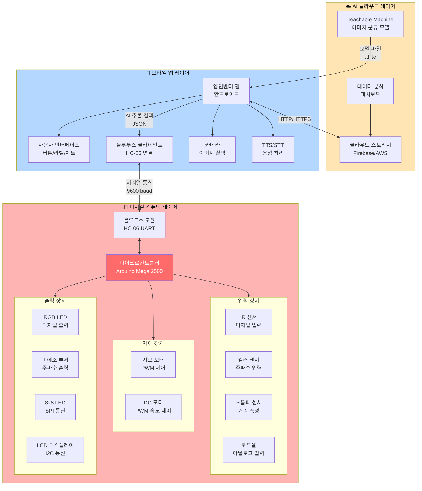

# 스마트 팩토리 시스템 아키텍처 완전 가이드

> **"3계층 시스템: 피지컬 컴퓨팅 ↔ 모바일 앱 ↔ AI 클라우드"**  
> 하드웨어부터 AI까지 전체 시스템 설계 바이블

---

## 📋 목차

1. [시스템 3계층 아키텍처](#시스템-3계층-아키텍처)
2. [피지컬 컴퓨팅 레이어](#피지컬-컴퓨팅-레이어)
3. [모바일 앱 레이어](#모바일-앱-레이어)
4. [AI 클라우드 레이어](#ai-클라우드-레이어)
5. [블루투스 통신 프로토콜](#블루투스-통신-프로토콜)
6. [기본 용어 사전](#기본-용어-사전)
7. [핵심 알고리즘 정의](#핵심-알고리즘-정의)
8. [Cursor AI 코딩 프롬프트](#cursor-ai-코딩-프롬프트)

---

## 🏗️ 시스템 3계층 아키텍처

### 전체 시스템 구조도



### 계층별 역할 정의

| 계층 | 주요 역할 | 핵심 기술 | 데이터 흐름 |
|------|----------|----------|------------|
| **☁️ AI 클라우드** | 모델 학습 및 배포 | Teachable Machine, TensorFlow Lite | 모델 → 앱 (다운로드) |
| **📱 모바일 앱** | 사용자 인터페이스 + AI 추론 | 앱인벤터, Personal Image Classifier | 사진 → AI 결과 → 아두이노 |
| **🔧 피지컬 컴퓨팅** | 센서 입력 + 액추에이터 제어 | Arduino C/C++, 임베디드 시스템 | 센서 → 처리 → 모터/LED |

---

## 🔧 피지컬 컴퓨팅 레이어

### 1. 마이크로컨트롤러 (MCU)

#### Arduino Mega 2560 스펙

```
┌─────────────────────────────────────┐
│   Arduino Mega 2560 (ATmega2560)    │
├─────────────────────────────────────┤
│ CPU Clock:        16 MHz            │
│ Flash Memory:     256 KB            │
│ SRAM:             8 KB              │
│ EEPROM:           4 KB              │
│                                     │
│ Digital I/O:      54 pins           │
│ - PWM:            15 pins           │
│ Analog Input:     16 pins (A0-A15) │
│                                     │
│ UART:             4개 (Serial 0~3)  │
│ I2C:              1개 (SDA, SCL)    │
│ SPI:              1개 (MOSI,MISO)   │
│                                     │
│ Operating Voltage: 5V               │
│ Input Voltage:    7-12V (권장)      │
│ DC Current:       40mA per pin      │
└─────────────────────────────────────┘
```

#### 역할과 책임

```
[MCU의 5가지 핵심 역할]

1. 센서 데이터 수집
   - 디지털 입력 읽기 (HIGH/LOW)
   - 아날로그 입력 읽기 (0-1023)
   - 주파수 측정 (pulseIn)
   
2. 신호 처리
   - 노이즈 필터링 (이동 평균, 중앙값)
   - 데이터 정규화 (0-255 매핑)
   - 임계값 비교 (if-else 로직)
   
3. 제어 신호 출력
   - 디지털 출력 (digitalWrite)
   - PWM 출력 (analogWrite)
   - 주파수 생성 (tone)
   
4. 통신 관리
   - UART 시리얼 통신 (블루투스)
   - I2C 통신 (LCD, EEPROM)
   - SPI 통신 (LED 매트릭스)
   
5. 상태 관리
   - 상태 머신 구현
   - 타이밍 제어 (millis)
   - 인터럽트 처리
```

---

### 2. 입력 장치 (센서)

#### 2.1 디지털 센서: IR 센서 (TCRT5000)

```
[IR 센서 동작 원리]

    IR LED                포토트랜지스터
    (적외선 방출)         (반사광 감지)
        ↓                     ↑
        ●─────────────────────●
               물체 표면
        
동작 과정:
1. IR LED가 적외선 방출
2. 물체가 있으면 적외선 반사
3. 포토트랜지스터가 반사광 감지
4. 전압 변화 → 디지털 신호 출력

출력 신호:
  - HIGH (5V): 물체 없음
  - LOW (0V):  물체 감지 (10cm 이내)
```

**스펙 시트**

| 항목 | 값 | 설명 |
|------|-----|------|
| **전원 전압** | 5V DC | 아두이노 5V 핀 연결 |
| **출력 타입** | 디지털 (HIGH/LOW) | D2 핀에 연결 |
| **감지 거리** | 1~10cm | 검은색: 1cm, 흰색: 10cm |
| **응답 시간** | < 1ms | 빠른 물체 감지 가능 |
| **소비 전류** | 20mA | 저전력 |

**알고리즘**

```
알고리즘: IR_물체감지
━━━━━━━━━━━━━━━━━━━━━━━━━━━━━━━━
입력: 없음
출력: boolean (true: 감지됨, false: 없음)

프로세스:
  1. PIN_IR_SENSOR의 디지털 값 읽기
     value ← digitalRead(PIN_IR_SENSOR)
  
  2. 논리 반전 (센서는 LOW가 감지)
     IF value == LOW THEN
       RETURN true   // 물체 감지됨
     ELSE
       RETURN false  // 물체 없음
     END IF

시간 복잡도: O(1)
공간 복잡도: O(1)
━━━━━━━━━━━━━━━━━━━━━━━━━━━━━━━━
```

#### 2.2 주파수 입력: 컬러 센서 (TCS3200)

```
[컬러 센서 동작 원리]

  백색 LED 조명
       ↓
  ┌──────────┐
  │ 필터 선택 │
  │ S2  S3   │
  ├──────────┤
  │  R G B C │ ← 4가지 필터
  ├──────────┤
  │ 광다이오드 │
  └─────┬────┘
        │
     주파수 출력
     (OUT 핀)

필터 선택 (S2, S3):
  S2=L, S3=L → Red 필터
  S2=H, S3=H → Green 필터
  S2=L, S3=H → Blue 필터
  S2=H, S3=L → Clear (필터 없음)
```

**스펙 시트**

| 항목 | 값 | 설명 |
|------|-----|------|
| **전원 전압** | 2.7-5.5V | 5V 사용 권장 |
| **출력 타입** | 주파수 (Hz) | 0-600 kHz |
| **주파수 스케일** | S0, S1으로 조절 | 20%, 2% 등 선택 가능 |
| **측정 시간** | 10-100ms | 필터당 |
| **정확도** | ±10% | 조도에 영향받음 |

**알고리즘**

```
알고리즘: RGB_색상_측정
━━━━━━━━━━━━━━━━━━━━━━━━━━━━━━━━
입력: 없음
출력: RGB 구조체 {r, g, b} (0-255)

데이터 구조:
  struct RGB {
    int r, g, b
  }

프로세스:
  1. 주파수 스케일 설정 (20%)
     digitalWrite(S0, HIGH)
     digitalWrite(S1, LOW)
  
  2. Red 필터 선택 및 측정
     digitalWrite(S2, LOW)
     digitalWrite(S3, LOW)
     redFreq ← pulseIn(OUT, LOW, 100000)  // 타임아웃 100ms
     delay(10)
  
  3. Green 필터 선택 및 측정
     digitalWrite(S2, HIGH)
     digitalWrite(S3, HIGH)
     greenFreq ← pulseIn(OUT, LOW, 100000)
     delay(10)
  
  4. Blue 필터 선택 및 측정
     digitalWrite(S2, LOW)
     digitalWrite(S3, HIGH)
     blueFreq ← pulseIn(OUT, LOW, 100000)
     delay(10)
  
  5. 주파수 → RGB 값 변환 (역비례 관계)
     rgb.r ← map(redFreq, 12, 200, 255, 0)
     rgb.g ← map(greenFreq, 12, 200, 255, 0)
     rgb.b ← map(blueFreq, 12, 200, 255, 0)
  
  6. 범위 제한 (0-255)
     rgb.r ← constrain(rgb.r, 0, 255)
     rgb.g ← constrain(rgb.g, 0, 255)
     rgb.b ← constrain(rgb.b, 0, 255)
  
  7. RETURN rgb

주의사항:
  - 주파수가 낮을수록 색이 진함 (역비례)
  - 조도에 따라 캘리브레이션 필요
  - 센서와 물체 거리: 5-10mm 권장

시간 복잡도: O(1) [약 30-100ms]
공간 복잡도: O(1)
━━━━━━━━━━━━━━━━━━━━━━━━━━━━━━━━
```

#### 2.3 거리 측정: 초음파 센서 (HC-SR04)

```
[초음파 센서 동작 원리]

  TRIG 핀       ECHO 핀
  (송신)        (수신)
     ↓             ↑
  ┌─────┐      ┌─────┐
  │ ))) │──→   │ ((( │
  └─────┘ 초음파 └─────┘
           ↓        ↑
         물체 표면 (반사)

타이밍 다이어그램:
  TRIG  ___╔═╗_________________
           10μs
  
  ECHO  ____╔═══════════╗______
            ← duration →
            (왕복 시간)

거리 계산:
  distance = duration × 음속 / 2
           = duration × 0.034 / 2 (cm)
           = duration × 0.017 (cm)
```

**스펙 시트**

| 항목 | 값 | 설명 |
|------|-----|------|
| **전원 전압** | 5V DC | |
| **측정 범위** | 2-400cm | |
| **정확도** | ±3mm | 온도 보정 필요 |
| **측정 각도** | 15도 | 원뿔형 |
| **주파수** | 40kHz | 초음파 주파수 |
| **최소 대기시간** | 60ms | 연속 측정 간격 |

**알고리즘**

```
알고리즘: 초음파_거리측정
━━━━━━━━━━━━━━━━━━━━━━━━━━━━━━━━
입력: 없음
출력: float distance (cm), -1 (오류)

상수:
  SOUND_SPEED = 0.034  // cm/μs (음속, 20°C 기준)
  TIMEOUT = 30000      // μs (최대 대기 시간)

프로세스:
  1. 트리거 신호 생성 (10μs 펄스)
     digitalWrite(TRIG, LOW)
     delayMicroseconds(2)
     digitalWrite(TRIG, HIGH)
     delayMicroseconds(10)
     digitalWrite(TRIG, LOW)
  
  2. 에코 신호 대기 (펄스 폭 측정)
     duration ← pulseIn(ECHO, HIGH, TIMEOUT)
  
  3. 타임아웃 체크
     IF duration == 0 THEN
       RETURN -1  // 측정 실패
     END IF
  
  4. 거리 계산 (왕복 시간 / 2)
     distance ← duration × SOUND_SPEED / 2
  
  5. 유효 범위 검증
     IF distance < 2 OR distance > 400 THEN
       RETURN -1  // 범위 초과
     END IF
  
  6. RETURN distance

보정 공식 (온도 고려):
  음속 = 331.3 + (0.606 × 온도)  // m/s
  
  예: 25°C → 346.5 m/s = 0.03465 cm/μs

시간 복잡도: O(1) [약 2-30ms]
공간 복잡도: O(1)
━━━━━━━━━━━━━━━━━━━━━━━━━━━━━━━━
```

#### 2.4 아날로그 센서: 로드셀 (무게 센서)

```
[로드셀 동작 원리]

  스트레인 게이지 (저항 변화)
  ┌─────────────────┐
  │   휘트스톤 브리지   │
  │   R1    R2       │
  │    ├─┬─┤         │
  │   R3    R4       │
  └──────┬───────────┘
         │
    증폭기 (HX711)
         │
      아날로그 전압 출력

무게 → 변형 → 저항 변화 → 전압 변화
```

**스펙 시트 (HX711 증폭기)**

| 항목 | 값 | 설명 |
|------|-----|------|
| **전원 전압** | 2.6-5.5V | |
| **출력 타입** | 24bit ADC | 고정밀 |
| **샘플링 속도** | 10/80 Hz | 선택 가능 |
| **측정 범위** | 0-5kg (센서 따라 다름) | |
| **정확도** | 0.1g | |
| **통신 방식** | 시리얼 (2-wire) | DT, SCK |

**알고리즘**

```
알고리즘: 로드셀_무게측정
━━━━━━━━━━━━━━━━━━━━━━━━━━━━━━━━
입력: 없음
출력: float weight (g)

전역 변수:
  calibrationFactor = 420.0  // 캘리브레이션 계수
  tareOffset = 0             // 영점 오프셋

프로세스:
  1. HX711에서 24bit 원시 값 읽기
     rawValue ← hx711.read()
  
  2. 영점 보정
     adjustedValue ← rawValue - tareOffset
  
  3. 무게 계산
     weight ← adjustedValue / calibrationFactor
  
  4. RETURN weight

캘리브레이션 알고리즘:
━━━━━━━━━━━━━━━━━━━━━━━━━━━━━━━━
  1. 영점 조정 (Tare)
     FOR i = 1 TO 10:
       samples[i] ← hx711.read()
     END FOR
     tareOffset ← average(samples)
  
  2. 계수 계산 (알려진 무게로)
     knownWeight ← 100.0  // g (알려진 무게)
     rawValue ← hx711.read()
     calibrationFactor ← (rawValue - tareOffset) / knownWeight
  
  3. EEPROM에 저장
     EEPROM.put(0, calibrationFactor)
     EEPROM.put(4, tareOffset)

시간 복잡도: O(1) [약 100ms]
공간 복잡도: O(1)
━━━━━━━━━━━━━━━━━━━━━━━━━━━━━━━━
```

---

### 3. 제어 장치 (액추에이터)

#### 3.1 서보 모터 (PWM 제어)

```
[서보 모터 동작 원리]

PWM 신호 (20ms 주기)
  
  0도:   1ms   HIGH ╔═╗_______________
              (5%)
  
  90도:  1.5ms HIGH ╔════╗____________
              (7.5%)
  
  180도: 2ms   HIGH ╔═════╗___________
              (10%)

  ← 20ms (50Hz) →

제어 방식:
  - PWM 듀티비 변화 → 각도 제어
  - 내부 피드백 회로로 정밀 위치 제어
  - ±1도 정확도
```

**스펉 시트 (MG996R)**

| 항목 | 값 | 설명 |
|------|-----|------|
| **전원 전압** | 4.8-6.6V | 외부 전원 필수 |
| **회전 범위** | 0-180도 | |
| **토크** | 11 kg·cm (6V) | 강력한 힘 |
| **속도** | 0.17 sec/60° | 빠른 응답 |
| **제어 신호** | PWM (50Hz) | 1-2ms 펄스 폭 |
| **중량** | 55g | |

**알고리즘**

```
알고리즘: 서보_각도제어
━━━━━━━━━━━━━━━━━━━━━━━━━━━━━━━━
입력: targetAngle (0-180도)
출력: 없음

전역 객체:
  Servo myServo  // 서보 객체

프로세스:
  1. 각도 범위 제한
     targetAngle ← constrain(targetAngle, 0, 180)
  
  2. PWM 신호 전송
     myServo.write(targetAngle)
     
  3. 안정화 대기 (각도 차이에 비례)
     currentAngle ← myServo.read()
     angleDiff ← abs(targetAngle - currentAngle)
     delayTime ← angleDiff × 3  // ms (경험적 값)
     delay(delayTime)

시간 복잡도: O(1)
공간 복잡도: O(1)

━━━━━━━━━━━━━━━━━━━━━━━━━━━━━━━━

알고리즘: 부드러운_서보_이동
━━━━━━━━━━━━━━━━━━━━━━━━━━━━━━━━
입력: startAngle, endAngle, duration (ms)
출력: 없음

프로세스:
  1. 이동 거리 및 단계 계산
     totalSteps ← abs(endAngle - startAngle)
     stepDelay ← duration / totalSteps
     direction ← sign(endAngle - startAngle)
  
  2. 점진적 이동
     currentAngle ← startAngle
     FOR step = 0 TO totalSteps:
       currentAngle ← currentAngle + direction
       myServo.write(currentAngle)
       delay(stepDelay)
     END FOR

시간 복잡도: O(n) [n = 각도 차이]
공간 복잡도: O(1)
━━━━━━━━━━━━━━━━━━━━━━━━━━━━━━━━
```

#### 3.2 DC 모터 (속도 제어)

```
[DC 모터 PWM 속도 제어]

PWM 듀티비 → 평균 전압 → 속도

  0%    ___________________  정지
  
  25%   ╔═╗_╔═╗_╔═╗_╔═╗_  느림
  
  50%   ╔═══╗_╔═══╗_╔═══╗  중간
  
  75%   ╔═════╗_╔═════╗_╔  빠름
  
  100%  ╔═══════════════  최고속

PWM 주파수: 약 490Hz (Arduino 기본)
```

**스펙 시트**

| 항목 | 값 | 설명 |
|------|-----|------|
| **전원 전압** | 3-12V | 모터 종류에 따라 |
| **정격 전압** | 12V | 컨베이어용 |
| **속도 제어** | PWM (0-255) | analogWrite |
| **방향 제어** | H-Bridge (L298N) | 정방향/역방향 |
| **정격 전류** | 500mA | 외부 전원 필수 |

**알고리즘**

```
알고리즘: DC모터_속도제어
━━━━━━━━━━━━━━━━━━━━━━━━━━━━━━━━
입력: speed (0-255), direction (FORWARD/BACKWARD)
출력: 없음

상수:
  MOTOR_PWM_PIN = 9
  MOTOR_DIR_PIN1 = 7
  MOTOR_DIR_PIN2 = 8

프로세스:
  1. 속도 범위 제한
     speed ← constrain(speed, 0, 255)
  
  2. 방향 설정
     IF direction == FORWARD THEN
       digitalWrite(MOTOR_DIR_PIN1, HIGH)
       digitalWrite(MOTOR_DIR_PIN2, LOW)
     ELSE  // BACKWARD
       digitalWrite(MOTOR_DIR_PIN1, LOW)
       digitalWrite(MOTOR_DIR_PIN2, HIGH)
     END IF
  
  3. PWM 속도 출력
     analogWrite(MOTOR_PWM_PIN, speed)

시간 복잡도: O(1)
공간 복잡도: O(1)

━━━━━━━━━━━━━━━━━━━━━━━━━━━━━━━━

알고리즘: 부드러운_가감속
━━━━━━━━━━━━━━━━━━━━━━━━━━━━━━━━
입력: targetSpeed (0-255), acceleration (가속도)
출력: 없음

전역 변수:
  currentSpeed = 0

프로세스:
  1. 목표 속도까지 점진적 증가/감소
     WHILE currentSpeed != targetSpeed:
       IF currentSpeed < targetSpeed THEN
         currentSpeed ← currentSpeed + acceleration
         IF currentSpeed > targetSpeed THEN
           currentSpeed ← targetSpeed
         END IF
       ELSE
         currentSpeed ← currentSpeed - acceleration
         IF currentSpeed < targetSpeed THEN
           currentSpeed ← targetSpeed
         END IF
       END IF
       
       analogWrite(MOTOR_PWM_PIN, currentSpeed)
       delay(20)  // 부드러운 가속을 위한 지연
     END WHILE

시간 복잡도: O(n) [n = 속도 차이 / 가속도]
공간 복잡도: O(1)
━━━━━━━━━━━━━━━━━━━━━━━━━━━━━━━━
```

---

### 4. 출력 장치 (디스플레이/알림)

#### 4.1 RGB LED (디지털 출력)

```
[RGB LED 색상 조합]

        RED (255, 0, 0)
           ●
          ╱ ╲
         ╱   ╲
        ╱     ╲
       ●───────● 
  BLUE        GREEN
(0,0,255)   (0,255,0)

색상 조합:
  - 빨강 + 초록 = 노랑 (255, 255, 0)
  - 빨강 + 파랑 = 마젠타 (255, 0, 255)
  - 초록 + 파랑 = 청록 (0, 255, 255)
  - 전부 켜기 = 흰색 (255, 255, 255)
```

**알고리즘**

```
알고리즘: RGB_색상_설정
━━━━━━━━━━━━━━━━━━━━━━━━━━━━━━━━
입력: r (0-255), g (0-255), b (0-255)
출력: 없음

프로세스:
  1. 공통 음극 vs 공통 양극 확인
     IF 공통 음극 THEN
       // 직접 출력
       analogWrite(PIN_RED, r)
       analogWrite(PIN_GREEN, g)
       analogWrite(PIN_BLUE, b)
     ELSE  // 공통 양극
       // 반전 출력
       analogWrite(PIN_RED, 255 - r)
       analogWrite(PIN_GREEN, 255 - g)
       analogWrite(PIN_BLUE, 255 - b)
     END IF

시간 복잡도: O(1)
공간 복잡도: O(1)
━━━━━━━━━━━━━━━━━━━━━━━━━━━━━━━━
```

#### 4.2 피에조 부저 (주파수 출력)

```
[음계 주파수 표]

옥타브 4 (중음):
  도(C4):  262 Hz
  레(D4):  294 Hz
  미(E4):  330 Hz
  파(F4):  349 Hz
  솔(G4):  392 Hz
  라(A4):  440 Hz (표준음)
  시(B4):  494 Hz
  
옥타브 5 (고음):
  도(C5):  523 Hz
  레(D5):  587 Hz
  미(E5):  659 Hz
  파(F5):  698 Hz
  솔(G5):  784 Hz
  라(A5):  880 Hz
  시(B5):  988 Hz
```

**알고리즘**

```
알고리즘: 멜로디_재생
━━━━━━━━━━━━━━━━━━━━━━━━━━━━━━━━
입력: melody[] (주파수 배열), duration[] (길이 배열), length
출력: 없음

프로세스:
  FOR i = 0 TO length-1:
    // 음 재생
    tone(BUZZER_PIN, melody[i], duration[i])
    
    // 음 길이 대기
    delay(duration[i])
    
    // 음 간격 (10%)
    noTone(BUZZER_PIN)
    delay(duration[i] × 0.1)
  END FOR

예시: 도레미 연주
  melody[] = {262, 294, 330}
  duration[] = {200, 200, 400}
  length = 3

시간 복잡도: O(n)
공간 복잡도: O(1)
━━━━━━━━━━━━━━━━━━━━━━━━━━━━━━━━
```

#### 4.3 8x8 LED 매트릭스 (SPI 통신)

```
[MAX7219 칩 제어]

SPI 통신 (3선):
  DIN  (Data In)   → 데이터
  CLK  (Clock)     → 클럭 신호
  CS   (Chip Select) → 칩 선택

레지스터 주소:
  0x09: Decode Mode (BCD/직접)
  0x0A: Intensity (밝기 0-15)
  0x0B: Scan Limit (행 수)
  0x0C: Shutdown (켜기/끄기)
  0x01-0x08: Digit 0-7 (각 행 데이터)
```

**알고리즘**

```
알고리즘: LED매트릭스_패턴_표시
━━━━━━━━━━━━━━━━━━━━━━━━━━━━━━━━
입력: pattern[8] (byte 배열)
출력: 없음

프로세스:
  1. 8개 행에 대해 반복
     FOR row = 0 TO 7:
       // 각 행 데이터 전송
       lc.setRow(0, row, pattern[row])
     END FOR

예시: 웃는 얼굴
  pattern[8] = {
    B00111100,  // 행 0
    B01000010,  // 행 1
    B10100101,  // 행 2
    B10000001,  // 행 3
    B10100101,  // 행 4
    B10011001,  // 행 5
    B01000010,  // 행 6
    B00111100   // 행 7
  }

시간 복잡도: O(1) [8행 고정]
공간 복잡도: O(1)
━━━━━━━━━━━━━━━━━━━━━━━━━━━━━━━━
```

#### 4.4 LCD 디스플레이 (I2C 통신)

```
[I2C 통신 프로토콜]

2선 통신:
  SDA (Serial Data)  → 양방향 데이터
  SCL (Serial Clock) → 클럭 신호

주소 지정:
  LCD 주소: 0x27 (일반적)
  다른 I2C 장치와 공존 가능

속도:
  Standard: 100 kHz
  Fast:     400 kHz
```

**알고리즘**

```
알고리즘: LCD_텍스트_출력
━━━━━━━━━━━━━━━━━━━━━━━━━━━━━━━━
입력: row (0-3), col (0-19), text (문자열)
출력: 없음

프로세스:
  1. 커서 위치 설정
     lcd.setCursor(col, row)
  
  2. 텍스트 출력
     lcd.print(text)

시간 복잡도: O(n) [n = 문자열 길이]
공간 복잡도: O(1)

━━━━━━━━━━━━━━━━━━━━━━━━━━━━━━━━

알고리즘: LCD_스크롤_텍스트
━━━━━━━━━━━━━━━━━━━━━━━━━━━━━━━━
입력: text (긴 문자열), row, scrollSpeed (ms)
출력: 없음

프로세스:
  1. 텍스트가 화면보다 길 경우
     textLength ← length(text)
     IF textLength <= 20 THEN
       // 그냥 출력
       lcd.setCursor(0, row)
       lcd.print(text)
     ELSE
       // 스크롤
       FOR offset = 0 TO textLength - 20:
         substring ← text[offset : offset+20]
         lcd.setCursor(0, row)
         lcd.print(substring)
         delay(scrollSpeed)
       END FOR
     END IF

시간 복잡도: O(n) [n = 문자열 길이]
공간 복잡도: O(1)
━━━━━━━━━━━━━━━━━━━━━━━━━━━━━━━━
```

---

## 📱 모바일 앱 레이어 (앱인벤터)

### 1. 앱인벤터 아키텍처

```
┌─────────────────────────────────────────┐
│        앱인벤터 애플리케이션 구조         │
├─────────────────────────────────────────┤
│                                         │
│  ┌─────────────────────────────────┐   │
│  │   UI 레이어 (Designer)           │   │
│  │   - Screen                       │   │
│  │   - Button, Label, TextBox       │   │
│  │   - Camera, Canvas               │   │
│  │   - Chart, ListPicker            │   │
│  └─────────────────────────────────┘   │
│           ↓ 이벤트 연결                 │
│  ┌─────────────────────────────────┐   │
│  │   로직 레이어 (Blocks Editor)     │   │
│  │   - Event Handlers               │   │
│  │   - Procedures                   │   │
│  │   - Variables                    │   │
│  │   - Control Flow                 │   │
│  └─────────────────────────────────┘   │
│           ↓ 호출                        │
│  ┌─────────────────────────────────┐   │
│  │   컴포넌트 레이어                 │   │
│  │   - BluetoothClient              │   │
│  │   - PersonalImageClassifier      │   │
│  │   - TextToSpeech                 │   │
│  │   - SpeechRecognizer             │   │
│  │   - ChartData2D                  │   │
│  └─────────────────────────────────┘   │
│           ↓ 통신                        │
│  ┌─────────────────────────────────┐   │
│  │   외부 인터페이스                 │   │
│  │   - 블루투스 (아두이노)           │   │
│  │   - 카메라 (이미지 촬영)          │   │
│  │   - 인터넷 (Firebase, API)       │   │
│  └─────────────────────────────────┘   │
│                                         │
└─────────────────────────────────────────┘
```

### 2. 핵심 컴포넌트 역할

#### 2.1 BluetoothClient (블루투스 클라이언트)

**역할**: 아두이노와 무선 통신

```
[블루투스 연결 상태 머신]

     ┌──────┐
     │ 대기 │
     └───┬──┘
         │ ListPicker 선택
         ↓
     ┌──────┐
     │ 연결 │ ← Connect("HC-06")
     └───┬──┘
         │ 연결 성공
         ↓
    ┌────────┐
    │ 데이터  │ ← SendText / ReceiveText
    │ 교환    │
    └───┬────┘
        │ Disconnect
        ↓
    ┌───────┐
    │ 연결  │
    │ 해제  │
    └───────┘
```

**주요 블록**

```
■ 장치 검색 및 연결
  when ListPicker_Bluetooth.BeforePicking
    set ListPicker_Bluetooth.Elements to
      BluetoothClient1.AddressesAndNames
      
  when ListPicker_Bluetooth.AfterPicking
    call BluetoothClient1.Connect
      address: ListPicker_Bluetooth.Selection

■ 데이터 송신
  when Button_Send.Click
    if BluetoothClient1.IsConnected then
      call BluetoothClient1.SendText
        text: TextBox_Command.Text
        
■ 데이터 수신
  when Clock_Receive.Timer
    if BluetoothClient1.BytesAvailableToReceive > 0 then
      set receivedData to
        BluetoothClient1.ReceiveText(-1)  // -1: 모두 읽기
      // 데이터 파싱 및 처리
```

#### 2.2 PersonalImageClassifier (AI 이미지 분류)

**역할**: Teachable Machine 모델로 이미지 분류

```
[AI 추론 파이프라인]

  1. 모델 로드
     ↓
  2. 이미지 입력 (카메라/갤러리)
     ↓
  3. AI 추론 (TensorFlow Lite)
     ↓
  4. 결과 반환
     - Label: "red", "blue", "yellow"
     - Confidence: 0.95 (95%)
```

**주요 블록**

```
■ 모델 로드 (Screen1.Initialize)
  when Screen1.Initialize
    call PersonalImageClassifier1.LoadModel
      modelPath: "model.tflite"

■ 이미지 촬영
  when Button_TakePhoto.Click
    call Camera1.TakePicture
    
  when Camera1.AfterPicture
    set Image1.Picture to image
    call PersonalImageClassifier1.ClassifyImage
      image: image

■ AI 결과 처리
  when PersonalImageClassifier1.GotClassification
    if confidence > 0.8 then
      set Label_Result.Text to label
      set Label_Confidence.Text to 
        join(round(confidence × 100), "%")
      
      // 아두이노에 결과 전송
      call BluetoothClient1.SendText
        text: join("COLOR:", label)
    else
      call Notifier1.ShowAlert
        message: "낮은 신뢰도. 다시 촬영하세요."
```

#### 2.3 TextToSpeech & SpeechRecognizer

**역할**: 음성 입출력 (사용자 경험 향상)

```
[음성 인터페이스 플로우]

  사용자 말하기
       ↓
  SpeechRecognizer.GetText
       ↓
  음성 → 텍스트 변환
       ↓
  명령어 파싱 (if-else)
       ↓
  동작 실행
       ↓
  TextToSpeech.Speak (피드백)
```

**주요 블록**

```
■ 음성 인식 시작
  when Button_VoiceCommand.Click
    call SpeechRecognizer1.GetText

■ 음성 인식 결과 처리
  when SpeechRecognizer1.AfterGettingText
    set command to result
    
    // 명령어 파싱
    if contains(command, "빨강") then
      set color to "red"
      set quantity to extractNumber(command)
      
    else if contains(command, "통계") then
      // 통계 화면으로 전환
      
    else if contains(command, "정지") then
      call BluetoothClient1.SendText
        text: "STOP"
        
    else
      call TextToSpeech1.Speak
        message: "인식할 수 없는 명령입니다"

■ 음성 피드백
  when Button_Speak.Click
    call TextToSpeech1.Speak
      message: Label_Status.Text
```

#### 2.4 ChartData2D (데이터 시각화)

**역할**: 실시간 통계 차트 표시

```
[차트 종류]

1. 막대 차트 (Bar Chart)
   ██████ 빨강: 45개
   ████ 파랑: 30개
   ███████ 노랑: 52개

2. 원형 차트 (Pie Chart)
   🔴 35%
   🔵 24%
   🟡 41%

3. 라인 차트 (Line Chart)
   처리량
    │    ╱╲
    │   ╱  ╲  ╱
    │  ╱    ╲╱
    └─────────────→ 시간
```

**주요 블록**

```
■ 차트 데이터 추가 (실시간)
  when BluetoothClient1.ReceiveText
    set jsonData to call JSON.parse(receivedText)
    
    // 막대 차트 업데이트
    call Chart_Bar.ClearData
    call Chart_Bar.AddData
      category: "빨강"
      value: get jsonData.red
    call Chart_Bar.AddData
      category: "파랑"
      value: get jsonData.blue
    call Chart_Bar.AddData
      category: "노랑"
      value: get jsonData.yellow

■ 원형 차트 (비율)
  set total to jsonData.red + jsonData.blue + jsonData.yellow
  set redPercent to round((jsonData.red / total) × 100)
  
  call Chart_Pie.SetData
    data: create list(redPercent, bluePercent, yellowPercent)
    labels: create list("빨강", "파랑", "노랑")
    colors: create list(RED, BLUE, YELLOW)

■ 라인 차트 (시간대별)
  when Clock_Update.Timer  // 매 1분
    set currentTime to Clock1.FormatTime
    set currentCount to get global.totalCount
    
    call Chart_Line.AddDataPoint
      x: currentTime
      y: currentCount
```

---

## ☁️ AI 클라우드 레이어 (Teachable Machine)

### 1. Teachable Machine 워크플로우

```
[AI 모델 학습 파이프라인]

Step 1: 데이터 수집
  ┌─────────────────────┐
  │ 웹캠으로 이미지 촬영  │
  │ - 빨강: 100장        │
  │ - 파랑: 100장        │
  │ - 노랑: 100장        │
  └──────────┬──────────┘
             │
Step 2: 데이터 증강 (자동)
  ┌──────────▼──────────┐
  │ 회전, 밝기, 노이즈    │
  │ → 데이터셋 3배 증가   │
  └──────────┬──────────┘
             │
Step 3: 모델 학습
  ┌──────────▼──────────┐
  │ MobileNet 전이학습   │
  │ - Epoch: 50         │
  │ - Batch Size: 16    │
  └──────────┬──────────┘
             │
Step 4: 모델 내보내기
  ┌──────────▼──────────┐
  │ TensorFlow Lite     │
  │ .tflite 파일 다운로드 │
  └──────────┬──────────┘
             │
Step 5: 앱인벤터에 업로드
  ┌──────────▼──────────┐
  │ PersonalImage       │
  │ Classifier에 로드    │
  └─────────────────────┘
```

### 2. 데이터 수집 가이드라인

```
알고리즘: 최적_데이터셋_구축
━━━━━━━━━━━━━━━━━━━━━━━━━━━━━━━━
목표: 정확도 95% 이상

데이터 다양성 체크리스트:

1. 각도 다양성 (6가지)
   - 정면 (0도)
   - 좌측 30도
   - 우측 30도
   - 위에서 45도
   - 아래에서 30도
   - 측면 90도

2. 조명 다양성 (4가지)
   - 밝은 조명 (1000 lux 이상)
   - 일반 조명 (500 lux)
   - 어두운 조명 (200 lux)
   - 역광 (백라이트)

3. 거리 다양성 (3가지)
   - 가까이 (10cm)
   - 중간 (30cm)
   - 멀리 (50cm)

4. 배경 다양성 (3가지)
   - 흰색 배경
   - 검은색 배경
   - 자연 배경

최소 샘플 수:
  각 클래스당 = 6 × 4 × 3 × 3 = 216장
  
  3개 클래스 = 216 × 3 = 648장
  
권장: 클래스당 100-200장 (증강 포함)

시간 투자:
  - 촬영: 30분
  - 라벨링: 10분 (자동)
  - 학습: 5분
  - 테스트: 10분
  ────────────────
  총: 약 55분
━━━━━━━━━━━━━━━━━━━━━━━━━━━━━━━━
```

### 3. 모델 최적화

```
[하이퍼파라미터 튜닝]

파라미터          기본값    추천값    설명
─────────────────────────────────────
Epochs            50       50-100   학습 반복 횟수
Batch Size        16       8-32     한 번에 처리할 이미지 수
Learning Rate     0.001    0.001    학습 속도
Image Size        224x224  224x224  입력 이미지 크기

과적합 방지:
  - Dropout: 0.5 (50% 뉴런 비활성화)
  - Data Augmentation: ON
  - Early Stopping: Validation Loss 증가 시 중단

모델 정확도 목표:
  - Training Accuracy: > 98%
  - Validation Accuracy: > 95%
  - Test Accuracy: > 90%
```

---

## 🔗 블루투스 통신 프로토콜

### 1. 물리 계층 (Physical Layer)

```
[HC-06 블루투스 모듈 스펙]

┌─────────────────────────────────┐
│        HC-06 Bluetooth          │
├─────────────────────────────────┤
│ Bluetooth Version: 2.0          │
│ Frequency:         2.4 GHz      │
│ Range:             10m (Class 2)│
│ UART Baud Rate:    9600 bps     │
│ Operating Voltage: 3.3-6V       │
│ Current:           30mA (Active)│
│                    8mA (Sleep)  │
│                                 │
│ Pins:                           │
│   VCC  → 5V (아두이노)           │
│   GND  → GND                    │
│   TXD  → RX1 (아두이노)          │
│   RXD  → TX1 (아두이노)          │
└─────────────────────────────────┘

주의: TXD-RX, RXD-TX 교차 연결!
```

### 2. 데이터 링크 계층 (Data Link Layer)

```
[시리얼 통신 프로토콜]

UART (Universal Asynchronous Receiver-Transmitter)

  Start  D0 D1 D2 D3 D4 D5 D6 D7 Stop
  ╔═╗    ┌─┬─┬─┬─┬─┬─┬─┬─┐    ╔═╗
  ║0║────┤ │ │ │ │ │ │ │ │────║1║
  ╚═╝    └─┴─┴─┴─┴─┴─┴─┴─┘    ╚═╝
  
  - Baud Rate: 9600 bps (초당 9600 비트)
  - Data Bits: 8 bit
  - Stop Bits: 1 bit
  - Parity: None
  - Flow Control: None

전송 시간 계산:
  1 바이트 = 1 Start + 8 Data + 1 Stop = 10 bits
  전송 시간 = 10 bits / 9600 bps = 1.04 ms
```

### 3. 애플리케이션 계층 (Application Layer)

#### 3.1 JSON 프로토콜

```
[메시지 포맷]

방향: 앱 → 아두이노 (명령)
━━━━━━━━━━━━━━━━━━━━━━━━━━━━━━━━
{
  "cmd": "PICK",
  "color": "red",
  "zone": 1,
  "speed": 150
}

방향: 아두이노 → 앱 (상태/통계)
━━━━━━━━━━━━━━━━━━━━━━━━━━━━━━━━
{
  "status": "SUCCESS",
  "red": 45,
  "blue": 32,
  "yellow": 28,
  "error": 2,
  "timestamp": 1234567890
}

장점:
  - 가독성 높음
  - 확장 용이
  - 파싱 간단

단점:
  - 오버헤드 큼 (약 100 bytes)
  - 속도 느림
```

#### 3.2 고속 바이너리 프로토콜

```
[커스텀 바이너리 포맷]

메시지 구조 (8 bytes):
  ┌────┬────┬────┬────┬────┬────┬────┬────┐
  │STX │CMD │D1  │D2  │D3  │D4  │CHK │ETX │
  └────┴────┴────┴────┴────┴────┴────┴────┘
  
  STX: Start of Text (0x02)
  CMD: Command (1 byte)
  D1-D4: Data (4 bytes)
  CHK: Checksum (XOR)
  ETX: End of Text (0x03)

명령 코드:
  0x01: PICK (집기)
  0x02: PLACE (놓기)
  0x03: HOME (원점 복귀)
  0x10: GET_STATUS (상태 조회)
  0x11: RESET (리셋)

예시: 빨강 블록 집기
  02 01 00 00 00 00 03 03
  │  │  └─ 색상 (0=빨강)
  │  └─ PICK 명령
  └─ 시작 바이트

장점:
  - 고속 전송 (8 bytes)
  - 오류 검출 (체크섬)
  - 효율적

단점:
  - 가독성 낮음
  - 디버깅 어려움
```

### 4. 통신 알고리즘

```
알고리즘: 안정적_블루투스_송신
━━━━━━━━━━━━━━━━━━━━━━━━━━━━━━━━
입력: message (문자열)
출력: boolean (성공/실패)

프로세스:
  1. 연결 상태 확인
     IF NOT isConnected() THEN
       RETURN false
     END IF
  
  2. 재시도 루프 (최대 3회)
     FOR attempt = 1 TO 3:
       TRY:
         sendText(message)
         
         // ACK 대기 (1초 타임아웃)
         ack ← waitForACK(1000)
         
         IF ack == "OK" THEN
           RETURN true
         END IF
       CATCH timeout:
         delay(100)  // 재시도 전 대기
       END TRY
     END FOR
  
  3. 모두 실패
     RETURN false

시간 복잡도: O(1)
공간 복잡도: O(n) [n = 메시지 길이]

━━━━━━━━━━━━━━━━━━━━━━━━━━━━━━━━

알고리즘: 안정적_블루투스_수신
━━━━━━━━━━━━━━━━━━━━━━━━━━━━━━━━
입력: 없음
출력: message (문자열) or NULL

전역 변수:
  buffer = ""  // 수신 버퍼

프로세스:
  1. 수신 가능한 바이트 확인
     IF bytesAvailable() == 0 THEN
       RETURN NULL
     END IF
  
  2. 줄바꿈까지 읽기
     WHILE bytesAvailable() > 0:
       char ← readChar()
       
       IF char == '\n' THEN
         message ← buffer
         buffer ← ""
         
         // ACK 전송
         sendText("OK")
         
         RETURN message
       ELSE
         buffer ← buffer + char
       END IF
     END WHILE
  
  3. 아직 완성 안됨
     RETURN NULL

시간 복잡도: O(n) [n = 메시지 길이]
공간 복잡도: O(n)
━━━━━━━━━━━━━━━━━━━━━━━━━━━━━━━━
```

---

## 📚 기본 용어 사전

### A. 하드웨어 용어

| 용어 | 영문 | 정의 | 예시 |
|------|------|------|------|
| **디지털 신호** | Digital Signal | HIGH(5V) 또는 LOW(0V) 두 가지 상태만 존재 | LED 켜기/끄기 |
| **아날로그 신호** | Analog Signal | 연속적인 전압 값 (0-5V) | 밝기 조절, 속도 제어 |
| **PWM** | Pulse Width Modulation | 디지털 신호로 아날로그 효과 구현 | 서보 각도, DC모터 속도 |
| **I2C** | Inter-Integrated Circuit | 2선 통신 (SDA, SCL), 여러 장치 연결 가능 | LCD, EEPROM |
| **SPI** | Serial Peripheral Interface | 4선 고속 통신 (MOSI, MISO, SCK, CS) | LED 매트릭스, SD카드 |
| **UART** | Universal Asynchronous RX/TX | 비동기 시리얼 통신 | 블루투스, GPS |
| **ADC** | Analog-to-Digital Converter | 아날로그 전압 → 디지털 값 변환 | analogRead() |
| **DAC** | Digital-to-Analog Converter | 디지털 값 → 아날로그 전압 변환 | analogWrite() |
| **Pull-up** | Pull-up Resistor | 버튼 누르지 않았을 때 HIGH 유지 | INPUT_PULLUP |
| **Pull-down** | Pull-down Resistor | 버튼 누르지 않았을 때 LOW 유지 | 외부 저항 필요 |

### B. 소프트웨어 용어

| 용어 | 영문 | 정의 | 예시 |
|------|------|------|------|
| **상태 머신** | State Machine | 시스템을 명확한 상태로 분리하여 관리 | IDLE, SCANNING, PICKING |
| **폴링** | Polling | 주기적으로 센서 값 확인 | loop()에서 반복 읽기 |
| **인터럽트** | Interrupt | 이벤트 발생 시 즉시 처리 | attachInterrupt() |
| **디바운싱** | Debouncing | 버튼 떨림 현상 제거 | delay(50) 추가 |
| **필터링** | Filtering | 센서 노이즈 제거 | 이동 평균, 중앙값 |
| **캘리브레이션** | Calibration | 센서 보정 (정확도 향상) | 색상 기준값 설정 |
| **임계값** | Threshold | 판단 기준값 | if (value > 100) |
| **핸드셰이크** | Handshake | 통신 시작 전 연결 확인 | 블루투스 페어링 |
| **ACK/NACK** | Acknowledgment | 수신 확인/거부 신호 | "OK" / "ERROR" |
| **타임아웃** | Timeout | 일정 시간 내 응답 없으면 실패 처리 | pulseIn(pin, HIGH, 1000) |

### C. AI/ML 용어

| 용어 | 영문 | 정의 | 예시 |
|------|------|------|------|
| **모델** | Model | 학습된 AI 알고리즘 | .tflite 파일 |
| **추론** | Inference | 학습된 모델로 예측 수행 | ClassifyImage() |
| **신뢰도** | Confidence | 예측 결과의 확신 정도 (0-1) | 0.95 = 95% |
| **라벨** | Label | 분류 클래스 이름 | "red", "blue", "yellow" |
| **전이학습** | Transfer Learning | 사전 학습된 모델 활용 | MobileNet 기반 |
| **과적합** | Overfitting | 학습 데이터에만 잘 맞음 | 새 데이터 정확도 낮음 |
| **데이터 증강** | Data Augmentation | 데이터 인위적 변형 | 회전, 밝기 조절 |
| **배치** | Batch | 한 번에 처리할 데이터 묶음 | Batch Size: 16 |
| **에포크** | Epoch | 전체 데이터셋 1회 학습 | 50 Epochs |

---

## 🧮 핵심 알고리즘 정의

### 1. 제어 알고리즘

#### 1.1 PID 제어

```
알고리즘: PID_제어
━━━━━━━━━━━━━━━━━━━━━━━━━━━━━━━━
목적: 목표값에 정확하고 빠르게 도달

입력:
  - setpoint: 목표값
  - currentValue: 현재값
  
출력:
  - output: 제어 출력 (0-255)

전역 변수:
  - lastError = 0
  - integral = 0
  - Kp = 2.0  // 비례 계수
  - Ki = 0.5  // 적분 계수
  - Kd = 1.0  // 미분 계수

프로세스:
  1. 오차 계산
     error ← setpoint - currentValue
  
  2. 비례항 (P): 현재 오차에 비례
     P ← Kp × error
  
  3. 적분항 (I): 누적 오차
     integral ← integral + error
     I ← Ki × integral
  
  4. 미분항 (D): 오차 변화율
     derivative ← error - lastError
     D ← Kd × derivative
  
  5. 제어 출력 계산
     output ← P + I + D
     output ← constrain(output, 0, 255)
  
  6. 변수 업데이트
     lastError ← error
  
  7. RETURN output

적용 예시:
  - 온도 제어: 목표 온도 유지
  - 속도 제어: 일정 속도 유지
  - 위치 제어: 정밀 위치 제어

시간 복잡도: O(1)
공간 복잡도: O(1)
━━━━━━━━━━━━━━━━━━━━━━━━━━━━━━━━
```

### 2. 신호 처리 알고리즘

#### 2.1 이동 평균 필터

```
알고리즘: 이동평균_필터
━━━━━━━━━━━━━━━━━━━━━━━━━━━━━━━━
목적: 센서 노이즈 제거 (단순하고 효과적)

입력: newValue (새로운 센서 값)
출력: filteredValue (필터링된 값)

전역 변수:
  - buffer[N]: 순환 버퍼 (크기 N)
  - index = 0: 현재 인덱스
  - sum = 0: 합계
  - N = 10: 샘플 개수

초기화:
  FOR i = 0 TO N-1:
    buffer[i] ← 0
  END FOR

프로세스:
  1. 이전 값 제거
     sum ← sum - buffer[index]
  
  2. 새 값 추가
     buffer[index] ← newValue
     sum ← sum + newValue
  
  3. 인덱스 순환
     index ← (index + 1) % N
  
  4. 평균 계산
     filteredValue ← sum / N
  
  5. RETURN filteredValue

장점:
  - 구현 간단
  - CPU 부하 낮음 O(1)
  - 메모리 사용 일정

단점:
  - 응답 속도 느림 (N에 비례)
  - 급격한 변화 추적 어려움

시간 복잡도: O(1)
공간 복잡도: O(N)
━━━━━━━━━━━━━━━━━━━━━━━━━━━━━━━━
```

#### 2.2 중앙값 필터

```
알고리즘: 중앙값_필터
━━━━━━━━━━━━━━━━━━━━━━━━━━━━━━━━
목적: 이상치(Outlier) 제거에 강함

입력: 없음
출력: medianValue (중앙값)

전역 변수:
  - buffer[N]: 샘플 버퍼
  - N = 5: 샘플 개수 (홀수 권장)

프로세스:
  1. N개 샘플 수집
     FOR i = 0 TO N-1:
       buffer[i] ← readSensor()
       delay(10)
     END FOR
  
  2. 정렬 (Bubble Sort - 작은 N에 적합)
     FOR i = 0 TO N-2:
       FOR j = 0 TO N-2-i:
         IF buffer[j] > buffer[j+1] THEN
           swap(buffer[j], buffer[j+1])
         END IF
       END FOR
     END FOR
  
  3. 중앙값 선택
     medianValue ← buffer[N/2]
  
  4. RETURN medianValue

장점:
  - 이상치에 매우 강함
  - 급격한 노이즈 제거 효과적

단점:
  - 정렬 필요 (시간 소요)
  - N개 샘플 수집 대기 시간

시간 복잡도: O(N²) [정렬]
공간 복잡도: O(N)

최적화: Quick Select 알고리즘 사용 시 O(N)
━━━━━━━━━━━━━━━━━━━━━━━━━━━━━━━━
```

### 3. 패턴 인식 알고리즘

#### 3.1 유클리드 거리 (색상 유사도)

```
알고리즘: 색상_유클리드_거리
━━━━━━━━━━━━━━━━━━━━━━━━━━━━━━━━
목적: 두 색상의 유사도 계산

입력:
  - color1: {r1, g1, b1}
  - color2: {r2, g2, b2}
  
출력: distance (거리, 0에 가까울수록 유사)

프로세스:
  1. RGB 각 채널 차이 계산
     dr ← r1 - r2
     dg ← g1 - g2
     db ← b1 - b2
  
  2. 유클리드 거리 계산
     distance ← sqrt(dr² + dg² + db²)
  
  3. RETURN distance

응용: 색상 분류
  FOR each referenceColor IN referenceColors:
    dist ← euclideanDistance(measuredColor, referenceColor)
    IF dist < minDistance THEN
      minDistance ← dist
      closestColor ← referenceColor
    END IF
  END FOR
  
  RETURN closestColor

시간 복잡도: O(1)
공간 복잡도: O(1)
━━━━━━━━━━━━━━━━━━━━━━━━━━━━━━━━
```

---

## 🤖 Cursor AI 코딩 프롬프트

### 1. 기본 구조 프롬프트

#### 프롬프트 1: 프로젝트 초기 설정

```
당신은 Arduino 임베디드 시스템 전문가입니다. 
스마트 팩토리 색상 분류 시스템을 구현하려고 합니다.

요구사항:
1. Arduino Mega 2560 사용
2. 입력: IR 센서 (D2), 컬러 센서 TCS3200 (A0-A4)
3. 출력: 서보 모터 (D10), DC 모터 (D9), RGB LED (D11-13)
4. 통신: 블루투스 HC-06 (Serial1)

다음 파일 구조로 프로젝트를 생성해주세요:
- main_controller.ino (setup + loop)
- sensor_handler.h/.cpp (센서 모듈)
- monitoring.h/.cpp (LED/부저 모듈)
- communication.h/.cpp (블루투스 모듈)

절차적 프로그래밍 구조로 작성하고, 
모든 변수/함수는 영문으로, 주석은 한글로 작성해주세요.
```

#### 프롬프트 2: 센서 모듈 구현

```
TCS3200 컬러 센서를 제어하는 모듈을 작성해주세요.

핀 연결:
- S0: A0, S1: A1, S2: A2, S3: A3, OUT: A4

요구사항:
1. RGB 구조체 정의 {r, g, b}
2. setupColorSensor() 함수: 핀 모드 설정
3. readColorSensor() 함수:
   - 빨강/초록/파랑 필터 순차 선택
   - pulseIn으로 주파수 측정
   - 0-255 범위로 정규화
   - RGB 구조체 반환

주파수와 색상 값은 역비례 관계입니다.
주파수 범위: 12-200 (실험적 값)
```

#### 프롬프트 3: 상태 머신 구현

```
색상 분류 시스템의 상태 머신을 구현해주세요.

상태 정의 (enum):
- STATE_IDLE: 대기
- STATE_DETECTING: IR 센서 감지
- STATE_MEASURING: 색상 측정
- STATE_SORTING: 게이트 제어

상태 전이 조건:
1. IDLE → DETECTING: IR 센서 LOW
2. DETECTING → MEASURING: 벨트 정지 후 100ms
3. MEASURING → SORTING: RGB 값 획득
4. SORTING → IDLE: 게이트 동작 완료 (2초 후)

loop() 함수 내에서 switch문으로 구현하고,
비차단(non-blocking) 방식으로 작성해주세요.
millis()를 사용하여 타이밍 제어하세요.
```

### 2. 고급 기능 프롬프트

#### 프롬프트 4: 블루투스 통신 프로토콜

```
아두이노와 앱인벤터 간 JSON 통신 프로토콜을 구현해주세요.

수신 메시지 형식 (앱 → 아두이노):
{
  "cmd": "RESET",
  "param1": 100
}

송신 메시지 형식 (아두이노 → 앱):
{
  "status": "SUCCESS",
  "red": 45,
  "blue": 32,
  "yellow": 28
}

요구사항:
1. parseJSON() 함수: 수신 메시지 파싱
2. createJSON() 함수: 송신 메시지 생성
3. sendStatistics() 함수: 통계 데이터 전송
4. 비차단 방식으로 Serial1.available() 체크
5. 줄바꿈('\n')을 메시지 종료 표시로 사용

ArduinoJson 라이브러리 사용해주세요.
```

#### 프롬프트 5: PID 속도 제어

```
DC 모터의 속도를 PID 제어로 일정하게 유지하는 코드를 작성해주세요.

요구사항:
1. 엔코더로 현재 속도 측정 (RPM)
2. 목표 속도: 150 RPM
3. PID 계수: Kp=2.0, Ki=0.5, Kd=1.0
4. 제어 주기: 50ms (20Hz)
5. PWM 출력 범위: 0-255

함수:
- updatePID(currentSpeed, targetSpeed) → pwmValue
- readEncoder() → currentRPM

전역 변수로 lastError, integral 유지하세요.
```

### 3. 디버깅 프롬프트

#### 프롬프트 6: 시리얼 모니터 디버깅

```
다음 코드에 시리얼 모니터 디버깅 출력을 추가해주세요:

[코드 붙여넣기]

추가할 내용:
1. setup()에서 초기화 완료 메시지
2. loop()에서 현재 상태 출력 (1초마다)
3. 센서 읽기 시 원시 값 + 변환 값 출력
4. 오류 발생 시 상세 오류 메시지
5. 통신 송수신 시 메시지 내용 출력

형식:
[DEBUG] 카테고리: 메시지 내용

Serial.println() 사용하고, 
과도한 출력으로 성능 저하 없도록 주의하세요.
```

#### 프롬프트 7: 코드 최적화

```
다음 코드를 최적화해주세요:

[코드 붙여넣기]

최적화 항목:
1. delay() 사용을 millis() 기반으로 변경
2. 전역 변수 메모리 사용 최소화
3. 불필요한 연산 제거
4. 함수 인라인화 (작은 함수)
5. 문자열 리터럴을 PROGMEM으로 이동

성능 목표:
- loop() 실행 시간: < 10ms
- 메모리 사용: < 50% (RAM)

최적화 전후 비교 주석으로 설명해주세요.
```

### 4. 앱인벤터 블록 프롬프트

#### 프롬프트 8: AI 스캔 화면 설계

```
앱인벤터에서 다음 기능을 구현하는 블록 코딩 방법을 
자연어로 단계별로 설명해주세요:

기능: AI 이미지 분류 + 결과를 아두이노에 전송

구성:
1. Button_Scan 클릭 시 카메라 촬영
2. Camera1.AfterPicture에서:
   - Image1에 사진 표시
   - PersonalImageClassifier1.ClassifyImage 호출
3. GotClassification 이벤트에서:
   - 신뢰도 > 80% 확인
   - Label_Result에 라벨 표시
   - Label_Confidence에 신뢰도 표시
   - JSON 메시지 생성: {"color": label}
   - BluetoothClient1.SendText로 전송
4. 신뢰도 < 80%면 재촬영 요청

각 단계마다 사용할 블록 이름과 파라미터를 명시해주세요.
```

#### 프롬프트 9: 실시간 차트 업데이트

```
블루투스로 받은 통계 데이터를 차트에 실시간 표시하는
블록 코딩 방법을 설명해주세요:

수신 데이터 (JSON):
{"red": 45, "blue": 32, "yellow": 28}

차트 종류:
1. 막대 차트 (Chart_Bar): 각 색상별 개수
2. 원형 차트 (Chart_Pie): 비율

요구사항:
1. Clock.Timer (1초마다 실행)
2. 블루투스 수신 데이터 파싱
3. 차트 데이터 업데이트
4. 합계 계산 및 표시

JSON 파싱은 Web.JsonTextDecode 사용하고,
차트 색상은 실제 물체 색상과 일치시켜주세요.
```

### 5. 문제 해결 프롬프트

#### 프롬프트 10: 열린 질문 (Vibe Coding)

```
나는 스마트 팩토리 색상 분류 시스템을 만들고 있습니다.

현재 문제:
[문제 설명을 자유롭게 작성]

예: "컬러 센서가 노란색을 빨간색으로 잘못 인식합니다"

시스템 구성:
- 아두이노 Mega 2560
- TCS3200 컬러 센서
- HC-06 블루투스
- 앱인벤터 앱

이 문제의 원인을 분석하고,
해결 방법을 단계별로 제시해주세요.
가능한 원인을 모두 나열하고,
각각에 대한 테스트 방법과 수정 코드를 포함해주세요.
```

#### 프롬프트 11: 성능 진단

```
내 시스템의 성능을 진단하고 개선점을 제안해주세요.

현재 성능:
- IR 센서 물체 감지: 정상
- 색상 측정 시간: 약 200ms
- 분류 정확도: 85%
- 초당 처리량: 약 3개

목표:
- 측정 시간: < 100ms
- 정확도: > 95%
- 처리량: > 5개/초

다음 관점에서 분석해주세요:
1. 알고리즘 효율성
2. 하드웨어 한계
3. 센서 캘리브레이션
4. 타이밍 최적화
5. 데이터 필터링

각 항목마다 구체적인 개선 방법과
예상 효과를 제시해주세요.
```

---

## 🎓 학습 로드맵

### 초급 단계 (1-2주)

```
Week 1: 하드웨어 기초
  Day 1-2: Arduino 기본 (digitalWrite, analogWrite)
  Day 3-4: 센서 입력 (digitalRead, analogRead)
  Day 5-6: 서보 모터 제어
  Day 7: 종합 실습

Week 2: 통신 및 알고리즘
  Day 1-2: 시리얼 통신
  Day 3-4: 블루투스 통신
  Day 5-6: 상태 머신 구현
  Day 7: 색상 분류 프로젝트
```

### 중급 단계 (3-4주)

```
Week 3: 앱인벤터 연동
  Day 1-2: 앱인벤터 기본
  Day 3-4: 블루투스 연결
  Day 5-6: Teachable Machine
  Day 7: AI 연동 프로젝트

Week 4: 시스템 통합
  Day 1-2: 전체 시스템 조립
  Day 3-4: 디버깅 및 최적화
  Day 5-6: 발표 자료 준비
  Day 7: 최종 발표
```

---

**Last Updated**: 2026-01-22  
**Version**: 1.0  
**제작**: Smart Factory Education Team  

**이 문서는 소스 코드 없이 시스템의 구조, 원리, 알고리즘만 설명합니다.**  
**실제 구현은 Day3_시나리오_상세가이드.md를 참조하세요.** 🚀
