# 앱인벤터 기본 기능 가이드

## 목차
1. [기본 UI 사용법](#기본-ui-사용법)
2. [Bluetooth 통신](#bluetooth-통신)
3. [데이터 저장 (TinyDB)](#데이터-저장-tinydb)
4. [차트 사용](#차트-사용)
5. [미디어 사용](#미디어-사용)
6. [HTTP 통신](#http-통신)

---

## 전체 구조도

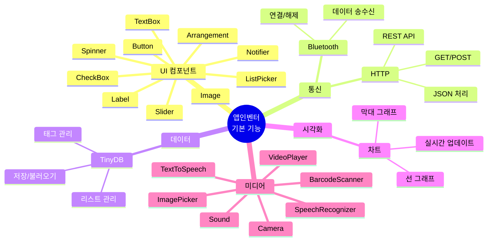

---

## 기본 UI 사용법

### UI 컴포넌트 계층 구조

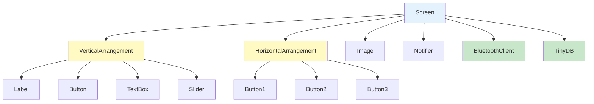

### 1. 버튼 (Button)

#### Designer 설정
```
Button1:
  - Text: "클릭하세요"
  - BackgroundColor: 파란색
  - FontSize: 20
  - Width: Fill parent
  - Height: 50 pixels
```

#### Blocks 사용
```
Button1.Click 이벤트:
  set Label1.Text to "버튼이 클릭되었습니다"
  set Button1.Enabled to false  // 버튼 비활성화
```

### 2. 레이블 (Label)

#### Designer 설정
```
Label1:
  - Text: "안녕하세요"
  - FontSize: 18
  - TextColor: 검은색
  - TextAlignment: center
```

#### Blocks 사용
```
// 텍스트 변경
set Label1.Text to "새로운 텍스트"

// 색상 변경
set Label1.BackgroundColor to 빨간색

// 숨기기/보이기
set Label1.Visible to false  // 숨기기
set Label1.Visible to true   // 보이기
```

### 3. 텍스트 박스 (TextBox)

#### Designer 설정
```
TextBox1:
  - Hint: "이름을 입력하세요"
  - MultiLine: false
  - NumbersOnly: false
```

#### Blocks 사용
```
Button_Submit.Click:
  set name to TextBox1.Text
  set Label1.Text to join("안녕하세요, ", name, "님!")
  set TextBox1.Text to ""  // 텍스트 박스 비우기
```

### 4. 슬라이더 (Slider)

#### Designer 설정
```
Slider1:
  - MinValue: 0
  - MaxValue: 100
  - ThumbPosition: 50
```

#### Blocks 사용
```
Slider1.PositionChanged:
  set Label_Value.Text to Slider1.ThumbPosition
  
  // 조건부 색상 변경
  if Slider1.ThumbPosition > 80
  then
    set Label_Value.TextColor to 빨간색
  else
    set Label_Value.TextColor to 검은색
```

### 5. 체크박스 (CheckBox)

#### Blocks 사용
```
CheckBox1.Changed:
  if CheckBox1.Checked
  then
    set Label1.Text to "체크됨"
  else
    set Label1.Text to "체크 해제됨"
```

### 6. 리스트 피커 (ListPicker)

#### Blocks 사용
```
ListPicker1.BeforePicking:
  set ListPicker1.Elements to make a list
    item: "옵션 1"
    item: "옵션 2"
    item: "옵션 3"

ListPicker1.AfterPicking:
  set Label1.Text to join("선택: ", ListPicker1.Selection)
```

### 7. 스피너 (Spinner)

#### Designer 설정
```
Spinner1:
  - ElementsFromString: "빨강,파랑,초록,노랑"
```

#### Blocks 사용
```
Spinner1.AfterSelecting:
  set Label1.Text to Spinner1.Selection
```

### 8. 이미지 (Image)

#### Blocks 사용
```
Button_LoadImage.Click:
  set Image1.Picture to "robot.png"  // assets에서 로드
  
Button_ClearImage.Click:
  set Image1.Picture to ""  // 이미지 제거
```

### 9. 레이아웃 (Arrangement)

#### HorizontalArrangement (가로 배치)
```
Designer:
  HorizontalArrangement1:
    - AlignHorizontal: Center
    - AlignVertical: Center
    - Width: Fill parent
    
  안에 버튼 3개 배치 → 가로로 나란히
```

#### VerticalArrangement (세로 배치)
```
Designer:
  VerticalArrangement1:
    - AlignHorizontal: Center
    - Width: Fill parent
    
  안에 버튼 3개 배치 → 세로로 나란히
```

### 10. 알림 (Notifier)

#### Blocks 사용
```
// 경고창
Button_Alert.Click:
  call Notifier1.ShowAlert("경고 메시지입니다")

// 선택 대화상자
Button_Choose.Click:
  call Notifier1.ShowChooseDialog(
    message: "계속하시겠습니까?",
    title: "확인",
    button1Text: "예",
    button2Text: "아니오"
  )

Notifier1.AfterChoosing:
  if choice = "예"
  then
    // 예 선택 시 동작
  else
    // 아니오 선택 시 동작

// 토스트 메시지 (짧게 표시)
call Notifier1.ShowMessageDialog(
  message: "저장되었습니다",
  title: "완료"
)
```

---

## Bluetooth 통신

### Bluetooth 통신 프로세스

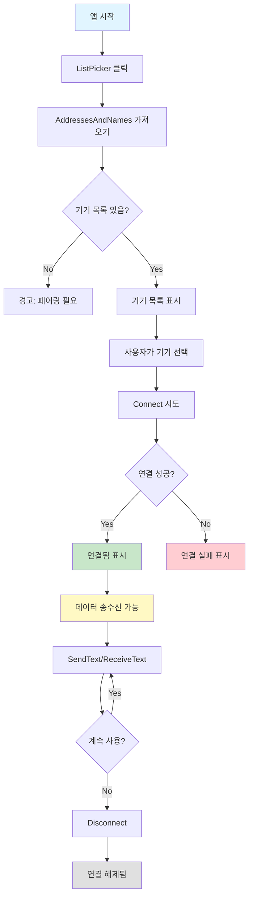

### 1. 기본 연결

#### 필요한 컴포넌트
```
Connectivity:
  - BluetoothClient1
  
User Interface:
  - ListPicker_BT (기기 선택)
  - Label_Status (연결 상태)
  - Button_Disconnect (연결 해제)
```

#### 기기 목록 가져오기
```
ListPicker_BT.BeforePicking:
  set ListPicker_BT.Elements to BluetoothClient1.AddressesAndNames
  
  // 페어링된 기기가 없으면
  if length of list ListPicker_BT.Elements = 0
  then
    call Notifier1.ShowAlert("페어링된 Bluetooth 기기가 없습니다")
```

#### 연결하기
```
ListPicker_BT.AfterPicking:
  call Notifier1.ShowProgressDialog(
    message: "연결 중...",
    title: "Bluetooth"
  )
  
  if call BluetoothClient1.Connect(ListPicker_BT.Selection)
  then
    call Notifier1.DismissProgressDialog
    set Label_Status.Text to "연결됨"
    set Label_Status.BackgroundColor to 초록색
    set ListPicker_BT.Enabled to false
    set Button_Disconnect.Enabled to true
  else
    call Notifier1.DismissProgressDialog
    call Notifier1.ShowAlert("연결 실패")
    set Label_Status.Text to "연결 실패"
    set Label_Status.BackgroundColor to 빨간색
```

#### 연결 해제
```
Button_Disconnect.Click:
  call BluetoothClient1.Disconnect
  set Label_Status.Text to "연결 해제됨"
  set Label_Status.BackgroundColor to 회색
  set ListPicker_BT.Enabled to true
  set Button_Disconnect.Enabled to false
```

### 2. 데이터 전송

#### 텍스트 전송
```
Button_Send.Click:
  if BluetoothClient1.IsConnected
  then
    set message to TextBox_Input.Text
    call BluetoothClient1.SendText(message)
    set Label_Sent.Text to join("전송: ", message)
    set TextBox_Input.Text to ""
  else
    call Notifier1.ShowAlert("Bluetooth가 연결되지 않았습니다")
```

#### 바이트 전송
```
Button_SendBytes.Click:
  if BluetoothClient1.IsConnected
  then
    call BluetoothClient1.Send1ByteNumber(255)
    // 또는
    call BluetoothClient1.Send2ByteNumber(1024)
    // 또는
    call BluetoothClient1.Send4ByteNumber(100000)
```

### 3. 데이터 수신

#### 텍스트 수신 (Clock 사용)
```
Designer:
  Clock_Receive:
    - TimerInterval: 100 (0.1초)
    - TimerEnabled: true

Blocks:
  Clock_Receive.Timer:
    if BluetoothClient1.IsConnected
    then
      if BluetoothClient1.BytesAvailableToReceive > 0
      then
        set receivedText to BluetoothClient1.ReceiveText(-1)
        set Label_Received.Text to receivedText
        
        // 리스트에 추가
        add items to list global receivedList
          item: receivedText
```

#### 구분자로 수신
```
Clock_Receive.Timer:
  if BluetoothClient1.IsConnected
  then
    if BluetoothClient1.BytesAvailableToReceive > 0
    then
      // 줄바꿈까지 읽기
      set line to BluetoothClient1.ReceiveText(10)  // 10 = \n
      
      // 쉼표로 분리
      set dataList to split text line at ","
      
      // 첫 번째 값
      set value1 to select list item
        list: dataList
        index: 1
```

### 4. 양방향 통신

#### 양방향 통신 시퀀스

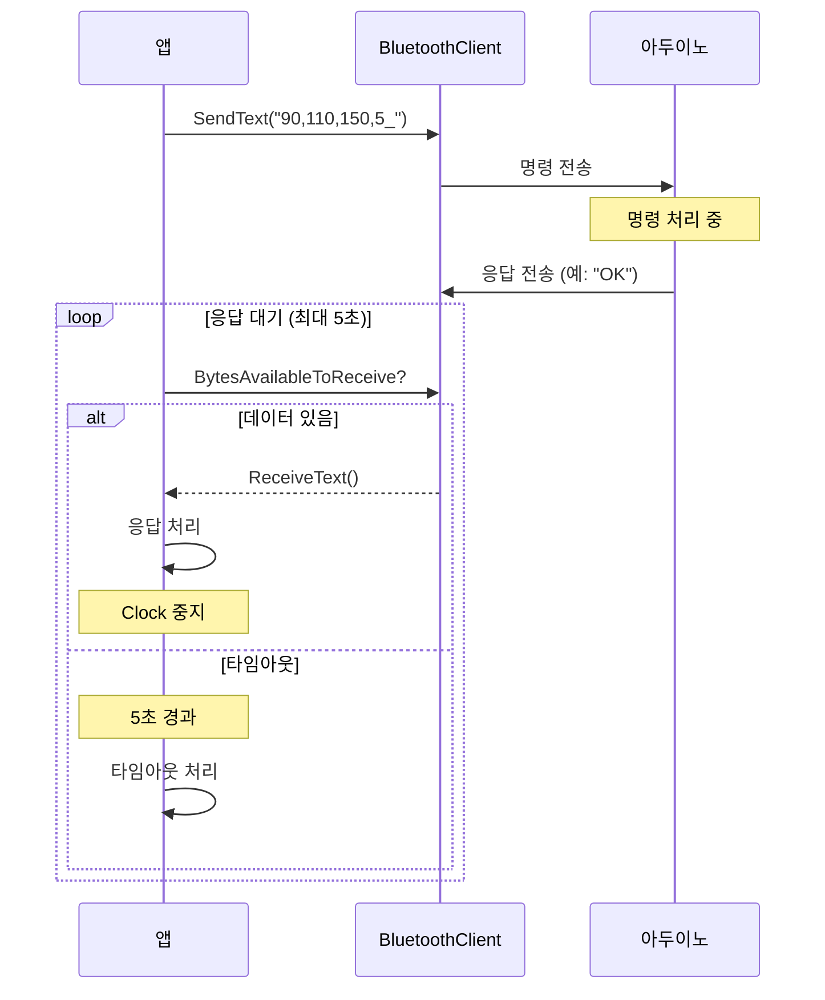

```
전역 변수:
  initialize global commandQueue to create empty list
  initialize global responseTimeout to 0

// 명령 전송 및 응답 대기
Procedure sendCommandAndWait (command):
  if BluetoothClient1.IsConnected
  then
    call BluetoothClient1.SendText(command)
    set global responseTimeout to 0
    set Clock_WaitResponse.TimerEnabled to true

Clock_WaitResponse.Timer:
  set global responseTimeout to (global responseTimeout + 1)
  
  if BluetoothClient1.BytesAvailableToReceive > 0
  then
    set response to BluetoothClient1.ReceiveText(-1)
    set Label_Response.Text to response
    set Clock_WaitResponse.TimerEnabled to false
    
  else if global responseTimeout > 50  // 5초 타임아웃
  then
    call Notifier1.ShowAlert("응답 없음")
    set Clock_WaitResponse.TimerEnabled to false
```

---

## 데이터 저장 (TinyDB)

### TinyDB 데이터 흐름

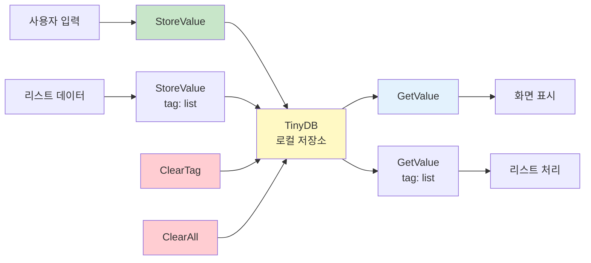

### 1. 기본 저장 및 불러오기

#### 단일 값 저장
```
Button_Save.Click:
  set name to TextBox_Name.Text
  call TinyDB1.StoreValue(
    tag: "userName",
    valueToStore: name
  )
  call Notifier1.ShowAlert("저장되었습니다")
```

#### 단일 값 불러오기
```
Button_Load.Click:
  set name to TinyDB1.GetValue(
    tag: "userName",
    valueIfTagNotThere: "이름 없음"
  )
  set Label_Name.Text to name
```

### 2. 리스트 저장

#### 리스트 저장
```
Button_SaveList.Click:
  set scoreList to make a list
    item: 100
    item: 85
    item: 92
    item: 78
  
  call TinyDB1.StoreValue(
    tag: "scores",
    valueToStore: scoreList
  )
```

#### 리스트 불러오기
```
Button_LoadList.Click:
  set scoreList to TinyDB1.GetValue(
    tag: "scores",
    valueIfTagNotThere: create empty list
  )
  
  // 리스트 표시
  set Label_Scores.Text to join list scoreList separator: ", "
```

### 3. 복잡한 데이터 저장

#### 딕셔너리 형태로 저장
```
Button_SaveUser.Click:
  // 사용자 정보를 리스트로 저장
  set userInfo to make a list
    item: TextBox_Name.Text
    item: TextBox_Age.Text
    item: TextBox_Email.Text
  
  call TinyDB1.StoreValue(
    tag: "userInfo",
    valueToStore: userInfo
  )
```

#### 불러와서 사용
```
Button_LoadUser.Click:
  set userInfo to TinyDB1.GetValue(
    tag: "userInfo",
    valueIfTagNotThere: create empty list
  )
  
  if length of list userInfo > 0
  then
    set TextBox_Name.Text to select list item
      list: userInfo
      index: 1
    set TextBox_Age.Text to select list item
      list: userInfo
      index: 2
    set TextBox_Email.Text to select list item
      list: userInfo
      index: 3
```

### 4. 여러 항목 관리

#### 항목 추가
```
Button_AddItem.Click:
  // 기존 리스트 불러오기
  set itemList to TinyDB1.GetValue(
    tag: "items",
    valueIfTagNotThere: create empty list
  )
  
  // 새 항목 추가
  add items to list itemList
    item: TextBox_NewItem.Text
  
  // 다시 저장
  call TinyDB1.StoreValue(
    tag: "items",
    valueToStore: itemList
  )
  
  set TextBox_NewItem.Text to ""
```

#### 항목 삭제
```
Button_DeleteItem.Click:
  set itemList to TinyDB1.GetValue(
    tag: "items",
    valueIfTagNotThere: create empty list
  )
  
  // 특정 인덱스 삭제
  remove list item
    list: itemList
    index: Spinner_Items.SelectionIndex
  
  // 다시 저장
  call TinyDB1.StoreValue(
    tag: "items",
    valueToStore: itemList
  )
```

### 5. 전체 데이터 관리

#### 모든 태그 가져오기
```
Button_ShowAll.Click:
  set allTags to TinyDB1.GetTags
  set Label_Tags.Text to join list allTags separator: "\n"
```

#### 특정 태그 삭제
```
Button_ClearTag.Click:
  call TinyDB1.ClearTag("userName")
  call Notifier1.ShowAlert("삭제되었습니다")
```

#### 모든 데이터 삭제
```
Button_ClearAll.Click:
  call Notifier1.ShowChooseDialog(
    message: "모든 데이터를 삭제하시겠습니까?",
    title: "확인",
    button1Text: "예",
    button2Text: "아니오"
  )

Notifier1.AfterChoosing:
  if choice = "예"
  then
    call TinyDB1.ClearAll
    call Notifier1.ShowAlert("모든 데이터가 삭제되었습니다")
```

---

## 차트 사용

### 차트 생성 프로세스

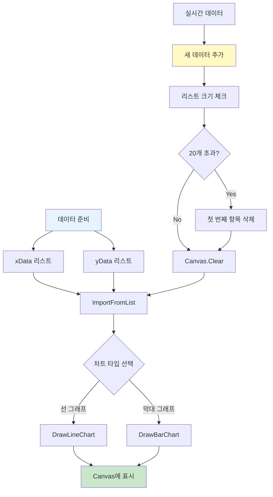

### 1. ChartData2D 확장 기능 사용

#### 필요한 설정
```
Extensions:
  - ChartData2D.aix 다운로드 및 추가
  
Components:
  - Canvas1 (차트를 그릴 캔버스)
  - ChartData2D1 (차트 데이터 관리)
```

### 2. 선 그래프 (Line Chart)

#### 데이터 준비
```
Screen1.Initialize:
  // X축 데이터
  set xData to make a list
    item: 1
    item: 2
    item: 3
    item: 4
    item: 5
  
  // Y축 데이터
  set yData to make a list
    item: 10
    item: 25
    item: 15
    item: 30
    item: 20
```

#### 차트 그리기
```
Button_DrawChart.Click:
  // 차트 데이터 설정
  call ChartData2D1.ImportFromList(
    xList: global xData,
    yList: global yData
  )
  
  // 선 그래프 그리기
  call ChartData2D1.DrawLineChart(
    canvas: Canvas1,
    color: 파란색,
    lineWidth: 3
  )
```

### 3. 막대 그래프 (Bar Chart)

```
Button_DrawBarChart.Click:
  // 데이터 설정
  set labels to make a list
    item: "월"
    item: "화"
    item: "수"
    item: "목"
    item: "금"
  
  set values to make a list
    item: 85
    item: 92
    item: 78
    item: 95
    item: 88
  
  // 막대 그래프 그리기
  call ChartData2D1.ImportFromList(
    xList: labels,
    yList: values
  )
  
  call ChartData2D1.DrawBarChart(
    canvas: Canvas1,
    color: 초록색,
    barWidth: 30
  )
```

### 4. 실시간 차트 업데이트

```
전역 변수:
  initialize global dataPoints to create empty list
  initialize global timeStamp to 0

Clock_UpdateChart.Timer:
  // 새 데이터 포인트 추가
  set global timeStamp to (global timeStamp + 1)
  set newValue to random integer from 0 to 100
  
  add items to list global dataPoints
    item: newValue
  
  // 최대 20개 데이터만 유지
  if length of list global dataPoints > 20
  then
    remove list item
      list: global dataPoints
      index: 1
  
  // 차트 다시 그리기
  call Canvas1.Clear
  call ChartData2D1.ImportFromList(
    xList: range(1, length of list global dataPoints),
    yList: global dataPoints
  )
  call ChartData2D1.DrawLineChart(
    canvas: Canvas1,
    color: 빨간색,
    lineWidth: 2
  )
```

### 5. Canvas로 간단한 차트

#### 막대 그래프 직접 그리기
```
Procedure drawSimpleBarChart (values):
  call Canvas1.Clear
  
  set barWidth to Canvas1.Width / length of list values
  set maxValue to max(values)
  
  set index to 1
  for each value in list values
    set barHeight to (value / maxValue) * Canvas1.Height
    set x to (index - 1) * barWidth
    set y to Canvas1.Height - barHeight
    
    call Canvas1.DrawRect(
      x: x,
      y: y,
      width: barWidth - 5,
      height: barHeight,
      fill: true
    )
    
    set index to (index + 1)
```

---

## 미디어 사용

### 미디어 컴포넌트 구조

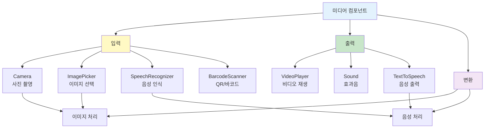

### 1. 카메라 (Camera)

#### 사진 찍기
```
Button_TakePicture.Click:
  call Camera1.TakePicture
  
Camera1.AfterPicture:
  set Image1.Picture to image
  
  // 이미지 경로 저장
  call TinyDB1.StoreValue(
    tag: "lastPhoto",
    valueToStore: image
  )
  
  set Label_Status.Text to "사진이 저장되었습니다"
```

### 2. 이미지 피커 (ImagePicker)

#### 갤러리에서 선택
```
Button_SelectImage.Click:
  call ImagePicker1.Open

ImagePicker1.AfterPicking:
  set Image1.Picture to ImagePicker1.Selection
  set Label_ImagePath.Text to ImagePicker1.Selection
```

### 3. 비디오 플레이어 (VideoPlayer)

#### 비디오 재생
```
Button_PlayVideo.Click:
  set VideoPlayer1.Source to "video.mp4"  // assets에서
  call VideoPlayer1.Start

Button_PauseVideo.Click:
  call VideoPlayer1.Pause

Button_StopVideo.Click:
  call VideoPlayer1.Stop

VideoPlayer1.Completed:
  set Label_Status.Text to "재생 완료"
```

### 4. 사운드 (Sound)

#### 효과음 재생
```
Button_PlaySound.Click:
  set Sound1.Source to "beep.mp3"
  call Sound1.Play

Button_StopSound.Click:
  call Sound1.Stop
```

### 5. 음성 인식 (SpeechRecognizer)

#### 음성 입력
```
Button_VoiceInput.Click:
  call SpeechRecognizer1.GetText

SpeechRecognizer1.AfterGettingText:
  set Label_Result.Text to result
  
  // 음성 명령 처리
  if result = "초기 위치"
  then
    call BluetoothClient1.SendText("90,110,150,5_")
  else if result = "물건 집어"
  then
    call BluetoothClient1.SendText("90,150,120,40_")
```

### 6. 텍스트 음성 변환 (TextToSpeech)

#### 텍스트 읽기
```
Button_Speak.Click:
  set message to TextBox_Message.Text
  call TextToSpeech1.Speak(message)

TextToSpeech1.AfterSpeaking:
  set Label_Status.Text to "읽기 완료"
```

### 7. 바코드 스캐너 (BarcodeScanner)

#### QR 코드 / 바코드 스캔
```
Button_Scan.Click:
  call BarcodeScanner1.DoScan

BarcodeScanner1.AfterScan:
  set Label_Result.Text to result
  
  // URL이면 웹브라우저로 열기
  if starts at text result piece "http"
  then
    call ActivityStarter1.StartActivity
```

---

## HTTP 통신

### HTTP 통신 아키텍처

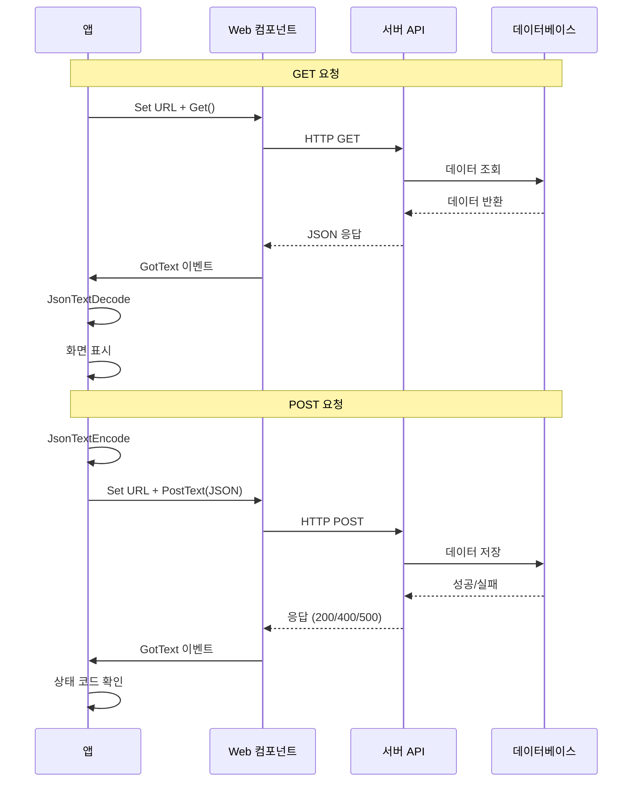

### REST API 메서드

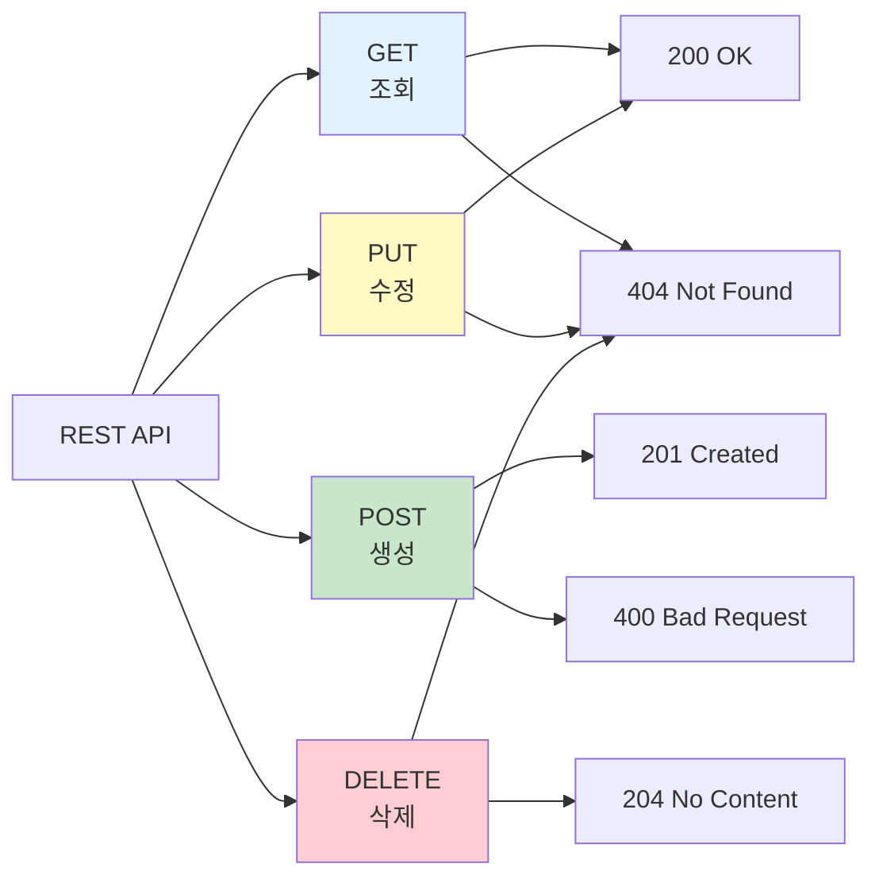

### 1. Web 컴포넌트 기본

#### GET 요청
```
Button_Get.Click:
  set Web1.Url to "https://api.example.com/data"
  call Web1.Get

Web1.GotText:
  set Label_Response.Text to responseContent
  set Label_Status.Text to join("상태 코드: ", responseCode)
```

#### POST 요청
```
Button_Post.Click:
  set Web1.Url to "https://api.example.com/submit"
  
  // POST 데이터 설정
  set postData to join(
    "name=", TextBox_Name.Text,
    "&age=", TextBox_Age.Text,
    "&email=", TextBox_Email.Text
  )
  
  call Web1.PostText(postData)

Web1.GotText:
  set Label_Response.Text to responseContent
```

### 2. JSON 데이터 처리

#### JSON 처리 흐름

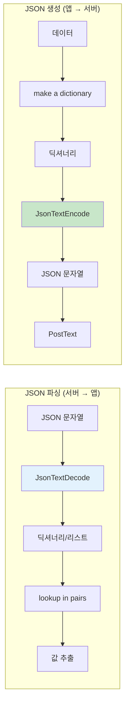

#### JSON 파싱
```
Web1.GotText:
  // JSON 응답 예시: {"temperature":25,"humidity":60}
  
  // JsonTextDecode 사용
  set jsonData to call Web1.JsonTextDecode(responseContent)
  
  // 값 추출
  set temperature to lookup in pairs
    list: jsonData
    key: "temperature"
    notFound: 0
  
  set humidity to lookup in pairs
    list: jsonData
    key: "humidity"
    notFound: 0
  
  set Label_Temp.Text to join("온도: ", temperature, "°C")
  set Label_Humid.Text to join("습도: ", humidity, "%")
```

#### JSON 생성
```
Button_SendJson.Click:
  // 딕셔너리 생성
  set jsonData to make a dictionary
    pair: "name" : TextBox_Name.Text
    pair: "value" : Slider1.ThumbPosition
    pair: "timestamp" : Clock1.Now
  
  // JSON 문자열로 변환
  set jsonString to call Web1.JsonTextEncode(jsonData)
  
  // POST 전송
  set Web1.Url to "https://api.example.com/data"
  call Web1.PostText(jsonString)
```

### 3. REST API 사용

#### GET - 데이터 조회
```
Button_GetUser.Click:
  set userId to TextBox_UserId.Text
  set Web1.Url to join("https://api.example.com/users/", userId)
  call Web1.Get

Web1.GotText:
  if responseCode = 200
  then
    set userData to call Web1.JsonTextDecode(responseContent)
    set Label_UserName.Text to get value for key userData key "name"
    set Label_UserEmail.Text to get value for key userData key "email"
  else
    call Notifier1.ShowAlert("사용자를 찾을 수 없습니다")
```

#### POST - 데이터 생성
```
Button_CreateUser.Click:
  set Web1.Url to "https://api.example.com/users"
  
  set newUser to make a dictionary
    pair: "name" : TextBox_Name.Text
    pair: "email" : TextBox_Email.Text
    pair: "age" : TextBox_Age.Text
  
  set jsonString to call Web1.JsonTextEncode(newUser)
  call Web1.PostText(jsonString)

Web1.GotText:
  if responseCode = 201
  then
    call Notifier1.ShowAlert("사용자가 생성되었습니다")
  else
    call Notifier1.ShowAlert("생성 실패")
```

#### PUT - 데이터 수정
```
Button_UpdateUser.Click:
  set userId to TextBox_UserId.Text
  set Web1.Url to join("https://api.example.com/users/", userId)
  
  set updateData to make a dictionary
    pair: "name" : TextBox_Name.Text
    pair: "email" : TextBox_Email.Text
  
  set jsonString to call Web1.JsonTextEncode(updateData)
  call Web1.PutText(jsonString)

Web1.GotText:
  if responseCode = 200
  then
    call Notifier1.ShowAlert("수정되었습니다")
```

#### DELETE - 데이터 삭제
```
Button_DeleteUser.Click:
  call Notifier1.ShowChooseDialog(
    message: "정말 삭제하시겠습니까?",
    title: "확인",
    button1Text: "예",
    button2Text: "아니오"
  )

Notifier1.AfterChoosing:
  if choice = "예"
  then
    set userId to TextBox_UserId.Text
    set Web1.Url to join("https://api.example.com/users/", userId)
    call Web1.Delete
```

### 4. 헤더 설정

#### Authorization 헤더
```
Button_AuthRequest.Click:
  set Web1.Url to "https://api.example.com/protected"
  
  // 헤더 설정
  set Web1.RequestHeaders to make a list
    item: make a list
      item: "Authorization"
      item: join("Bearer ", global apiToken)
    item: make a list
      item: "Content-Type"
      item: "application/json"
  
  call Web1.Get
```

### 5. 오류 처리

#### HTTP 상태 코드 처리

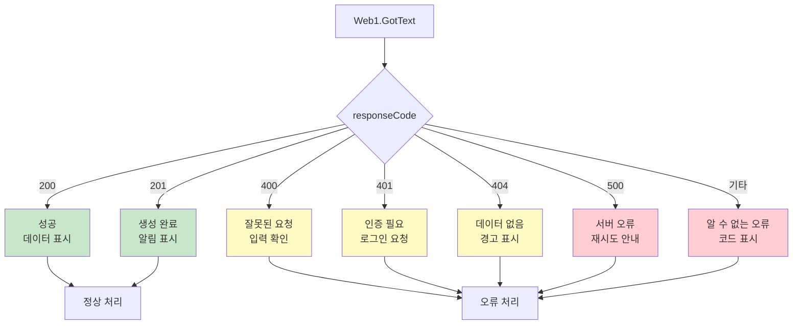

```
Web1.GotText:
  if responseCode = 200
  then
    // 성공
    set Label_Response.Text to responseContent
    
  else if responseCode = 400
  then
    call Notifier1.ShowAlert("잘못된 요청입니다")
    
  else if responseCode = 401
  then
    call Notifier1.ShowAlert("인증이 필요합니다")
    
  else if responseCode = 404
  then
    call Notifier1.ShowAlert("데이터를 찾을 수 없습니다")
    
  else if responseCode = 500
  then
    call Notifier1.ShowAlert("서버 오류가 발생했습니다")
    
  else
    call Notifier1.ShowAlert(join("오류 코드: ", responseCode))
```

### 6. 실시간 데이터 모니터링

```
전역 변수:
  initialize global isMonitoring to false

Button_StartMonitoring.Click:
  set global isMonitoring to true
  set Clock_Monitor.TimerEnabled to true
  set Button_StartMonitoring.Enabled to false
  set Button_StopMonitoring.Enabled to true

Button_StopMonitoring.Click:
  set global isMonitoring to false
  set Clock_Monitor.TimerEnabled to false
  set Button_StartMonitoring.Enabled to true
  set Button_StopMonitoring.Enabled to false

Clock_Monitor.Timer (매 5초):
  if global isMonitoring
  then
    set Web1.Url to "https://api.example.com/sensor/data"
    call Web1.Get

Web1.GotText:
  set sensorData to call Web1.JsonTextDecode(responseContent)
  
  set temperature to get value for key sensorData key "temperature"
  set humidity to get value for key sensorData key "humidity"
  
  set Label_Temp.Text to join(temperature, "°C")
  set Label_Humid.Text to join(humidity, "%")
  
  // 차트에 추가
  add items to list global dataPoints
    item: temperature
```

---

## 통합 예제

### IoT 센서 모니터링 시스템 아키텍처

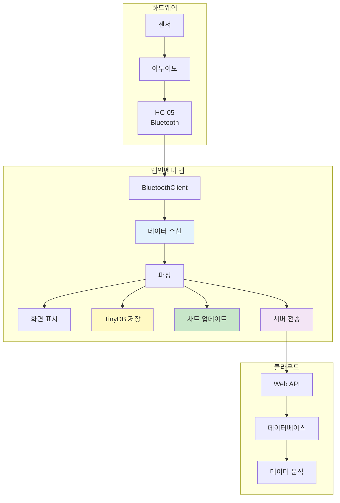

### 데이터 흐름도

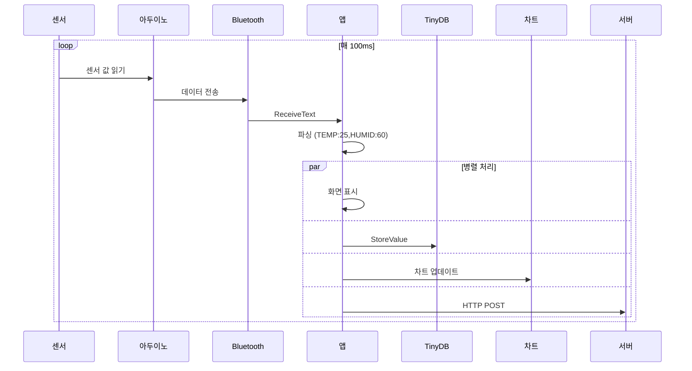

### 예제: IoT 센서 모니터링 앱

```
Components:
  - BluetoothClient1 (Bluetooth 통신)
  - TinyDB1 (데이터 저장)
  - Canvas1 (차트)
  - Web1 (서버 통신)
  - Clock_Update (주기적 업데이트)

전역 변수:
  initialize global sensorData to create empty list
  initialize global isConnected to false

Screen1.Initialize:
  // 저장된 데이터 불러오기
  set global sensorData to TinyDB1.GetValue(
    tag: "sensorHistory",
    valueIfTagNotThere: create empty list
  )

// Bluetooth 연결
ListPicker_BT.AfterPicking:
  if call BluetoothClient1.Connect(ListPicker_BT.Selection)
  then
    set global isConnected to true
    set Clock_Update.TimerEnabled to true
    set Label_Status.Text to "연결됨"

// 데이터 수신 및 처리
Clock_Update.Timer:
  if global isConnected
  then
    if BluetoothClient1.BytesAvailableToReceive > 0
    then
      // 데이터 수신
      set receivedData to BluetoothClient1.ReceiveText(-1)
      
      // 파싱 (예: "TEMP:25,HUMID:60")
      set dataList to split text receivedData at ","
      set temp to select list item list dataList index 1
      set humid to select list item list dataList index 2
      
      // 화면 표시
      set Label_Temp.Text to temp
      set Label_Humid.Text to humid
      
      // 로컬 저장
      add items to list global sensorData
        item: make a list
          item: Clock1.Now
          item: temp
          item: humid
      
      call TinyDB1.StoreValue(
        tag: "sensorHistory",
        valueToStore: global sensorData
      )
      
      // 차트 업데이트
      call updateChart
      
      // 서버에 전송
      call uploadToServer(temp, humid)

// 차트 업데이트
Procedure updateChart:
  // 최근 20개 데이터만 표시
  set recentData to take last 20 items from global sensorData
  
  call Canvas1.Clear
  // 차트 그리기 로직...

// 서버 업로드
Procedure uploadToServer (temperature, humidity):
  set Web1.Url to "https://api.example.com/sensor"
  
  set jsonData to make a dictionary
    pair: "temperature" : temperature
    pair: "humidity" : humidity
    pair: "timestamp" : Clock1.Now
  
  set jsonString to call Web1.JsonTextEncode(jsonData)
  call Web1.PostText(jsonString)

Web1.GotText:
  if responseCode = 200
  then
    set Label_Upload.Text to "업로드 완료"
  else
    set Label_Upload.Text to "업로드 실패"
```

---

## 요약

### 앱인벤터 기능 요약 맵

```mermaid
graph TB
    A[앱인벤터 앱] --> B[사용자 인터페이스]
    A --> C[데이터 관리]
    A --> D[통신]
    A --> E[시각화]
    A --> F[미디어]
    
    B --> B1[Button, Label, TextBox]
    B --> B2[Slider, CheckBox]
    B --> B3[ListPicker, Spinner]
    B --> B4[Notifier, Arrangement]
    
    C --> C1[TinyDB<br/>로컬 저장]
    C --> C2[리스트 관리]
    C --> C3[태그 시스템]
    
    D --> D1[Bluetooth<br/>근거리 통신]
    D --> D2[HTTP/REST<br/>인터넷 통신]
    D --> D3[JSON 처리]
    
    E --> E1[Chart<br/>데이터 시각화]
    E --> E2[Canvas<br/>그래픽]
    E --> E3[실시간 업데이트]
    
    F --> F1[Camera/ImagePicker<br/>이미지]
    F --> F2[Sound/VideoPlayer<br/>오디오/비디오]
    F --> F3[SpeechRecognizer/TTS<br/>음성]
    F --> F4[BarcodeScanner<br/>QR/바코드]
    
    style A fill:#e3f2fd
    style B fill:#fff9c4
    style C fill:#c8e6c9
    style D fill:#f3e5f5
    style E fill:#ffe0b2
    style F fill:#f8bbd0
```

### UI 컴포넌트
- Button, Label, TextBox, Slider
- CheckBox, ListPicker, Spinner
- Image, Notifier

### Bluetooth
- 연결/해제
- 텍스트/바이트 전송
- 실시간 수신

### 데이터 저장
- TinyDB로 로컬 저장
- 리스트, 딕셔너리 저장
- 태그 관리

### 차트
- 선 그래프, 막대 그래프
- 실시간 업데이트
- Canvas 직접 그리기

### 미디어
- Camera, ImagePicker
- VideoPlayer, Sound
- SpeechRecognizer, TextToSpeech

### HTTP 통신
- GET, POST, PUT, DELETE
- JSON 파싱/생성
- REST API 사용
- 오류 처리

**Happy Coding! 📱🤖**

